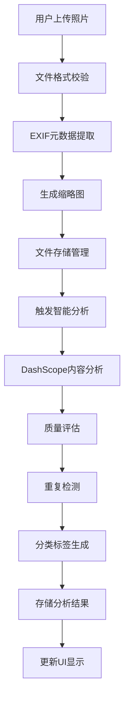
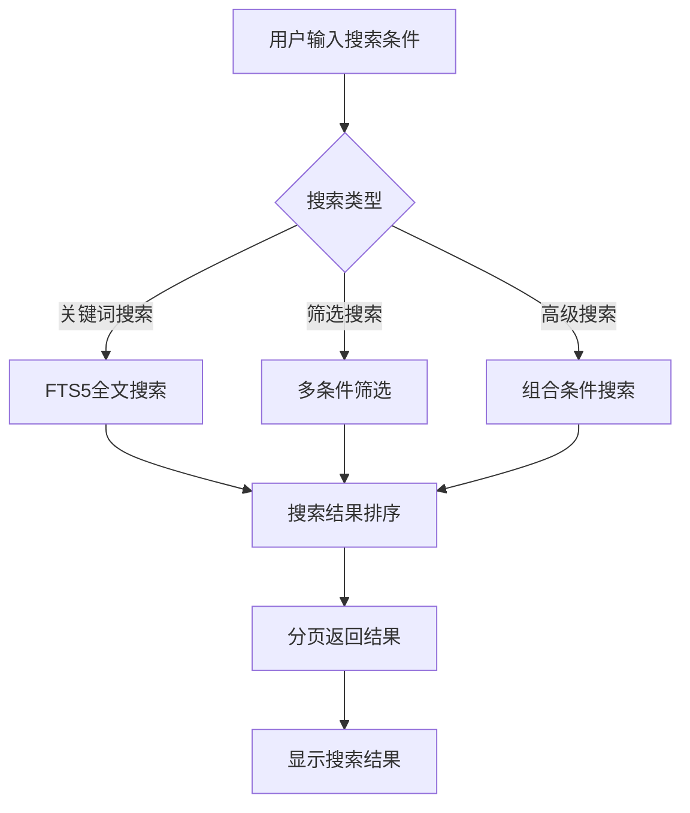

# 家庭单机版智能照片整理系统详细设计文档

## 一、文档基础信息

| 项目名称 | 家庭单机版智能照片整理系统                | 文档类型 | 详细设计文档                     |
| -------- | ----------------------------------------- | -------- | --------------------------------- |
| 文档版本 | V1.0                                      | 文档状态 | ☑ 草稿 □ 评审中 □ 已确认 □ 已归档 |
| 编写人   | AI助手                                    | 编写日期 | 2025年9月9日                      |
| 关联文档 | 《家庭单机版简要设计文档》《数据库设计文档》《API接口详细文档》 |          |                           |

## 二、项目概述

### 1. 项目定位与目标

**项目目标**：开发一套适合家庭使用的单机版智能照片整理系统，基于DashScope Qwen大模型技术，实现照片的自动化分析、智能分类、标签生成和重复检测，帮助家庭用户高效管理历史照片，提升照片整理效率60%以上。

**核心价值**：解决家庭照片数量庞大、分类困难、查找不便等问题，通过AI技术实现照片的智能化管理，提供多维度检索和自动去重功能，让家庭成员能够快速找到需要的照片，同时保护家庭隐私数据安全。

**目标用户**：
- 家庭用户（管理家庭照片集合）
- 个人用户（管理个人历史照片）
- 摄影爱好者（专业照片管理）
- 老年用户（简单易用的照片管理）

### 2. 简化原则

基于家庭单机版的使用场景，我们遵循以下核心简化原则：
- **单用户家庭使用**：无需多用户管理、权限控制、操作审计
- **本地数据存储**：所有数据本地化，无需云端同步
- **简洁配置管理**：单个JSON配置文件，环境变量覆盖敏感配置
- **性能适度要求**：响应时间≤2秒，支持1-5万张照片管理
- **成本可控**：控制AI API调用频率，支持离线模式

### 3. 系统架构概述

**架构模式**：采用 B/S（浏览器/服务器）架构，前端通过浏览器访问，无需安装客户端；后端采用单机部署架构，数据完全本地化存储；AI服务通过DashScope API调用，支持离线缓存机制。

**技术栈选型**：
- 前端：HTML5 + CSS3 + JavaScript（原生） + Bootstrap（UI框架） + 响应式设计
- 后端：Python 3.8+ + FastAPI（Web框架） + SQLAlchemy（ORM）
- 数据库：SQLite（轻量级本地数据库，无需额外服务）
- AI服务：DashScope Qwen-VL（阿里云大模型服务）
- 图像处理：PIL（Python Imaging Library） + OpenCV
- 部署环境：单机部署 + 本地Web服务
- 工具链：Git（版本控制） + 虚拟环境（依赖管理）

## 三、模块架构设计

### 1. 模块清单与职责

| 模块编号 | 模块名称         | 核心功能                                                     | 技术实现 | 交付物                                       |
| -------- | ---------------- | ------------------------------------------------------------ | -------- | -------------------------------------------- |
| M01      | 照片导入模块     | 1. 照片文件导入与校验；2. EXIF元数据提取；3. 缩略图生成；4. 本地文件存储管理 | Python + PIL + FastAPI | 照片导入接口、元数据提取工具、缩略图生成器   |
| M02      | 智能分析模块     | 1. DashScope Qwen-VL模型集成；2. 照片内容分析；3. 质量评估；4. 重复检测 | Python + DashScope API + OpenCV | AI分析引擎、质量评估算法、重复检测算法     |
| M03      | 照片管理模块     | 1. 照片CRUD操作；2. 照片查询与筛选；3. 批量操作；4. 照片统计 | FastAPI + SQLAlchemy | 照片管理接口、查询筛选器、统计报表         |
| M04      | 分类标签模块     | 1. 自动分类算法；2. 中文标签生成与管理；3. 家庭分类规则配置；4. 标签统计分析 | Python + 规则引擎 | 分类算法、标签管理系统、分类规则配置       |
| M05      | 搜索检索模块     | 1. 关键词搜索；2. 多维度筛选；3. 高级搜索；4. 搜索结果排序 | SQLite FTS5 + Python | 搜索引擎、筛选器、排序算法                 |
| M06      | 存储管理模块     | 1. 本地文件存储管理；2. 存储空间统计；3. 文件备份与恢复；4. 存储优化 | Python + 文件系统 | 存储管理器、备份恢复工具、空间统计器       |
| M07      | Web界面模块      | 1. 用户界面设计；2. 交互功能实现；3. 响应式布局；4. 用户体验优化 | HTML5 + CSS3 + JavaScript | Web界面、交互组件、样式文件                 |
| M08      | 系统配置模块     | 1. 系统参数配置；2. DashScope API密钥管理；3. 用户权限管理；4. 系统监控 | Python + JSON | 配置管理界面、权限管理、系统监控面板       |

### 2. 模块依赖关系

```
Web界面模块 (M07)
├── 照片管理模块 (M03)
├── 搜索检索模块 (M05)
├── 分类标签模块 (M04)
└── 系统配置模块 (M08)

照片管理模块 (M03)
├── 照片导入模块 (M01)
├── 智能分析模块 (M02)
├── 存储管理模块 (M06)
└── 数据库设计

智能分析模块 (M02)
├── DashScope API
├── 照片导入模块 (M01)
└── 分类标签模块 (M04)

照片导入模块 (M01)
├── 存储管理模块 (M06)
└── 文件系统操作

存储管理模块 (M06)
└── 文件系统操作
```

## 四、核心功能设计

### 1. 功能清单

#### 1.1 照片导入管理功能

| 功能 ID | 功能名称     | 核心描述                                                     | 操作角色           | 前置条件                    | 所属模块 |
| ------- | ------------ | ------------------------------------------------------------ | ------------------ | --------------------------- | -------- |
| FM01    | 照片文件导入 | 支持拖拽上传和文件选择两种方式，批量导入照片文件           | 用户手动           | 文件格式支持（JPG/PNG等） | M01     |
| FM02    | EXIF元数据提取 | 解析照片EXIF信息，提取拍摄时间、相机型号、GPS坐标等元数据 | 系统自动           | 照片文件完整               | M01     |
| FM03    | 缩略图生成   | 自动生成统一尺寸的缩略图，提升界面显示性能                 | 系统自动           | 照片导入成功               | M01     |
| FM04    | 文件存储管理 | 按年月日自动创建文件夹结构，管理照片文件存储               | 系统自动           | 存储空间充足               | M01     |

#### 1.2 智能分析功能

| 功能 ID | 功能名称     | 核心描述                                                     | 操作角色           | 前置条件                    | 所属模块 |
| ------- | ------------ | ------------------------------------------------------------ | ------------------ | --------------------------- | -------- |
| FM05    | 照片内容分析 | 调用DashScope Qwen-VL模型分析照片内容，识别场景、物体、人物、情感，生成中文描述 | 系统自动、用户手动 | 照片已导入 + DashScope API可用 | M02     |
| FM06    | 照片质量评估 | 使用OpenCV分析照片清晰度、亮度、对比度，计算综合质量评分，标记质量问题 | 系统自动           | 照片已导入 + 图像处理库可用 | M02     |
| FM07    | 重复照片检测 | 计算照片感知哈希值，与已有照片进行相似度对比，识别重复照片组 | 系统自动、用户手动 | 照片已导入 + 图像哈希库可用 | M02     |
| FM08    | 分析结果缓存 | 本地缓存AI分析结果，支持离线模式，减少API调用成本         | 系统自动           | 分析结果已生成 + 缓存空间可用 | M02     |

#### 1.3 分类标签管理功能

| 功能 ID | 功能名称     | 核心描述                                                     | 操作角色           | 前置条件                    | 所属模块 |
| ------- | ------------ | ------------------------------------------------------------ | ------------------ | --------------------------- | -------- |
| FM09    | 智能分类建议 | 基于AI分析结果，按家庭场景自动分类（聚会、旅行、生日等），生成分类建议 | 系统自动           | 照片分析完成 + 分类规则已配置 | M04     |
| FM10    | 标签生成管理 | 根据分析结果自动生成中文标签，支持手动添加和编辑，提供标签统计分析 | 系统自动、用户手动 | 照片分析完成 + 标签规则已配置 | M04     |
| FM11    | 分类规则配置 | 预置家庭场景分类规则，支持用户自定义分类规则               | 用户手动           | 系统初始化完成             | M04     |
| FM12    | 标签统计分析 | 统计标签使用频率、分类分布，为用户提供数据分析             | 系统自动           | 有标签数据                 | M04     |

#### 1.4 照片管理功能

| 功能 ID | 功能名称     | 核心描述                                                     | 操作角色           | 前置条件                    | 所属模块 |
| ------- | ------------ | ------------------------------------------------------------ | ------------------ | --------------------------- | -------- |
| FM13    | 照片CRUD操作 | 提供照片的增删改查操作，支持批量操作                       | 用户手动           | 照片数据存在               | M03     |
| FM14    | 照片查询筛选 | 支持多维度筛选，包括分类、标签、时间范围、质量评分等条件   | 用户手动           | 有照片数据                 | M03     |
| FM15    | 照片批量操作 | 支持批量删除、批量分类、批量导出等功能                     | 用户手动           | 选择多张照片               | M03     |
| FM16    | 照片统计报表 | 提供照片数量、存储空间、分类分布等统计信息                 | 用户手动           | 有照片数据                 | M03     |

#### 1.5 搜索检索功能

| 功能 ID | 功能名称     | 核心描述                                                     | 操作角色           | 前置条件                    | 所属模块 |
| ------- | ------------ | ------------------------------------------------------------ | ------------------ | --------------------------- | -------- |
| FM17    | 关键词搜索   | 支持照片描述、标签、文件名等内容的关键词搜索               | 用户手动           | 有搜索关键词               | M05     |
| FM18    | 多维度筛选   | 支持按时间、地点、质量、格式等多个维度进行筛选             | 用户手动           | 有筛选条件                 | M05     |
| FM19    | 高级搜索     | 支持组合条件搜索，AND/OR逻辑运算                           | 用户手动           | 有高级搜索条件             | M05     |
| FM20    | 搜索结果排序 | 支持按时间、相关度、质量等维度排序搜索结果                 | 用户手动           | 有搜索结果                 | M05     |

#### 1.6 存储管理功能

| 功能 ID | 功能名称     | 核心描述                                                     | 操作角色           | 前置条件                    | 所属模块 |
| ------- | ------------ | ------------------------------------------------------------ | ------------------ | --------------------------- | -------- |
| FM21    | 文件存储管理 | 管理照片文件和缩略图的存储路径和命名规则                   | 系统自动           | 存储目录存在               | M06     |
| FM22    | 存储空间统计 | 统计存储空间使用情况，提供存储空间预警                     | 系统自动           | 有存储数据                 | M06     |
| FM23    | 文件备份恢复 | 支持照片文件的备份和恢复功能                               | 用户手动           | 有备份需求                 | M06     |
| FM24    | 存储优化     | 定期清理临时文件，优化存储空间使用                         | 系统自动           | 系统运行中                 | M06     |

#### 1.7 系统配置功能

| 功能 ID | 功能名称     | 核心描述                                                     | 操作角色           | 前置条件                    | 所属模块 |
| ------- | ------------ | ------------------------------------------------------------ | ------------------ | --------------------------- | -------- |
| FM25    | 系统参数配置 | 管理系统运行参数，包括AI分析、存储、性能等配置             | 用户手动           | 有配置需求                 | M08     |
| FM26    | API密钥管理  | 管理DashScope API密钥，支持环境变量配置                     | 用户手动           | 有API密钥                   | M08     |
| FM27    | 系统监控     | 监控系统运行状态，包括CPU、内存、磁盘使用情况               | 系统自动           | 系统运行中                 | M08     |

### 2. 核心业务流程

#### 2.1 照片导入与分析流程



#### 2.2 照片检索流程



## 四、核心函数设计与调用关系

### 1. 函数清单

| 函数名                                                  | 功能描述                            | 输入参数                                                     | 返回结果                                        | 所属服务            |
| ------------------------------------------------------- | ----------------------------------- | ------------------------------------------------------------ | ----------------------------------------------- | ------------------- |
| analyze_photo_content(photo_path, analysis_type)       | 分析照片内容，调用DashScope API     | 照片路径、分析类型（content/quality/scene）                  | 分析结果 {description, objects, scene, tags}    | PhotoAnalysisService |
| assess_photo_quality(photo_path)                        | 评估照片质量，计算综合评分          | 照片路径                                                     | 质量评估 {score, sharpness, brightness, issues} | QualityAssessmentService |
| detect_duplicate_photos(photo_ids, threshold)           | 检测重复照片，返回重复组列表        | 照片ID列表、相似度阈值                                       | 重复组列表 {groups: [{photos: [], similarity}]} | DuplicateDetectionService |
| generate_photo_tags(analysis_result, max_tags)          | 生成照片标签，支持中文标签          | 分析结果、最大标签数量                                       | 标签列表 {tags: [{name, confidence, source}]}   | TagGenerationService |
| classify_photo_scene(analysis_result, family_rules)     | 分类照片场景，针对家庭场景优化      | 分析结果、家庭分类规则                                       | 分类结果 {category, subcategory, confidence}    | SceneClassificationService |
| cache_analysis_result(photo_id, result, ttl)            | 缓存分析结果，支持离线访问          | 照片ID、分析结果、缓存时间                                   | 缓存状态 {cached, cache_key, expires_at}        | CacheManagementService |
| validate_photo_file(file_path)                          | 验证照片文件，检查格式和完整性      | 文件路径                                                     | 验证结果 {valid, format, size, error_message}   | FileValidationService |

### 2. 关键调用流程

1. 照片导入完成→调用analyze_photo_content函数；

1. 先调用validate_photo_file验证文件→文件无效则返回错误；

1. 调用cache_analysis_result检查缓存→有缓存则直接返回；

1. 调用DashScope API进行内容分析→生成分析结果；

1. 调用generate_photo_tags生成标签→调用classify_photo_scene进行分类；

1. 调用cache_analysis_result缓存结果→返回完整分析数据给调用方。

## 五、数据结构设计

### 1. 数据库设计概述

基于家庭单机版的使用场景，采用SQLite作为数据存储引擎，实现照片信息管理、AI分析结果存储、标签分类管理、重复检测等核心功能。数据库设计遵循简单原则，确保系统易于维护和扩展。

#### 1.1 设计原则
- **简单性原则**：表结构简单清晰，避免过度设计
- **家庭单机优化**：针对家庭使用场景，数据量适中（1-5万张照片）
- **SQLite特性利用**：充分利用SQLite的轻量级特性
- **性能与存储平衡**：在查询性能和存储空间之间找到平衡点
- **数据完整性**：确保数据一致性和完整性

#### 1.2 技术选型
- **数据库引擎**：SQLite 3.x
- **存储方式**：单文件数据库存储
- **字符编码**：UTF-8
- **事务支持**：ACID事务保证
- **并发访问**：支持多线程读取，单线程写入

### 2. 核心数据表设计

#### 2.1 照片表 (photos)

**表说明**：存储照片的基本信息、元数据和分析状态

| 字段名 | 数据类型 | 长度 | 主键 | 非空 | 默认值 | 说明 |
|--------|----------|------|------|------|--------|------|
| id | INTEGER | - | 是 | 是 | AUTOINCREMENT | 照片唯一标识 |
| filename | VARCHAR | 255 | 否 | 是 | - | 原始文件名 |
| original_path | VARCHAR | 500 | 否 | 是 | - | 原始文件路径 |
| thumbnail_path | VARCHAR | 500 | 否 | 否 | NULL | 缩略图路径 |
| file_size | INTEGER | - | 否 | 是 | 0 | 文件大小（字节） |
| width | INTEGER | - | 否 | 是 | 0 | 图片宽度 |
| height | INTEGER | - | 否 | 是 | 0 | 图片高度 |
| format | VARCHAR | 10 | 否 | 是 | - | 图片格式 |
| file_hash | VARCHAR | 64 | 否 | 是 | - | 文件MD5哈希值 |
| perceptual_hash | VARCHAR | 16 | 否 | 否 | NULL | 图像感知哈希值 |
| taken_at | DATETIME | - | 否 | 否 | NULL | 拍摄时间 |
| camera_make | VARCHAR | 100 | 否 | 否 | NULL | 相机品牌 |
| camera_model | VARCHAR | 100 | 否 | 否 | NULL | 相机型号 |
| lens_model | VARCHAR | 100 | 否 | 否 | NULL | 镜头型号 |
| focal_length | REAL | - | 否 | 否 | NULL | 焦距 |
| aperture | REAL | - | 否 | 否 | NULL | 光圈值 |
| shutter_speed | VARCHAR | 20 | 否 | 否 | NULL | 快门速度 |
| iso | INTEGER | - | 否 | 否 | NULL | ISO感光度 |
| flash | VARCHAR | 20 | 否 | 否 | NULL | 闪光灯使用 |
| white_balance | VARCHAR | 20 | 否 | 否 | NULL | 白平衡 |
| exposure_mode | VARCHAR | 20 | 否 | 否 | NULL | 曝光模式 |
| metering_mode | VARCHAR | 20 | 否 | 否 | NULL | 测光模式 |
| orientation | INTEGER | - | 否 | 否 | NULL | 图像方向 |
| location_lat | REAL | - | 否 | 否 | NULL | GPS纬度 |
| location_lng | REAL | - | 否 | 否 | NULL | GPS经度 |
| location_alt | REAL | - | 否 | 否 | NULL | GPS海拔 |
| location_name | VARCHAR | 200 | 否 | 否 | NULL | 地点名称 |
| status | VARCHAR | 20 | 否 | 否 | 'pending' | 处理状态 |
| import_source | VARCHAR | 100 | 否 | 否 | NULL | 导入来源 |
| created_at | DATETIME | - | 否 | 是 | CURRENT_TIMESTAMP | 创建时间 |
| updated_at | DATETIME | - | 否 | 是 | CURRENT_TIMESTAMP | 更新时间 |

#### 2.2 照片分析结果表 (photo_analysis)

**表说明**：存储AI分析结果

| 字段名 | 数据类型 | 长度 | 主键 | 非空 | 默认值 | 说明 |
|--------|----------|------|------|------|--------|------|
| id | INTEGER | - | 是 | 是 | AUTOINCREMENT | 分析记录ID |
| photo_id | INTEGER | - | 否 | 是 | - | 关联照片ID |
| analysis_type | VARCHAR | 20 | 否 | 是 | - | 分析类型 |
| analysis_result | JSON | - | 否 | 否 | NULL | 分析结果数据 |
| confidence_score | FLOAT | - | 否 | 否 | NULL | 置信度评分 |
| created_at | DATETIME | - | 否 | 是 | CURRENT_TIMESTAMP | 创建时间 |
| updated_at | DATETIME | - | 否 | 是 | CURRENT_TIMESTAMP | 更新时间 |

#### 2.3 照片质量评估表 (photo_quality)

**表说明**：存储照片质量评估结果

| 字段名 | 数据类型 | 长度 | 主键 | 非空 | 默认值 | 说明 |
|--------|----------|------|------|------|--------|------|
| id | INTEGER | - | 是 | 是 | AUTOINCREMENT | 质量评估ID |
| photo_id | INTEGER | - | 否 | 是 | - | 关联照片ID |
| quality_score | FLOAT | - | 否 | 否 | NULL | 综合质量评分 |
| sharpness_score | FLOAT | - | 否 | 否 | NULL | 清晰度评分 |
| brightness_score | FLOAT | - | 否 | 否 | NULL | 亮度评分 |
| contrast_score | FLOAT | - | 否 | 否 | NULL | 对比度评分 |
| color_score | FLOAT | - | 否 | 否 | NULL | 色彩评分 |
| composition_score | FLOAT | - | 否 | 否 | NULL | 构图评分 |
| quality_level | VARCHAR | 20 | 否 | 否 | NULL | 质量等级 |
| technical_issues | JSON | - | 否 | 否 | NULL | 技术问题 |
| assessed_at | DATETIME | - | 否 | 是 | CURRENT_TIMESTAMP | 评估时间 |

#### 2.4 标签表 (tags)

**表说明**：存储标签信息

| 字段名 | 数据类型 | 长度 | 主键 | 非空 | 默认值 | 说明 |
|--------|----------|------|------|------|--------|------|
| id | INTEGER | - | 是 | 是 | AUTOINCREMENT | 标签ID |
| name | VARCHAR | 50 | 否 | 是 | - | 标签名称 |
| category | VARCHAR | 20 | 否 | 否 | 'custom' | 标签分类 |
| usage_count | INTEGER | - | 否 | 否 | 0 | 使用次数 |
| created_at | DATETIME | - | 否 | 是 | CURRENT_TIMESTAMP | 创建时间 |
| updated_at | DATETIME | - | 否 | 是 | CURRENT_TIMESTAMP | 更新时间 |

#### 2.5 照片标签关联表 (photo_tags)

**表说明**：照片和标签的多对多关系

| 字段名 | 数据类型 | 长度 | 主键 | 非空 | 默认值 | 说明 |
|--------|----------|------|------|------|--------|------|
| id | INTEGER | - | 是 | 是 | AUTOINCREMENT | 关联ID |
| photo_id | INTEGER | - | 否 | 是 | - | 照片ID |
| tag_id | INTEGER | - | 否 | 是 | - | 标签ID |
| confidence | FLOAT | - | 否 | 否 | NULL | 置信度 |
| source | VARCHAR | 20 | 否 | 否 | 'ai' | 标签来源 |
| created_at | DATETIME | - | 否 | 是 | CURRENT_TIMESTAMP | 创建时间 |

#### 2.6 分类表 (categories)

**表说明**：存储分类信息

| 字段名 | 数据类型 | 长度 | 主键 | 非空 | 默认值 | 说明 |
|--------|----------|------|------|------|--------|------|
| id | INTEGER | - | 是 | 是 | AUTOINCREMENT | 分类ID |
| name | VARCHAR | 50 | 否 | 是 | - | 分类名称 |
| parent_id | INTEGER | - | 否 | 否 | NULL | 父分类ID |
| description | VARCHAR | 200 | 否 | 否 | NULL | 分类描述 |
| sort_order | INTEGER | - | 否 | 否 | 0 | 排序顺序 |
| created_at | DATETIME | - | 否 | 是 | CURRENT_TIMESTAMP | 创建时间 |
| updated_at | DATETIME | - | 否 | 是 | CURRENT_TIMESTAMP | 更新时间 |

#### 2.7 照片分类关联表 (photo_categories)

**表说明**：照片和分类的多对多关系

| 字段名 | 数据类型 | 长度 | 主键 | 非空 | 默认值 | 说明 |
|--------|----------|------|------|------|--------|------|
| id | INTEGER | - | 是 | 是 | AUTOINCREMENT | 关联ID |
| photo_id | INTEGER | - | 否 | 是 | - | 照片ID |
| category_id | INTEGER | - | 否 | 是 | - | 分类ID |
| confidence | FLOAT | - | 否 | 否 | NULL | 置信度 |
| created_at | DATETIME | - | 否 | 是 | CURRENT_TIMESTAMP | 创建时间 |

#### 2.8 重复组表 (duplicate_groups)

**表说明**：存储重复照片分组信息

| 字段名 | 数据类型 | 长度 | 主键 | 非空 | 默认值 | 说明 |
|--------|----------|------|------|------|--------|------|
| id | INTEGER | - | 是 | 是 | AUTOINCREMENT | 组ID |
| representative_photo_id | INTEGER | - | 否 | 是 | - | 代表照片ID |
| group_hash | VARCHAR | 64 | 否 | 否 | NULL | 组哈希值 |
| similarity_threshold | FLOAT | - | 否 | 否 | 0.9 | 相似度阈值 |
| photo_count | INTEGER | - | 否 | 否 | 1 | 照片数量 |
| created_at | DATETIME | - | 否 | 是 | CURRENT_TIMESTAMP | 创建时间 |
| updated_at | DATETIME | - | 否 | 是 | CURRENT_TIMESTAMP | 更新时间 |

#### 2.9 重复照片关联表 (duplicate_group_photos)

**表说明**：重复组和照片的关联关系

| 字段名 | 数据类型 | 长度 | 主键 | 非空 | 默认值 | 说明 |
|--------|----------|------|------|------|--------|------|
| id | INTEGER | - | 是 | 是 | AUTOINCREMENT | 关联ID |
| group_id | INTEGER | - | 否 | 是 | - | 重复组ID |
| photo_id | INTEGER | - | 否 | 是 | - | 照片ID |
| similarity_score | FLOAT | - | 否 | 否 | NULL | 相似度评分 |
| created_at | DATETIME | - | 否 | 是 | CURRENT_TIMESTAMP | 创建时间 |

### 3. 数据关系图

```
照片表 (photos)
├── 分析结果表 (photo_analysis) [一对多]
├── 照片质量评估表 (photo_quality) [一对多]
├── 照片标签关联表 (photo_tags) [一对多]
├── 照片分类关联表 (photo_categories) [一对多]
└── 重复照片关联表 (duplicate_group_photos) [一对多]

标签表 (tags)
└── 照片标签关联表 (photo_tags) [一对多]

分类表 (categories)
└── 照片分类关联表 (photo_categories) [一对多]

重复组表 (duplicate_groups)
└── 重复照片关联表 (duplicate_group_photos) [一对多]
```

### 4. 索引设计

#### 4.1 主要索引

| 表名 | 字段名 | 索引类型 | 说明 |
|------|--------|----------|------|
| photos | file_hash | UNIQUE | 防止重复文件导入 |
| photos | taken_at | INDEX | 时间范围查询优化 |
| photos | status | INDEX | 状态筛选优化 |
| photo_analysis | photo_id, analysis_type | UNIQUE | 分析结果查询优化 |
| photo_tags | photo_id | INDEX | 照片标签查询优化 |
| photo_tags | tag_id | INDEX | 标签统计优化 |
| photo_categories | photo_id | INDEX | 照片分类查询优化 |
| duplicate_group_photos | group_id | INDEX | 重复组查询优化 |

#### 4.2 全文搜索索引

使用SQLite FTS5模块实现全文搜索：

```sql
-- 照片内容全文搜索索引
CREATE VIRTUAL TABLE photos_fts USING fts5(
  photo_id, filename, analysis_content, tags,
  content='photos', content_rowid='id'
);

-- 标签全文搜索索引
CREATE VIRTUAL TABLE tags_fts USING fts5(
  tag_id, tag_name,
  content='tags', content_rowid='id'
);
```

## 六、API接口设计

### 1. API设计原则

基于RESTful设计规范，遵循以下核心原则：
- **统一格式**：请求和响应使用统一的数据格式（JSON）
- **版本控制**：通过URL路径进行API版本控制（/api/v1/）
- **状态码规范**：使用标准HTTP状态码
- **错误处理**：统一的错误响应格式
- **单用户设计**：无需认证机制，简化权限控制

### 2. 基础信息

- **基础URL**：`http://localhost:8000/api/v1`
- **认证方式**：无需认证（单用户家庭使用）
- **数据格式**：JSON
- **字符编码**：UTF-8
- **时间格式**：ISO 8601 (YYYY-MM-DDTHH:mm:ssZ)

### 3. 响应格式

#### 3.1 成功响应格式
```json
{
  "success": true,
  "data": {
    // 响应数据
  },
  "meta": {
    "timestamp": "2025-01-01T00:00:00Z",
    "request_id": "uuid-string"
  }
}
```

#### 3.2 错误响应格式
```json
{
  "success": false,
  "error": {
    "code": "ERROR_CODE",
    "message": "错误描述",
    "details": {
      // 详细错误信息
    }
  },
  "meta": {
    "timestamp": "2025-01-01T00:00:00Z",
    "request_id": "uuid-string"
  }
}
```

#### 3.3 分页响应格式
```json
{
  "success": true,
  "data": {
    "items": [],
    "pagination": {
      "page": 1,
      "page_size": 20,
      "total": 100,
      "total_pages": 5,
      "has_next": true,
      "has_prev": false
    }
  },
  "meta": {
    "timestamp": "2025-01-01T00:00:00Z",
    "request_id": "uuid-string"
  }
}
```

### 4. 核心API接口

#### 4.1 照片管理API

**照片列表查询**
- **接口路径**：`GET /api/v1/photos`
- **功能描述**：获取照片列表，支持分页、筛选和排序
- **请求参数**：
  | 参数名 | 类型 | 必需 | 描述 |
  |--------|------|------|------|
  | page | integer | 否 | 页码，默认1 |
  | page_size | integer | 否 | 每页数量，默认20 |
  | q | string | 否 | 关键词搜索 |
  | category | string | 否 | 分类筛选 |
  | tag | string | 否 | 标签筛选 |
  | date_from | string | 否 | 开始日期 |
  | date_to | string | 否 | 结束日期 |
  | quality_min | float | 否 | 最低质量评分 |
  | sort_by | string | 否 | 排序字段 |

**照片详情查询**
- **接口路径**：`GET /api/v1/photos/{id}`
- **功能描述**：获取单张照片的详细信息
- **返回数据**：照片基本信息、EXIF元数据、分析结果、质量评估

**照片上传**
- **接口路径**：`POST /api/v1/photos/upload`
- **功能描述**：上传单张或批量照片文件
- **请求参数**：multipart/form-data格式的文件数据

#### 4.2 智能分析API

**照片内容分析**
- **接口路径**：`POST /api/v1/photos/{id}/analyze`
- **功能描述**：触发照片内容分析
- **请求参数**：
  ```json
  {
    "analysis_type": "content",
    "force_refresh": false
  }
  ```
- **返回数据**：分析结果、置信度、处理时间

**质量评估**
- **接口路径**：`POST /api/v1/photos/{id}/quality`
- **功能描述**：评估照片质量
- **返回数据**：质量评分、各项指标、问题列表

**重复检测**
- **接口路径**：`POST /api/v1/photos/duplicates`
- **功能描述**：检测重复照片
- **请求参数**：
  ```json
  {
    "photo_ids": [1, 2, 3],
    "threshold": 0.9
  }
  ```

#### 4.3 分类标签API

**标签管理**
- **接口路径**：`GET /api/v1/photos/{id}/tags`
- **功能描述**：获取照片标签列表
- **接口路径**：`POST /api/v1/photos/{id}/tags`
- **功能描述**：为照片添加标签
- **请求参数**：
  ```json
  {
    "tag_name": "家庭聚会",
    "confidence": 0.9
  }
  ```

**分类管理**
- **接口路径**：`GET /api/v1/photos/{id}/categories`
- **功能描述**：获取照片分类
- **接口路径**：`POST /api/v1/photos/{id}/categories`
- **功能描述**：为照片设置分类

#### 4.4 搜索API

**关键词搜索**
- **接口路径**：`GET /api/v1/search`
- **功能描述**：基于关键词的全文搜索
- **请求参数**：
  | 参数名 | 类型 | 必需 | 描述 |
  |--------|------|------|------|
  | q | string | 是 | 搜索关键词 |
  | type | string | 否 | 搜索类型（photo/tag） |
  | category | string | 否 | 分类筛选 |

**高级搜索**
- **接口路径**：`POST /api/v1/search/advanced`
- **功能描述**：组合条件搜索
- **请求参数**：复杂的筛选条件组合

#### 4.5 系统管理API

**系统状态**
- **接口路径**：`GET /api/v1/system/status`
- **功能描述**：获取系统运行状态
- **返回数据**：存储空间使用情况、分析队列状态

**配置管理**
- **接口路径**：`GET /api/v1/system/config`
- **功能描述**：获取系统配置
- **接口路径**：`PUT /api/v1/system/config`
- **功能描述**：更新系统配置

### 5. 错误码定义

| 错误码 | HTTP状态码 | 描述 |
|--------|------------|------|
| PHOTO_NOT_FOUND | 404 | 照片不存在 |
| INVALID_FILE_FORMAT | 400 | 文件格式不支持 |
| ANALYSIS_FAILED | 500 | 分析处理失败 |
| STORAGE_FULL | 507 | 存储空间不足 |
| API_LIMIT_EXCEEDED | 429 | API调用限制 |
| INVALID_REQUEST | 400 | 请求参数错误 |

## 七、配置管理设计

### 1. 配置文件结构

系统使用单个JSON配置文件`config.json`，包含所有模块的配置参数：

```json
{
  "system": {
    "max_file_size": 52428800,
    "timeout": 10,
    "max_concurrent": 2,
    "temp_file_max_age": 24
  },
  "database": {
    "path": "./data/photos.db"
  },
  "dashscope": {
    "api_key": "${DASHSCOPE_API_KEY}",
    "base_url": "https://dashscope.aliyuncs.com/api/v1"
  },
  "storage": {
    "base_path": "./photos_storage",
    "originals_path": "originals",
    "thumbnails_path": "thumbnails",
    "temp_path": "temp",
    "backups_path": "backups",
    "thumbnail_size": 300,
    "thumbnail_quality": 85
  },
  "analysis": {
    "duplicate_threshold": 5,
    "quality_threshold": 0
  },
  "logging": {
    "level": "INFO",
    "file_path": "./logs/app.log",
    "max_size": "10MB",
    "backup_count": 5
  }
}
```

### 2. 配置管理特性

- **统一管理**：所有模块共享统一配置，避免重复定义
- **启动时加载**：系统启动时加载配置文件，支持环境变量替换
- **错误处理**：配置错误时使用默认值，提供简单错误提示
- **环境变量支持**：敏感配置（如API密钥）支持环境变量覆盖
- **无需热更新**：配置修改后重启服务生效，简化系统复杂度

### 3. 配置参数说明

| 配置模块 | 参数名 | 类型 | 默认值 | 说明 |
|----------|--------|------|--------|------|
| system | max_file_size | number | 52428800 | 单文件最大大小（字节） |
| system | timeout | number | 10 | 请求超时时间（秒） |
| system | max_concurrent | number | 2 | 最大并发数 |
| dashscope | api_key | string | - | DashScope API密钥 |
| storage | base_path | string | ./photos_storage | 存储根目录 |
| storage | thumbnail_size | number | 300 | 缩略图尺寸 |
| analysis | duplicate_threshold | number | 5 | 重复检测阈值 |

## 八、非功能需求

### 1. 性能需求

- **单张照片处理时间**：≤ 2秒
- **智能处理时间**：10张照片 ≤ 20秒
- **照片检索响应时间**：≤ 1秒
- **界面加载时间**：≤ 2秒
- **并发处理能力**：最多2个并发分析任务
- **内存使用限制**：单次分析 ≤ 256MB
- **存储空间效率**：缩略图压缩率 ≥ 80%

### 2. 安全性需求

- **数据本地化**：所有数据存储在本地，无云端传输
- **隐私保护**：照片分析时临时上传，分析完立即删除
- **文件完整性**：通过MD5哈希值验证文件完整性
- **配置安全**：API密钥通过环境变量配置，避免明文存储

### 3. 可靠性需求

- **容错能力**：网络异常时自动切换到离线模式
- **数据持久化**：分析结果本地缓存，支持离线访问
- **异常恢复**：系统异常重启后能够恢复处理状态
- **资源监控**：实时监控系统资源使用情况

### 4. 可用性需求

- **用户友好**：界面简洁直观，操作流程简单
- **响应及时**：用户操作响应时间 ≤ 1秒
- **错误提示**：提供清晰的错误提示和解决建议
- **离线支持**：网络异常时提供基础功能

### 5. 可维护性需求

- **代码结构**：模块化设计，便于功能扩展
- **日志完整**：记录关键操作和错误信息
- **配置灵活**：支持运行时参数调整
- **文档齐全**：提供完整的API和使用文档

## 九、风险与应对措施

### 1. 技术风险

| 风险等级 | 潜在风险 | 影响程度 | 应对措施 |
|----------|----------|----------|----------|
| 高 | DashScope API服务不可用 | 系统核心功能受限 | 1. 实现本地缓存机制，支持离线模式；2. 提供备用分析算法；3. 建立服务监控和告警机制 |
| 中 | 大量照片处理性能瓶颈 | 用户体验下降 | 1. 采用异步处理队列，避免阻塞主线程；2. 实现任务优先级调度；3. 优化算法和数据结构 |
| 中 | 存储空间不足 | 系统无法正常工作 | 1. 实时监控存储空间使用情况；2. 实现智能清理机制；3. 支持外部存储扩展 |
| 低 | 网络连接不稳定 | 分析功能间断 | 1. 实现请求重试和断点续传；2. 缓存分析结果，支持离线查看 |

### 2. 数据风险

| 风险等级 | 潜在风险 | 影响程度 | 应对措施 |
|----------|----------|----------|----------|
| 高 | 照片文件损坏或丢失 | 数据丢失 | 1. 建立文件完整性校验机制；2. 实现定期备份策略；3. 支持数据恢复功能 |
| 中 | 分析结果不准确 | 用户体验下降 | 1. 建立人工审核机制；2. 持续优化AI模型；3. 提供用户反馈渠道 |
| 低 | 配置信息泄露 | 安全风险 | 1. 敏感信息使用环境变量；2. 配置文件权限控制；3. 定期安全审计 |

### 3. 业务风险

| 风险等级 | 潜在风险 | 影响程度 | 应对措施 |
|----------|----------|----------|----------|
| 中 | 用户操作习惯不适应 | 功能使用率低 | 1. 提供详细的用户指南；2. 实现渐进式功能介绍；3. 收集用户反馈持续优化 |
| 低 | 系统升级兼容性问题 | 升级困难 | 1. 建立向后兼容性测试；2. 提供平滑升级方案；3. 保留旧版本备份 |

## 十、监控与日志

### 1. 性能监控

#### 1.1 系统性能指标

- **响应时间监控**：记录各API接口的响应时间，设置性能阈值告警
- **资源使用监控**：监控CPU、内存、磁盘I/O使用情况
- **并发连接监控**：监控系统并发连接数和队列长度
- **存储空间监控**：实时监控存储空间使用率和增长趋势

#### 1.2 业务性能指标

- **照片处理效率**：统计单张照片处理时间、智能处理效率
- **搜索响应时间**：监控搜索查询的响应时间
- **用户操作统计**：记录用户常用的功能和操作路径

### 2. 日志管理

#### 2.1 日志级别与内容

| 日志级别 | 记录内容 | 输出位置 |
|----------|----------|----------|
| ERROR | 系统错误、异常信息 | 控制台 + 文件 |
| WARNING | 警告信息、潜在问题 | 控制台 + 文件 |
| INFO | 重要操作、状态变化 | 文件 |
| DEBUG | 详细调试信息 | 文件（仅开发环境） |

#### 2.2 日志轮转策略

- **文件大小限制**：单个日志文件最大10MB
- **保留策略**：保留最近30天的日志文件
- **压缩存储**：过期日志自动压缩存储
- **日志分析**：支持日志关键词搜索和统计分析

### 3. 健康检查

#### 3.1 系统健康检查点

- **数据库连接**：检查SQLite数据库连接状态
- **存储空间**：检查磁盘空间是否充足
- **网络连接**：检查DashScope API连接状态
- **内存使用**：检查系统内存使用是否正常

#### 3.2 健康检查接口

```json
GET /api/v1/health
{
  "status": "healthy",
  "timestamp": "2025-01-01T00:00:00Z",
  "checks": {
    "database": "healthy",
    "storage": "healthy",
    "network": "healthy",
    "memory": "healthy"
  }
}
```

## 十一、测试策略

### 1. 测试范围

#### 1.1 单元测试

- **测试对象**：各个模块的核心函数和方法
- **测试内容**：功能正确性、边界条件、异常处理
- **测试工具**：pytest框架
- **覆盖率目标**：核心代码≥80%

#### 1.2 集成测试

- **测试对象**：模块间的接口和数据流
- **测试内容**：数据传递正确性、接口兼容性
- **测试场景**：正常流程、异常流程、边界情况

#### 1.3 系统测试

- **测试对象**：完整系统功能
- **测试内容**：端到端业务流程、性能表现
- **测试环境**：模拟生产环境

### 2. 性能测试

#### 2.1 性能测试指标

- **并发用户数**：模拟2个并发用户
- **响应时间目标**：95%的请求响应时间≤2秒
- **资源使用限制**：CPU使用率≤80%，内存使用≤512MB
- **稳定性测试**：连续运行24小时无内存泄露

#### 2.2 压力测试场景

- **批量导入测试**：1000张照片批量导入
- **并发分析测试**：10张照片同时分析
- **搜索性能测试**：在5000张照片中搜索
- **存储压力测试**：持续写入大量数据

### 3. 兼容性测试

#### 3.1 操作系统兼容性

- **Windows**：Windows 10/11
- **macOS**：macOS 10.15+
- **Linux**：Ubuntu 18.04+

#### 3.2 浏览器兼容性

- **Chrome**：最新版本
- **Firefox**：最新版本
- **Safari**：最新版本
- **Edge**：最新版本

## 十二、部署与运维

### 1. 部署架构

#### 1.1 单机部署架构

```
[用户浏览器] ←→ [Web服务器:8000] ←→ [SQLite数据库]
                     ↓
               [文件存储系统]
```

#### 1.2 部署环境要求

- **硬件要求**：
  - CPU：Intel i5/Ryzen 5及以上
  - 内存：8GB及以上
  - 存储：100GB可用空间
  - 网络：稳定的互联网连接

- **软件要求**：
  - Python 3.8+
  - 支持的操作系统：Windows 10+/macOS 10.15+/Ubuntu 18.04+

### 2. 运维管理

#### 2.1 系统启动

```bash
# 安装依赖
pip install -r requirements.txt

# 设置环境变量
export DASHSCOPE_API_KEY=your_api_key

# 启动服务
python main.py
```

#### 2.2 系统监控

- **进程监控**：监控Python进程运行状态
- **端口监控**：监控8000端口服务可用性
- **日志监控**：实时监控错误日志
- **性能监控**：监控系统资源使用情况

#### 2.3 数据备份

- **自动备份**：每日凌晨2点自动备份数据库
- **手动备份**：提供一键备份功能
- **备份验证**：备份后自动验证文件完整性
- **备份清理**：保留最近30天的备份文件

### 3. 故障处理

#### 3.1 常见故障及解决

| 故障现象 | 可能原因 | 解决方法 |
|----------|----------|----------|
| 服务无法启动 | 端口被占用 | 更换端口或释放端口 |
| 数据库连接失败 | 文件权限问题 | 检查文件权限，修复数据库 |
| 照片上传失败 | 存储空间不足 | 清理存储空间或扩展存储 |
| 分析功能异常 | API密钥失效 | 更新API密钥，重启服务 |

#### 3.2 应急预案

- **服务宕机**：自动重启机制，5分钟内恢复服务
- **数据丢失**：从最近备份恢复数据
- **网络异常**：切换到离线模式，继续提供本地功能
- **存储故障**：转移到备用存储位置

## 十三、开发计划

### 1. 开发阶段划分

#### Phase 1: 核心框架搭建（2周）

- [ ] 项目结构搭建
- [ ] 数据库设计与实现
- [ ] 基础API框架
- [ ] 配置管理系统

#### Phase 2: 核心功能开发（4周）

- [ ] 照片导入模块
- [ ] 智能分析模块
- [ ] 照片管理模块
- [ ] 搜索检索模块

#### Phase 3: 高级功能开发（3周）

- [ ] 分类标签模块
- [ ] 存储管理模块
- [ ] Web界面开发

#### Phase 4: 测试与优化（2周）

- [ ] 系统测试
- [ ] 性能优化
- [ ] 文档完善

### 2. 里程碑

| 里程碑 | 时间节点 | 交付物 | 验收标准 |
|--------|----------|--------|----------|
| M1 | 第2周 | 核心框架 | 数据库正常工作，API框架可用 |
| M2 | 第6周 | 核心功能 | 照片导入、分析、管理功能正常 |
| M3 | 第9周 | 完整系统 | 所有功能开发完成 |
| M4 | 第11周 | 可发布版本 | 测试通过，文档完善 |

### 3. 质量保证

- **代码审查**：每个功能开发完成后进行代码审查
- **自动化测试**：核心功能编写单元测试
- **集成测试**：模块集成后进行集成测试
- **用户验收**：邀请目标用户进行功能验收

## 十四、总结

### 1. 项目特色

- **家庭单机化**：完全本地化部署，保护用户隐私
- **AI智能化**：集成DashScope大模型，提供智能分析
- **简单易用**：界面简洁直观，操作流程简单
- **性能优化**：针对家庭场景优化性能和资源使用

### 2. 技术亮点

- **模块化架构**：清晰的模块划分，便于维护和扩展
- **异步处理**：采用异步处理机制，提升用户体验
- **智能缓存**：本地缓存机制，支持离线使用
- **统一配置**：简化的配置管理，降低维护成本

### 3. 业务价值

- **解决痛点**：帮助家庭用户高效管理照片收藏
- **提升效率**：通过AI技术自动分类和标签，节省整理时间
- **保护隐私**：本地化存储，确保数据安全
- **用户友好**：简洁的界面设计，适合各年龄层用户

### 4. 预期成果

- **功能完整性**：覆盖照片管理的核心功能需求
- **性能达标**：满足家庭用户的性能期望
- **用户满意度**：提供良好的用户体验
- **维护便利性**：便于后续功能扩展和维护

---

**文档版本**：V1.0
**最后更新**：2025年9月9日
**文档状态**：草稿


### 1. 性能监控

**分析性能指标**：监控单张照片分析时间、批量分析吞吐量、API调用成功率等关键指标。当性能指标异常时，自动触发告警。

**资源使用监控**：监控CPU、内存、磁盘使用情况，确保系统稳定运行。当资源使用率过高时，自动调整分析并发数。

**成本监控**：监控DashScope API调用次数和费用，当接近预算限制时及时提醒用户。

### 2. 日志管理

**日志级别**：使用DEBUG、INFO、WARNING、ERROR、CRITICAL五个日志级别，根据环境配置合适的日志级别。

**日志内容**：记录照片分析过程、API调用结果、错误信息、性能指标等关键信息。不记录敏感信息，保护用户隐私。

**日志轮转**：实现日志文件自动轮转，避免单个日志文件过大。保留最近30天的日志文件，自动清理过期日志。

## 十二、测试策略

### 1. 单元测试

**测试覆盖**：对核心分析函数进行单元测试，确保每个函数都能正确处理各种输入情况。测试覆盖率要求达到80%以上。

**测试数据**：使用固定的测试照片集，包含各种场景和质量的照片。测试数据应覆盖正常情况、边界情况和异常情况。

**Mock测试**：使用Mock对象模拟DashScope API调用，确保测试不依赖外部服务。测试API调用失败、超时等异常情况。

### 2. 集成测试

**端到端测试**：测试完整的照片分析流程，从照片导入到分析结果存储。验证各个模块之间的协作是否正常。

**性能测试**：测试大量照片的批量分析性能，确保系统能够处理家庭用户的照片数量。测试并发分析的性能表现。

**容错测试**：测试网络中断、API服务不可用等异常情况下的系统表现。验证系统的容错能力和恢复能力。

## 十三、部署与运维

### 1. 部署要求

**硬件要求**：处理器Intel i5或AMD Ryzen 5及以上，内存8GB及以上，硬盘100GB及以上可用空间。

**软件要求**：Python 3.8及以上版本，支持的操作系统包括Windows 10/11、macOS 10.15+、Ubuntu 18.04+。

**网络要求**：需要稳定的网络连接用于DashScope API调用，支持离线模式运行。

### 2. 运维管理

**服务监控**：监控系统运行状态，包括服务可用性、性能指标、错误率等。提供健康检查接口，支持外部监控系统集成。

**数据备份**：定期备份分析结果数据库，确保数据安全。支持增量备份和全量备份，备份数据保留30天。

**故障处理**：建立故障处理流程，包括故障检测、问题定位、解决方案实施等。提供详细的故障处理文档和应急预案。

## 十四、附件

- 附件1：DashScope API调用示例代码
- 附件2：照片分析结果数据格式说明
- 附件3：家庭场景分类规则配置模板
- 附件4：性能测试用例和基准数据
- 附件5：故障排查手册和常见问题解答
