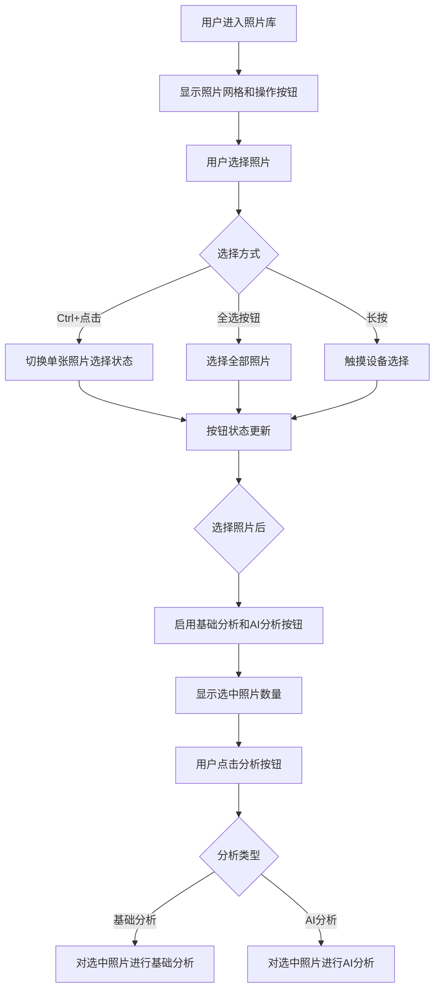
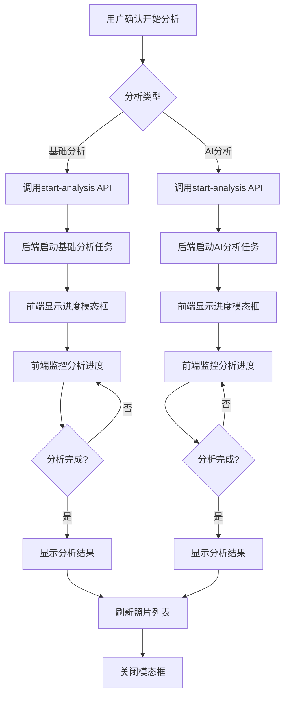

# 家庭版智能照片系统 - 选择智能处理功能详细设计文档

## 一、文档基础信息

| 项目名称 | 家庭版智能照片系统 | 文档类型 | 选择智能处理功能详细设计文档 |
| -------- | ------------------------- | -------- | ----------------------------- |
| 文档版本 | V1.0 | 文档状态 | ☑ 草稿 □ 评审中 □ 已确认 □ 已归档 |
| 编写人 | AI助手 | 编写日期 | 2025年9月20日 |
| 关联文档 | 《照片管理模块详细设计文档》《智能分析模块详细设计文档》《前端界面设计文档》 | | |

## 二、功能概述

### 2.1 功能目标

选择智能处理功能是照片管理模块的核心功能之一，允许用户在照片展示区选择特定的照片进行智能分析处理。该功能支持两种分析类型：基础分析（质量评估、EXIF标签）和AI分析（内容识别、智能标签），提供精细化的处理控制。

### 2.2 设计原则

- **用户自主性**：用户完全控制要处理哪些照片
- **灵活性**：支持选择处理和重新处理
- **透明性**：清晰显示照片的处理状态
- **高效性**：对选中照片进行批量处理
- **安全性**：确保处理过程的稳定性和数据完整性

### 2.3 功能范围

- ✅ 照片选择功能（Ctrl+点击或长按多选、全选）
- ✅ 状态显示功能（未处理/处理中/已处理标识）
- ✅ 智能处理功能（基础分析和AI分析按钮）
- ✅ 进度显示功能（实时处理进度）
- ✅ 结果反馈功能（处理结果展示）
- ✅ 错误处理功能（异常情况处理）

## 三、技术架构

### 3.1 技术栈

- **前端框架**：原生JavaScript ES6+ + Bootstrap 5.3.0
- **后端框架**：Python + FastAPI + Pydantic
- **数据库**：SQLite + SQLAlchemy 2.x
- **AI服务**：DashScope Qwen-VL API
- **异步处理**：asyncio + BackgroundTasks

### 3.2 系统架构

```
┌─────────────────┐    ┌─────────────────┐    ┌─────────────────┐
│   前端界面      │    │   API接口层     │    │   业务逻辑层     │
│                 │    │                 │    │                 │
│ • 照片选择UI    │◄──►│ • /analysis/    │◄──►│ • 分析服务      │
│ • 状态显示      │    │   batch-analyze │    │ • 状态管理      │
│ • 进度条        │    │ • /analysis/    │    │ • 任务队列      │
│ • 结果展示      │    │   queue/status  │    │                 │
└─────────────────┘    └─────────────────┘    └─────────────────┘
         │                       │                       │
         ▼                       ▼                       ▼
┌─────────────────┐    ┌─────────────────┐    ┌─────────────────┐
│   数据库层      │    │   AI服务层      │    │   文件系统      │
│                 │    │                 │    │                 │
│ • Photo表       │    │ • DashScope     │    │ • 照片文件      │
│ • PhotoAnalysis │    │ • Qwen-VL      │    │ • 临时文件      │
│ • PhotoQuality  │    │                 │    │                 │
└─────────────────┘    └─────────────────┘    └─────────────────┘
```

## 四、功能详细设计

### 4.1 数据模型设计

#### 4.1.1 照片状态模型

```javascript
// 前端照片状态判断逻辑
function getProcessingStatus(photo) {
    // 处理中状态 - 优先级最高
    if (photo.status === 'processing') {
        return {
            status: 'processing',
            icon: '⏳',
            text: '分析中',
            className: 'status-processing',
            canProcess: false
        };
    }

    // 已处理状态 - 有分析记录
    if (photo.analysis || photo.quality) {
        return {
            status: 'completed',
            icon: '✅',
            text: '已分析',
            className: 'status-completed',
            canProcess: true  // 支持重新处理
        };
    }

    // 未处理状态 - 默认状态
    return {
        status: 'unprocessed',
        icon: '🤖',
        text: '未分析',
        className: 'status-unprocessed',
        canProcess: true
    };
}
```

#### 4.1.2 处理结果数据结构

```typescript
interface ProcessingResult {
    total_photos: number;
    processed_photos: number;
    successful_photos: number;
    failed_photos: number;
    skipped_photos: number;
    progress_percentage: number;
    status: 'processing' | 'completed' | 'failed';
    errors: string[];
    start_time: string;
    end_time?: string;
}
```

### 4.2 界面设计

#### 4.2.1 照片卡片设计（实际实现）

**选择机制**：通过Ctrl+点击（桌面）或长按（触摸设备）进行多选

```html
<!-- 照片卡片模板（实际实现） -->
<div class="photo-card selectable" data-photo-id="123">
    <!-- 图片容器 -->
    <div class="photo-image-container">
        
        <div class="photo-overlay">
            <button class="btn btn-light btn-sm" data-photo-id="123" data-action="view" title="查看详情">
                <i class="bi bi-eye"></i>
            </button>
            <button class="btn btn-warning btn-sm" data-photo-id="123" data-action="edit" title="编辑">
                <i class="bi bi-pencil"></i>
            </button>
            <button class="btn btn-danger btn-sm" data-photo-id="123" data-action="delete" title="删除">
                <i class="bi bi-trash"></i>
            </button>
            <button class="btn btn-info btn-sm" data-photo-id="123" data-action="similar" title="相似照片">
                <i class="bi bi-search"></i>
            </button>
        </div>
    </div>

    <!-- 信息区域 -->
    <div class="photo-info">
        <div class="photo-header">
            <div class="photo-title">photo_123.jpg</div>
            <div class="photo-quality-container">
                <i class="bi bi-star quality-icon quality-assessed" data-level="good" title="质量评估：良好"></i>
                <i class="bi bi-robot ai-status-icon ai-analyzed" title="已完成AI分析"></i>
            </div>
        </div>
        <div class="photo-meta">
            <i class="bi bi-calendar me-1"></i>2024-01-15 (拍摄日期)
        </div>
        <div class="photo-tags">
            <span class="photo-tag">标签1</span>
            <span class="photo-tag">标签2</span>
        </div>
    </div>
</div>
```

**选择状态样式**：
```css
.photo-card.selected {
    box-shadow: 0 0 0 3px #007bff;
    transform: scale(0.98);
}
```

#### 4.2.2 照片展示区操作按钮（实际实现）

**触发方式**：通过照片展示区下方的操作按钮栏，选择照片后按钮被启用

```html
<!-- 照片展示区操作按钮栏 -->
<div class="btn-group" role="group">
    <button class="btn btn-sm btn-outline-secondary" id="selectAllBtn">全选</button>
    <button class="btn btn-sm btn-outline-secondary" id="clearSelectionBtn">取消选择</button>
    <button class="btn btn-sm btn-warning" id="basicProcessSelectedBtn" disabled>
        <i class="bi bi-graph-up"></i> 基础分析
    </button>
    <button class="btn btn-sm btn-primary" id="aiProcessSelectedBtn" disabled>
        <i class="bi bi-robot"></i> AI分析
    </button>
    <button class="btn btn-sm btn-outline-danger" id="deleteSelectedBtn" disabled>
        <i class="bi bi-trash"></i> 删除选中
    </button>
</div>
```

**处理机制**：
1. 用户选择照片 → 按钮状态更新（显示选中数量）
2. 点击"基础分析"按钮 → 对选中照片进行基础分析
3. 点击"AI分析"按钮 → 对选中照片进行AI分析
4. 按钮只在选中照片后才能使用

#### 4.2.3 处理进度模态框设计

```html
<!-- 处理进度模态框 -->
<div class="modal fade" id="batchProcessModal" tabindex="-1">
    <div class="modal-dialog modal-lg">
        <div class="modal-content">
            <div class="modal-header">
                <h5 class="modal-title">智能处理进度</h5>
                <button type="button" class="btn-close" data-bs-dismiss="modal"></button>
            </div>
            <div class="modal-body">
                <!-- 处理统计 -->
                <div class="processing-stats mb-3">
                    <div class="row text-center">
                        <div class="col-3">
                            <div class="stat-card">
                                <div class="stat-number" id="totalPhotos">0</div>
                                <div class="stat-label">总照片</div>
                            </div>
                        </div>
                        <div class="col-3">
                            <div class="stat-card">
                                <div class="stat-number text-success" id="processedPhotos">0</div>
                                <div class="stat-label">已处理</div>
                            </div>
                        </div>
                        <div class="col-3">
                            <div class="stat-card">
                                <div class="stat-number text-warning" id="pendingPhotos">0</div>
                                <div class="stat-label">待处理</div>
                            </div>
                        </div>
                        <div class="col-3">
                            <div class="stat-card">
                                <div class="stat-number text-danger" id="failedPhotos">0</div>
                                <div class="stat-label">失败</div>
                            </div>
                        </div>
                    </div>
                </div>

                <!-- 进度条 -->
                <div class="progress mb-3">
                    <div class="progress-bar progress-bar-striped progress-bar-animated"
                         id="processingProgressBar"
                         style="width: 0%"></div>
                </div>

                <!-- 状态信息 -->
                <div class="processing-status">
                    <div class="alert alert-info">
                        <i class="bi bi-info-circle me-2"></i>
                        <span id="processingStatus">正在准备智能处理...</span>
                    </div>
                </div>

                <!-- 详细日志 -->
                <div class="processing-details" style="display: none;">
                    <h6>处理详情</h6>
                    <div class="processing-log" id="processingLog" style="max-height: 200px; overflow-y: auto;">
                        <!-- 动态添加处理日志 -->
                    </div>
                </div>
            </div>
            <div class="modal-footer">
                <button type="button" class="btn btn-secondary" data-bs-dismiss="modal">
                    <i class="bi bi-x-lg me-1"></i> 取消
                </button>
                <button type="button" class="btn btn-primary" id="confirmProcessBtn">
                    <i class="bi bi-play-fill me-1"></i> 开始处理
                </button>
            </div>
        </div>
    </div>
</div>
```

### 4.3 交互流程设计

#### 4.3.1 选择照片处理流程（实际实现）



#### 4.3.2 智能分析处理流程（实际实现）



### 4.4 API接口设计

#### 4.4.1 条件分析接口（实际使用）

```python
@router.post("/start-analysis")
async def start_analysis(
    request: AnalysisRequest,
    background_tasks: BackgroundTasks,
    db: Session = Depends(get_db)
) -> AnalysisResponse:
    """
    开始条件分析（支持对选中照片进行批量处理）

    请求参数：
    - photo_ids: List[int] - 要处理的照片ID列表（用户选中的照片）
    - analysis_types: List[str] - 分析类型 ['quality'] 或 ['content']
    - force_reprocess: bool - 是否强制重新处理（默认False）

    返回：
    - task_id: str - 任务ID
    - total_photos: int - 选中照片数
    - analysis_types: List[str] - 分析类型
    - message: str - 响应消息
    """
```

#### 4.4.2 分析状态查询接口

```python
@router.get("/task-status/{task_id}")
async def get_analysis_task_status(
    task_id: str,
    initial_total: Optional[int] = None,
    db: Session = Depends(get_db)
) -> TaskStatusResponse:
    """
    获取分析任务状态

    参数：
    - task_id: str - 任务ID
    - initial_total: int - 初始照片总数（用于进度计算）

    返回：
    - status: str - 任务状态
    - total_photos: int - 总照片数
    - completed_photos: int - 已完成照片数
    - progress_percentage: float - 进度百分比
    """
```

#### 4.4.3 批量状态查询接口（已实现）

```python
@router.post("/batch-status")
async def get_analysis_batch_status(
    request: BatchStatusRequest,
    db: Session = Depends(get_db)
):
    """
    批量查询分析任务状态（解决并发查询过多问题）

    请求参数：
    - task_ids: List[str] - 任务ID列表
    - initial_totals: Dict[str, int] - 各任务初始照片数

    返回：
    - overall_status: str - 总体状态
    - overall_progress_percentage: float - 总体进度
    - task_details: List - 各任务详情
    """
```

### 4.5 核心功能实现

#### 4.5.1 选择照片功能（实际实现）

```javascript
// PhotoManager类 - 照片选择管理器
class PhotoManager {
    constructor() {
        this.selectedPhotos = new Set();
    }

    // 切换照片选择状态
    togglePhotoSelection(photoId) {
        const photoIdNum = typeof photoId === 'string' ? parseInt(photoId) : photoId;

        if (this.selectedPhotos.has(photoIdNum)) {
            this.selectedPhotos.delete(photoIdNum);
        } else {
            this.selectedPhotos.add(photoIdNum);
        }

        this.updateSelectionUI();
    }

    // 更新选择UI
    updateSelectionUI() {
        const selectedCount = this.selectedPhotos.size;

        // 更新照片卡片选中状态
        document.querySelectorAll('.photo-card').forEach(card => {
            const photoId = parseInt(card.getAttribute('data-photo-id'));
            if (this.selectedPhotos.has(photoId)) {
                card.classList.add('selected');
            } else {
                card.classList.remove('selected');
            }
        });

        // 更新按钮状态
        const basicBtn = document.getElementById('basicProcessSelectedBtn');
        const aiBtn = document.getElementById('aiProcessSelectedBtn');

        if (selectedCount > 0) {
            basicBtn.disabled = false;
            aiBtn.disabled = false;
            basicBtn.innerHTML = `<i class="bi bi-graph-up"></i> 基础分析 (${selectedCount})`;
            aiBtn.innerHTML = `<i class="bi bi-robot"></i> AI分析 (${selectedCount})`;
        } else {
            basicBtn.disabled = true;
            aiBtn.disabled = true;
            basicBtn.innerHTML = `<i class="bi bi-graph-up"></i> 基础分析`;
            aiBtn.innerHTML = `<i class="bi bi-robot"></i> AI分析`;
        }
    }
}
```

#### 4.5.2 智能处理功能（实际实现）

```javascript
// 基础分析按钮点击处理
if (window.elements.basicProcessSelectedBtn) {
    window.elements.basicProcessSelectedBtn.addEventListener('click', () => {
        if (window.PhotoManager && window.PhotoManager.selectedPhotos.size > 0) {
            const selectedIds = Array.from(window.PhotoManager.selectedPhotos);
            processSelectedPhotosBasic(selectedIds);
        } else {
            showWarning('请先选择要处理的照片');
        }
    });
}

// AI分析按钮点击处理
if (window.elements.aiProcessSelectedBtn) {
    window.elements.aiProcessSelectedBtn.addEventListener('click', () => {
        if (window.PhotoManager && window.PhotoManager.selectedPhotos.size > 0) {
            const selectedIds = Array.from(window.PhotoManager.selectedPhotos);
            processSelectedPhotosAI(selectedIds);
        } else {
            showWarning('请先选择要处理的照片');
        }
    });
}

// 处理选中照片的基础分析
window.processSelectedPhotosBasic = async (photoIds) => {
    const modalHtml = `
        <div class="modal fade" id="selectedBasicProcessModal">
            <div class="modal-dialog">
                <div class="modal-content">
                    <div class="modal-header">
                        <h5 class="modal-title">基础分析确认</h5>
                        <button type="button" class="btn-close" data-bs-dismiss="modal"></button>
                    </div>
                    <div class="modal-body">
                        <div class="alert alert-info">
                            基础分析将对选中的 ${photoIds.length} 张照片进行质量评估，生成时间、EXIF等基础标签
                        </div>
                    </div>
                    <div class="modal-footer">
                        <button type="button" class="btn btn-secondary" data-bs-dismiss="modal">取消</button>
                        <button type="button" class="btn btn-primary" onclick="startSelectedBasicProcessing(${JSON.stringify(photoIds).replace(/"/g, '&quot;')})">
                            开始基础分析
                        </button>
                    </div>
                </div>
            </div>
        </div>
    `;

    document.body.insertAdjacentHTML('beforeend', modalHtml);
    const modal = new bootstrap.Modal(document.getElementById('selectedBasicProcessModal'));
    modal.show();
};

// 处理选中照片的AI分析
window.processSelectedPhotosAI = async (photoIds) => {
    const modalHtml = `
        <div class="modal fade" id="selectedAIProcessModal">
            <div class="modal-dialog">
                <div class="modal-content">
                    <div class="modal-header">
                        <h5 class="modal-title">AI分析确认</h5>
                        <button type="button" class="btn-close" data-bs-dismiss="modal"></button>
                    </div>
                    <div class="modal-body">
                        <div class="alert alert-info">
                            AI分析将对选中的 ${photoIds.length} 张照片进行内容识别，生成智能标签
                        </div>
                    </div>
                    <div class="modal-footer">
                        <button type="button" class="btn btn-secondary" data-bs-dismiss="modal">取消</button>
                        <button type="button" class="btn btn-primary" onclick="startSelectedAIAnalysis(${JSON.stringify(photoIds).replace(/"/g, '&quot;')})">
                            开始AI分析
                        </button>
                    </div>
                </div>
            </div>
        </div>
    `;

    document.body.insertAdjacentHTML('beforeend', modalHtml);
    const modal = new bootstrap.Modal(document.getElementById('selectedAIProcessModal'));
    modal.show();
};
```

## 九、总结

### 9.1 功能价值

选择智能处理功能是照片管理系统的核心功能之一，为用户提供了精细化的智能分析控制：

1. **精确选择**：用户可以选择特定的照片进行分析，避免不必要的处理
2. **双重分析**：支持基础分析（质量评估、EXIF标签）和AI分析（内容识别、智能标签）
3. **批量处理**：对选中的多张照片进行批量分析，提高效率
4. **状态透明**：清晰显示照片的处理状态和选择状态
5. **用户友好**：直观的界面交互，支持多选和全选操作

### 9.2 技术亮点

1. **选择机制**：支持Ctrl+点击和长按两种选择方式，适配桌面和触摸设备
2. **状态同步**：选择状态与按钮状态实时同步，提供即时的用户反馈
3. **模态交互**：使用确认模态框确保用户明确知晓要进行的操作
4. **API集成**：与后端start-analysis接口无缝集成，支持条件分析
5. **错误处理**：完善的错误处理和用户提示机制

### 9.3 与导航栏分析的区别

| 功能 | 导航栏分析 | 选择智能处理 |
|------|-----------|-------------|
| 触发方式 | 导航栏按钮 | 选择照片后按钮启用 |
| 处理范围 | 所有待分析照片 | 用户选中的特定照片 |
| 用户控制 | 自动批量处理 | 精确选择控制 |
| 适用场景 | 初次导入后批量分析 | 补充分析或重新分析 |

### 9.4 总结

选择智能处理功能通过精确的选择机制和双重分析类型，为用户提供了灵活、高效的照片智能分析体验。该功能不仅提升了用户对照片处理的控制力，还通过直观的界面设计确保了良好的用户体验。

---

**文档状态**：已同步实际实现
**最后更新**：2025年9月27日
**版本号**：V1.1

**更新说明**：
- 修正了选择机制的描述，从导航栏触发改为照片选择后按钮启用
- 更新了界面设计，反映实际的操作按钮布局
- 补充了与导航栏分析功能的区别说明
- 同步了实际的交互流程和API调用方式

