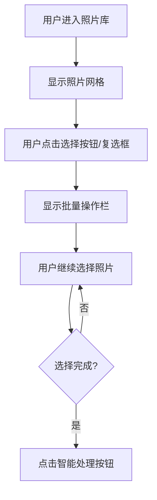
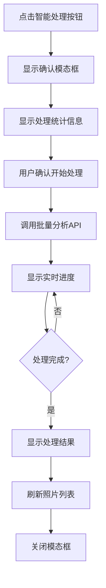

# 家庭版智能照片系统 - 选择智能处理功能详细设计文档

## 一、文档基础信息

| 项目名称 | 家庭版智能照片系统 | 文档类型 | 选择智能处理功能详细设计文档 |
| -------- | ------------------------- | -------- | ----------------------------- |
| 文档版本 | V1.0 | 文档状态 | ☑ 草稿 □ 评审中 □ 已确认 □ 已归档 |
| 编写人 | AI助手 | 编写日期 | 2025年9月20日 |
| 关联文档 | 《照片管理模块详细设计文档》《智能分析模块详细设计文档》《前端界面设计文档》 | | |

## 二、功能概述

### 2.1 功能目标

选择智能处理功能是照片管理模块的重要扩展功能，允许用户选择特定的照片进行智能分析处理。与导航栏的全量智能处理不同，该功能提供更精细化的处理控制，支持用户根据需要选择性地处理照片，包括重新处理已分析的照片。

### 2.2 设计原则

- **用户自主性**：用户完全控制要处理哪些照片
- **灵活性**：支持选择处理和重新处理
- **透明性**：清晰显示照片的处理状态
- **高效性**：批量处理提升效率
- **安全性**：确保处理过程的稳定性和数据完整性

### 2.3 功能范围

- ✅ 照片选择功能（复选框、多选、全选）
- ✅ 状态显示功能（未处理/处理中/已处理标识）
- ✅ 智能处理功能（批量AI分析）
- ✅ 进度显示功能（实时处理进度）
- ✅ 结果反馈功能（处理结果展示）
- ✅ 错误处理功能（异常情况处理）

## 三、技术架构

### 3.1 技术栈

- **前端框架**：原生JavaScript ES6+ + Bootstrap 5.3.0
- **后端框架**：Python + FastAPI + Pydantic
- **数据库**：SQLite + SQLAlchemy 2.x
- **AI服务**：DashScope Qwen-VL API
- **异步处理**：asyncio + BackgroundTasks

### 3.2 系统架构

```
┌─────────────────┐    ┌─────────────────┐    ┌─────────────────┐
│   前端界面      │    │   API接口层     │    │   业务逻辑层     │
│                 │    │                 │    │                 │
│ • 照片选择UI    │◄──►│ • /analysis/    │◄──►│ • 分析服务      │
│ • 状态显示      │    │   batch-analyze │    │ • 状态管理      │
│ • 进度条        │    │ • /analysis/    │    │ • 任务队列      │
│ • 结果展示      │    │   queue/status  │    │                 │
└─────────────────┘    └─────────────────┘    └─────────────────┘
         │                       │                       │
         ▼                       ▼                       ▼
┌─────────────────┐    ┌─────────────────┐    ┌─────────────────┐
│   数据库层      │    │   AI服务层      │    │   文件系统      │
│                 │    │                 │    │                 │
│ • Photo表       │    │ • DashScope     │    │ • 照片文件      │
│ • PhotoAnalysis │    │ • Qwen-VL      │    │ • 临时文件      │
│ • PhotoQuality  │    │                 │    │                 │
└─────────────────┘    └─────────────────┘    └─────────────────┘
```

## 四、功能详细设计

### 4.1 数据模型设计

#### 4.1.1 照片状态模型

```javascript
// 前端照片状态判断逻辑
function getProcessingStatus(photo) {
    // 处理中状态 - 优先级最高
    if (photo.status === 'processing') {
        return {
            status: 'processing',
            icon: '⏳',
            text: '分析中',
            className: 'status-processing',
            canProcess: false
        };
    }

    // 已处理状态 - 有分析记录
    if (photo.analysis || photo.quality) {
        return {
            status: 'completed',
            icon: '✅',
            text: '已分析',
            className: 'status-completed',
            canProcess: true  // 支持重新处理
        };
    }

    // 未处理状态 - 默认状态
    return {
        status: 'unprocessed',
        icon: '🤖',
        text: '未分析',
        className: 'status-unprocessed',
        canProcess: true
    };
}
```

#### 4.1.2 处理结果数据结构

```typescript
interface ProcessingResult {
    total_photos: number;
    processed_photos: number;
    successful_photos: number;
    failed_photos: number;
    skipped_photos: number;
    progress_percentage: number;
    status: 'processing' | 'completed' | 'failed';
    errors: string[];
    start_time: string;
    end_time?: string;
}
```

### 4.2 界面设计

#### 4.2.1 照片卡片设计

```html
<!-- 照片卡片模板 -->
<div class="photo-card selectable" data-photo-id="123">
    <!-- 选择框 -->
    <div class="photo-select-overlay">
        <input type="checkbox" class="photo-checkbox" id="photo-123">
        <label for="photo-123" class="photo-select-label"></label>
    </div>

    <!-- 状态标识 -->
    <div class="photo-status-badge status-unprocessed">
        <i class="bi bi-robot"></i>
        <span>未分析</span>
    </div>

    <!-- 图片容器 -->
    <div class="photo-image-container">
        
    </div>

    <!-- 信息区域 -->
    <div class="photo-info">
        <div class="photo-title">photo_123.jpg</div>
        <div class="photo-meta">2024-01-15 14:30</div>
    </div>
</div>
```

#### 4.2.2 批量操作栏设计

```html
<!-- 批量操作栏 -->
<div class="batch-actions-bar" id="batchActionsBar" style="display: none;">
    <div class="container-fluid">
        <div class="row align-items-center">
            <div class="col-md-4">
                <span class="selected-count">
                    已选择 <strong id="selectedCount">0</strong> 张照片
                </span>
                <span class="status-summary" id="statusSummary"></span>
            </div>
            <div class="col-md-8 text-end">
                <button type="button" class="btn btn-outline-secondary me-2" onclick="clearSelection()">
                    <i class="bi bi-x-lg"></i> 取消选择
                </button>
                <button type="button" class="btn btn-primary me-2" onclick="processSelectedPhotos()">
                    <i class="bi bi-robot"></i> 智能处理所选
                </button>
                <button type="button" class="btn btn-outline-primary" onclick="reprocessSelectedPhotos()">
                    <i class="bi bi-arrow-repeat"></i> 重新处理所选
                </button>
            </div>
        </div>
    </div>
</div>
```

#### 4.2.3 处理进度模态框设计

```html
<!-- 处理进度模态框 -->
<div class="modal fade" id="batchProcessModal" tabindex="-1">
    <div class="modal-dialog modal-lg">
        <div class="modal-content">
            <div class="modal-header">
                <h5 class="modal-title">智能处理进度</h5>
                <button type="button" class="btn-close" data-bs-dismiss="modal"></button>
            </div>
            <div class="modal-body">
                <!-- 处理统计 -->
                <div class="processing-stats mb-3">
                    <div class="row text-center">
                        <div class="col-3">
                            <div class="stat-card">
                                <div class="stat-number" id="totalPhotos">0</div>
                                <div class="stat-label">总照片</div>
                            </div>
                        </div>
                        <div class="col-3">
                            <div class="stat-card">
                                <div class="stat-number text-success" id="processedPhotos">0</div>
                                <div class="stat-label">已处理</div>
                            </div>
                        </div>
                        <div class="col-3">
                            <div class="stat-card">
                                <div class="stat-number text-warning" id="pendingPhotos">0</div>
                                <div class="stat-label">待处理</div>
                            </div>
                        </div>
                        <div class="col-3">
                            <div class="stat-card">
                                <div class="stat-number text-danger" id="failedPhotos">0</div>
                                <div class="stat-label">失败</div>
                            </div>
                        </div>
                    </div>
                </div>

                <!-- 进度条 -->
                <div class="progress mb-3">
                    <div class="progress-bar progress-bar-striped progress-bar-animated"
                         id="processingProgressBar"
                         style="width: 0%"></div>
                </div>

                <!-- 状态信息 -->
                <div class="processing-status">
                    <div class="alert alert-info">
                        <i class="bi bi-info-circle me-2"></i>
                        <span id="processingStatus">正在准备智能处理...</span>
                    </div>
                </div>

                <!-- 详细日志 -->
                <div class="processing-details" style="display: none;">
                    <h6>处理详情</h6>
                    <div class="processing-log" id="processingLog" style="max-height: 200px; overflow-y: auto;">
                        <!-- 动态添加处理日志 -->
                    </div>
                </div>
            </div>
            <div class="modal-footer">
                <button type="button" class="btn btn-secondary" data-bs-dismiss="modal">
                    <i class="bi bi-x-lg me-1"></i> 取消
                </button>
                <button type="button" class="btn btn-primary" id="confirmProcessBtn">
                    <i class="bi bi-play-fill me-1"></i> 开始处理
                </button>
            </div>
        </div>
    </div>
</div>
```

### 4.3 交互流程设计

#### 4.3.1 选择照片流程



#### 4.3.2 智能处理流程



### 4.4 API接口设计

#### 4.4.1 批量智能处理接口

```python
@app.post("/analysis/batch-analyze")
async def batch_analyze_photos(
    request: BatchAnalysisRequest,
    background_tasks: BackgroundTasks,
    db: Session = Depends(get_db)
) -> BatchAnalysisResponse:
    """
    批量智能处理照片

    请求参数：
    - photo_ids: List[int] - 要处理的照片ID列表
    - analysis_types: List[str] - 分析类型 ['content', 'quality', 'duplicate']
    - force_reprocess: bool - 是否强制重新处理（默认False）

    返回：
    - task_id: str - 任务ID
    - total_photos: int - 总照片数
    - message: str - 响应消息
    """
```

#### 4.4.2 处理状态查询接口

```python
@app.get("/analysis/queue/status")
async def get_analysis_queue_status(
    initial_total: int = Query(..., description="初始总照片数")
) -> AnalysisStatusResponse:
    """
    获取智能处理队列状态

    返回：
    - is_complete: bool - 是否处理完成
    - batch_total_photos: int - 批量总照片数
    - batch_completed_photos: int - 已完成照片数
    - processing_photos: int - 正在处理照片数
    - progress_percentage: float - 进度百分比
    - errors: List[str] - 错误列表
    """
```

### 4.5 核心功能实现

#### 4.5.1 照片选择功能

```javascript
class PhotoSelector {
    constructor() {
        this.selectedPhotos = new Set();
        this.initializeEventListeners();
    }

    // 初始化事件监听器
    initializeEventListeners() {
        // 监听复选框变化
        document.addEventListener('change', (e) => {
            if (e.target.classList.contains('photo-checkbox')) {
                this.togglePhotoSelection(e.target.dataset.photoId, e.target.checked);
            }
        });

        // 监听全选按钮
        const selectAllBtn = document.getElementById('selectAllBtn');
        if (selectAllBtn) {
            selectAllBtn.addEventListener('click', () => this.toggleSelectAll());
        }
    }

    // 切换单张照片选择状态
    togglePhotoSelection(photoId, isSelected) {
        const photoCard = document.querySelector(`[data-photo-id="${photoId}"]`);

        if (isSelected) {
            this.selectedPhotos.add(parseInt(photoId));
            photoCard?.classList.add('selected');
        } else {
            this.selectedPhotos.delete(parseInt(photoId));
            photoCard?.classList.remove('selected');
        }

        this.updateUI();
    }

    // 全选/取消全选
    toggleSelectAll() {
        const allPhotoCards = document.querySelectorAll('.photo-card[data-photo-id]');
        const allSelected = allPhotoCards.length === this.selectedPhotos.size;

        if (allSelected) {
            // 取消全选
            this.clearSelection();
        } else {
            // 全选
            allPhotoCards.forEach(card => {
                const photoId = parseInt(card.dataset.photoId);
                this.selectedPhotos.add(photoId);
                card.classList.add('selected');
                const checkbox = card.querySelector('.photo-checkbox');
                if (checkbox) checkbox.checked = true;
            });
        }

        this.updateUI();
    }

    // 取消选择
    clearSelection() {
        this.selectedPhotos.clear();
        document.querySelectorAll('.photo-card.selected').forEach(card => {
            card.classList.remove('selected');
            const checkbox = card.querySelector('.photo-checkbox');
            if (checkbox) checkbox.checked = false;
        });
        this.updateUI();
    }

    // 更新UI状态
    updateUI() {
        const selectedCount = this.selectedPhotos.size;
        const batchActionsBar = document.getElementById('batchActionsBar');

        if (selectedCount > 0) {
            // 显示批量操作栏
            batchActionsBar.style.display = 'block';
            document.getElementById('selectedCount').textContent = selectedCount;

            // 更新状态统计
            this.updateStatusSummary();
        } else {
            // 隐藏批量操作栏
            batchActionsBar.style.display = 'none';
        }

        // 更新全选按钮状态
        this.updateSelectAllButton();
    }

    // 更新状态统计
    updateStatusSummary() {
        const statusCounts = {
            unprocessed: 0,
            processing: 0,
            completed: 0
        };

        this.selectedPhotos.forEach(photoId => {
            const photo = this.getPhotoById(photoId);
            if (photo) {
                const status = getProcessingStatus(photo).status;
                statusCounts[status]++;
            }
        });

        const summaryParts = [];
        if (statusCounts.unprocessed > 0) {
            summaryParts.push(`${statusCounts.unprocessed}张未分析`);
        }
        if (statusCounts.processing > 0) {
            summaryParts.push(`${statusCounts.processing}张分析中`);
        }
        if (statusCounts.completed > 0) {
            summaryParts.push(`${statusCounts.completed}张已分析`);
        }

        document.getElementById('statusSummary').textContent =
            summaryParts.length > 0 ? ` (${summaryParts.join(', ')})` : '';
    }

    // 更新全选按钮
    updateSelectAllButton() {
        const selectAllBtn = document.getElementById('selectAllBtn');
        if (selectAllBtn) {
            const totalPhotos = document.querySelectorAll('.photo-card[data-photo-id]').length;
            const allSelected = totalPhotos === this.selectedPhotos.size && totalPhotos > 0;

            selectAllBtn.textContent = allSelected ? '取消全选' : '全选';
        }
    }

    // 获取选中的照片ID列表
    getSelectedPhotoIds() {
        return Array.from(this.selectedPhotos);
    }
}
```

#### 4.5.2 智能处理功能

```javascript
class BatchProcessor {
    constructor() {
        this.photoSelector = new PhotoSelector();
    }

    // 处理选中的照片
    async processSelectedPhotos(forceReprocess = false) {
        const selectedIds = this.photoSelector.getSelectedPhotoIds();

        if (selectedIds.length === 0) {
            showWarning('请先选择要处理的照片');
            return;
        }

        // 显示确认模态框
        await this.showProcessConfirmation(selectedIds, forceReprocess);
    }

    // 显示处理确认模态框
    async showProcessConfirmation(photoIds, forceReprocess) {
        const stats = await this.getProcessingStats(photoIds);

        const modalHtml = `
            <div class="modal fade" id="processConfirmationModal" tabindex="-1">
                <div class="modal-dialog">
                    <div class="modal-content">
                        <div class="modal-header">
                            <h5 class="modal-title">
                                ${forceReprocess ? '重新处理' : '智能处理'}确认
                            </h5>
                            <button type="button" class="btn-close" data-bs-dismiss="modal"></button>
                        </div>
                        <div class="modal-body">
                            <div class="alert alert-info">
                                <i class="bi bi-info-circle me-2"></i>
                                ${forceReprocess ?
                                    '将对选中的照片重新进行智能分析，原有的分析结果将被覆盖。' :
                                    '将对选中的照片进行智能分析，已分析的照片将被跳过。'
                                }
                            </div>

                            <div class="processing-preview">
                                <h6>处理统计：</h6>
                                <div class="row text-center">
                                    <div class="col-4">
                                        <div class="stat-item">
                                            <div class="stat-value">${stats.total}</div>
                                            <div class="stat-label">总照片</div>
                                        </div>
                                    </div>
                                    <div class="col-4">
                                        <div class="stat-item">
                                            <div class="stat-value text-success">${stats.toProcess}</div>
                                            <div class="stat-label">将处理</div>
                                        </div>
                                    </div>
                                    <div class="col-4">
                                        <div class="stat-item">
                                            <div class="stat-value text-warning">${stats.skip}</div>
                                            <div class="stat-label">将跳过</div>
                                        </div>
                                    </div>
                                </div>
                            </div>
                        </div>
                        <div class="modal-footer">
                            <button type="button" class="btn btn-secondary" data-bs-dismiss="modal">
                                取消
                            </button>
                            <button type="button" class="btn btn-primary" onclick="startBatchProcessing(${JSON.stringify(photoIds)}, ${forceReprocess})">
                                <i class="bi bi-play-fill me-1"></i> 开始处理
                            </button>
                        </div>
                    </div>
                </div>
            </div>
        `;

        // 显示模态框
        document.body.insertAdjacentHTML('beforeend', modalHtml);
        const modal = new bootstrap.Modal(document.getElementById('processConfirmationModal'));
        modal.show();

        // 模态框关闭时清理DOM
        document.getElementById('processConfirmationModal').addEventListener('hidden.bs.modal', function() {
            this.remove();
        });
    }

    // 获取处理统计信息
    async getProcessingStats(photoIds) {
        const stats = {
            total: photoIds.length,
            toProcess: 0,
            skip: 0
        };

        // 获取照片详情来判断状态
        for (const photoId of photoIds) {
            const photo = await this.getPhotoDetails(photoId);
            if (photo) {
                const status = getProcessingStatus(photo).status;
                if (status === 'unprocessed' || status === 'processing') {
                    stats.toProcess++;
                } else {
                    stats.skip++;
                }
            }
        }

        return stats;
    }

    // 开始批量处理
    async startBatchProcessing(photoIds, forceReprocess) {
        // 关闭确认模态框
        const confirmModal = bootstrap.Modal.getInstance(document.getElementById('processConfirmationModal'));
        if (confirmModal) {
            confirmModal.hide();
        }

        // 显示处理进度模态框
        this.showProcessingModal();

        try {
            // 调用批量分析API
            const response = await fetch(`${CONFIG.API_BASE_URL}/analysis/batch-analyze`, {
                method: 'POST',
                headers: {
                    'Content-Type': 'application/json'
                },
                body: JSON.stringify({
                    photo_ids: photoIds,
                    analysis_types: ['content', 'quality', 'duplicate'],
                    force_reprocess: forceReprocess
                })
            });

            if (!response.ok) {
                throw new Error('批量分析请求失败');
            }

            const result = await response.json();

            if (result.success && result.data.task_id) {
                // 开始监控处理进度
                await this.monitorProcessingProgress(result.data.task_id, result.data.total_photos);
            } else {
                throw new Error(result.message || '批量分析启动失败');
            }

        } catch (error) {
            console.error('批量处理启动失败:', error);
            showError('批量处理启动失败: ' + error.message);
            this.hideProcessingModal();
        }
    }

    // 显示处理进度模态框
    showProcessingModal() {
        const modalHtml = `
            <div class="modal fade" id="processingModal" tabindex="-1" data-bs-backdrop="static">
                <div class="modal-dialog modal-lg">
                    <div class="modal-content">
                        <div class="modal-header">
                            <h5 class="modal-title">智能处理进度</h5>
                        </div>
                        <div class="modal-body">
                            <div class="progress mb-3">
                                <div class="progress-bar progress-bar-striped progress-bar-animated"
                                     style="width: 0%"></div>
                            </div>
                            <div class="processing-status">
                                <div class="alert alert-info">
                                    <i class="bi bi-info-circle me-2"></i>
                                    <span>正在准备智能处理...</span>
                                </div>
                            </div>
                        </div>
                    </div>
                </div>
            </div>
        `;

        document.body.insertAdjacentHTML('beforeend', modalHtml);
        const modal = new bootstrap.Modal(document.getElementById('processingModal'));
        modal.show();
    }

    // 隐藏处理进度模态框
    hideProcessingModal() {
        const modal = bootstrap.Modal.getInstance(document.getElementById('processingModal'));
        if (modal) {
            modal.hide();
            document.getElementById('processingModal').remove();
        }
    }

    // 监控处理进度
    async monitorProcessingProgress(taskId, totalPhotos) {
        const progressBar = document.querySelector('#processingModal .progress-bar');
        const statusText = document.querySelector('#processingModal .processing-status span');

        const checkProgress = async () => {
            try {
                const response = await fetch(`${CONFIG.API_BASE_URL}/analysis/queue/status?initial_total=${totalPhotos}`);
                const status = await response.json();

                if (status.is_complete) {
                    // 处理完成
                    progressBar.style.width = '100%';
                    statusText.textContent = '智能处理完成！';

                    // 延迟关闭模态框
                    setTimeout(() => {
                        this.hideProcessingModal();
                        // 刷新照片列表
                        loadPhotos();
                        // 取消照片选择
                        this.photoSelector.clearSelection();
                    }, 2000);
                } else {
                    // 更新进度
                    const progress = Math.min(status.progress_percentage || 0, 95);
                    progressBar.style.width = `${progress}%`;
                    statusText.textContent = `正在处理... ${Math.round(progress)}% (${status.batch_completed_photos}/${status.batch_total_photos})`;

                    // 继续监控
                    setTimeout(checkProgress, 1000);
                }
            } catch (error) {
                console.error('进度检查失败:', error);
                statusText.textContent = '进度检查失败，正在重试...';
                setTimeout(checkProgress, 2000);
            }
        };

        // 开始监控
        checkProgress();
    }
}

// 全局实例
window.BatchProcessor = new BatchProcessor();

// 便捷函数
window.processSelectedPhotos = () => window.BatchProcessor.processSelectedPhotos(false);
window.reprocessSelectedPhotos = () => window.BatchProcessor.processSelectedPhotos(true);
window.clearSelection = () => window.BatchProcessor.photoSelector.clearSelection();
```

## 五、样式设计

### 5.1 CSS样式定义

```css
/* 照片选择相关样式 */
.photo-card.selectable {
    position: relative;
    transition: all 0.2s ease;
}

.photo-card.selectable.selected {
    box-shadow: 0 0 0 3px #007bff;
    transform: scale(0.98);
}

.photo-select-overlay {
    position: absolute;
    top: 8px;
    left: 8px;
    z-index: 10;
    opacity: 0;
    transition: opacity 0.2s ease;
}

.photo-card:hover .photo-select-overlay,
.photo-card.selected .photo-select-overlay {
    opacity: 1;
}

.photo-checkbox {
    width: 20px;
    height: 20px;
    border-radius: 4px;
    border: 2px solid #fff;
    background: rgba(0, 123, 255, 0.9);
    appearance: none;
    cursor: pointer;
}

.photo-checkbox:checked {
    background: #007bff;
}

.photo-checkbox:checked::after {
    content: '✓';
    color: white;
    font-size: 12px;
    font-weight: bold;
    position: absolute;
    top: 50%;
    left: 50%;
    transform: translate(-50%, -50%);
}

/* 状态标识样式 */
.photo-status-badge {
    position: absolute;
    top: 8px;
    right: 8px;
    padding: 4px 8px;
    border-radius: 12px;
    font-size: 12px;
    font-weight: 500;
    z-index: 5;
    display: flex;
    align-items: center;
    gap: 4px;
}

.photo-status-badge.status-unprocessed {
    background: #fff3cd;
    color: #856404;
    border: 1px solid #ffeaa7;
}

.photo-status-badge.status-processing {
    background: #d1ecf1;
    color: #0c5460;
    border: 1px solid #bee5eb;
}

.photo-status-badge.status-completed {
    background: #d4edda;
    color: #155724;
    border: 1px solid #c3e6cb;
}

/* 批量操作栏样式 */
.batch-actions-bar {
    background: #f8f9fa;
    border-bottom: 1px solid #dee2e6;
    padding: 12px 0;
    position: sticky;
    top: 0;
    z-index: 100;
}

.selected-count {
    font-size: 14px;
    color: #495057;
}

.status-summary {
    font-size: 12px;
    color: #6c757d;
    margin-left: 8px;
}

/* 处理进度模态框样式 */
.processing-stats .stat-card {
    padding: 16px;
    background: #f8f9fa;
    border-radius: 8px;
    margin-bottom: 16px;
}

.processing-stats .stat-number {
    font-size: 24px;
    font-weight: bold;
    color: #495057;
}

.processing-stats .stat-label {
    font-size: 12px;
    color: #6c757d;
    text-transform: uppercase;
    letter-spacing: 0.5px;
}

/* 响应式设计 */
@media (max-width: 768px) {
    .batch-actions-bar .row {
        flex-direction: column;
        gap: 12px;
    }

    .batch-actions-bar .text-end {
        text-align: center !important;
    }

    .photo-status-badge {
        font-size: 11px;
        padding: 3px 6px;
    }
}
```

## 六、测试策略

### 6.1 功能测试

#### 6.1.1 单元测试
- ✅ 照片选择功能测试
- ✅ 状态判断逻辑测试
- ✅ API调用测试
- ✅ 错误处理测试

#### 6.1.2 集成测试
- ✅ 选择处理完整流程测试
- ✅ 重新处理功能测试
- ✅ 批量操作测试
- ✅ 进度显示测试

#### 6.1.3 用户体验测试
- ✅ 界面响应速度测试
- ✅ 操作流畅性测试
- ✅ 错误提示准确性测试

### 6.2 性能测试

#### 6.2.1 并发处理测试
- 大量照片选择处理性能
- 多用户同时操作性能
- 内存使用情况测试

#### 6.2.2 网络条件测试
- 弱网络环境测试
- 网络中断恢复测试
- API超时处理测试

## 七、部署和维护

### 7.1 部署要求

#### 7.1.1 系统要求
- **操作系统**：Windows 10+ / macOS 10.15+ / Ubuntu 18.04+
- **内存**：最低4GB，推荐8GB+
- **存储**：根据照片库大小而定
- **网络**：稳定的互联网连接（用于AI分析）

#### 7.1.2 软件依赖
- **Python**：3.8+
- **Node.js**：16+（前端构建）
- **数据库**：SQLite 3.0+
- **AI服务**：DashScope API密钥

### 7.2 维护策略

#### 7.2.1 监控指标
- 处理成功率
- 平均处理时间
- 用户操作统计
- 系统资源使用

#### 7.2.2 日志管理
- 操作日志记录
- 错误日志分析
- 性能监控日志
- 用户行为日志

#### 7.2.3 备份策略
- 数据库定期备份
- 配置信息备份
- 日志文件轮转

## 八、风险评估和应对

### 8.1 技术风险

#### 8.1.1 API调用风险
- **风险**：AI服务调用失败或超时
- **应对**：实现重试机制、错误处理、降级策略

#### 8.1.2 并发处理风险
- **风险**：大量并发请求导致系统负载过高
- **应对**：实现请求队列、限流控制、资源监控

#### 8.1.3 数据一致性风险
- **风险**：处理过程中数据状态不一致
- **应对**：实现事务管理、状态同步、数据校验

### 8.2 业务风险

#### 8.2.1 用户操作风险
- **风险**：用户误操作导致数据丢失
- **应对**：实现操作确认、撤销机制、数据备份

#### 8.2.2 功能可用性风险
- **风险**：核心功能不可用影响用户体验
- **应对**：实现降级方案、状态监控、健康检查

## 九、总结

### 9.1 功能价值

选择智能处理功能为家庭版智能照片系统提供了以下价值：

1. **用户自主性**：用户可以精确控制要处理的照片
2. **处理效率**：支持批量处理，提升操作效率
3. **状态透明**：清晰显示照片处理状态
4. **灵活性**：支持选择处理和重新处理
5. **体验优化**：直观友好的交互界面

### 9.2 技术亮点

1. **前端架构**：模块化设计，组件复用性强
2. **状态管理**：实时状态同步，数据一致性保证
3. **用户体验**：响应式设计，交互流畅
4. **错误处理**：完善的异常处理和用户提示
5. **性能优化**：异步处理，资源合理利用

### 9.3 后续规划

#### 9.3.1 短期优化（V1.1）
- 智能过滤功能（只显示未处理的照片）
- 处理历史记录
- 自定义分析类型选择

#### 9.3.2 中期扩展（V2.0）
- 智能推荐功能（根据照片特征推荐处理）
- 批量操作模板
- 处理结果对比

#### 9.3.3 长期规划（V3.0）
- 机器学习优化（学习用户处理偏好）
- 云端处理支持
- 多设备同步

---

**文档状态**：草稿
**最后更新**：2025年9月20日
**版本号**：V1.0
