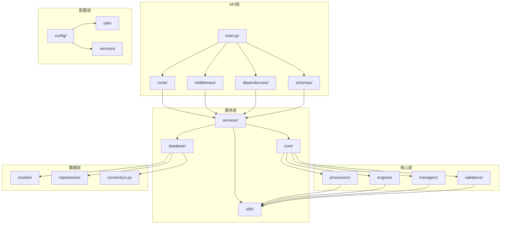

# 通用技术规范详细设计文档

## 一、文档基础信息

| 模块名称 | 通用技术规范详细设计                                      | 文档类型 | 技术规范文档                     |
| -------- | ------------------------------------------------------------ | -------- | --------------------------------- |
| 文档版本 | V1.0                                                         | 文档状态 | ☑ 草稿 □ 评审中 □ 已确认 □ 已归档 |
| 编写人   | AI助手                                                       | 编写日期 | 2025年9月                         |
| 适用范围 | 通用项目开发                                                 | 文档性质 | 技术指导文档 |

## 二、文档说明

本文档详细描述了通用项目的技术规范，包括代码组织规范、命名规范、代码风格、模块依赖关系、配置文件规范、日志规范、测试规范、部署规范等。通过统一的技术规范，确保代码的可维护性、可扩展性和团队协作效率。

## 三、代码组织规范

### 1. 模块组织原则

#### **单一职责原则**
- 每个模块只负责一个特定的功能领域
- 模块内部功能紧密相关，外部接口清晰
- 避免模块间的循环依赖

#### **分层架构原则**
- **前端层**：Vue 3.x + Composition API + Element Plus（Web项目）
- **API层**：FastAPI + Pydantic处理HTTP请求和响应（后端项目）
- **服务层**：业务逻辑处理和服务编排
- **核心层**：核心功能模块和算法实现
- **数据层**：数据存储、缓存和持久化

#### **依赖倒置原则**
- 高层模块不依赖低层模块
- 通过接口和抽象类定义依赖关系
- 使用依赖注入管理模块依赖
- 核心模块允许跨包导入，通过依赖注入管理复杂依赖

#### **分层职责规范**
```
入口层（main.py）
├── 允许跨包导入：from config.config_manager import ConfigManager
├── 允许同包导入：from api.main import create_app
└── 负责配置管理和应用启动

API层（api/目录）
├── 允许跨包导入：from config.path_manager import PathManager
├── 允许相对导入：from ..core.processor import Processor
├── 允许同包导入：from .routes import router
└── 负责依赖创建和注入

核心层（core/目录）
├── 允许跨包导入：from data.vector_store import VectorStore
├── 允许相对导入：from .config_integration import ConfigIntegration
├── 允许第三方库导入：import requests
└── 通过依赖注入接收外部依赖

工具层（utils/目录）
├── 允许标准库导入：import hashlib, import time
├── 允许第三方库导入：import re
└── 提供通用工具函数
```

### 2. 模块职责划分

#### **核心模块职责**
- **Processor**：业务逻辑处理、流程编排、结果整合
- **Engine**：核心算法实现、多策略处理
- **Manager**：资源管理、状态管理、生命周期管理
- **Service**：外部服务调用、接口封装、错误处理
- **Validator**：数据验证、格式检查、业务规则验证

#### **支持模块职责**
- **ConfigIntegration**：配置加载、验证、热更新
- **DataIntegration**：数据源集成、数据转换、缓存管理
- **ContextManager**：上下文管理、状态维护、会话管理
- **LogManager**：日志管理、日志配置、日志分析
- **Pydantic模型**：数据定义、验证、序列化
- **异常处理**：异常定义、错误分类、用户友好提示

## 四、前端技术规范

### 1. 前端技术栈选择策略

#### **技术栈选择原则**
根据项目规模、团队技术栈、开发周期和维护成本等因素，项目支持两种前端技术栈：

**🏆 推荐技术栈（适用于大型复杂项目）**：
- Vue 3.x + Element Plus + TypeScript
- 适用于：大型Web应用、复杂交互、多人协作开发

**⚡ 轻量技术栈（适用于中小型项目）**：
- 原生HTML/CSS/JavaScript + Bootstrap
- 适用于：单机版应用、快速原型开发、维护成本敏感项目

**当前项目采用：轻量技术栈（原生HTML/CSS/JavaScript + Bootstrap）**

### 2. Vue 3.x技术栈规范

#### **适用场景**
- 大型Web应用开发
- 复杂的前端交互逻辑
- 多组件复用的业务场景
- 需要类型安全和IDE支持的项目

#### **技术栈组成**
- **Vue 3.x**：使用Composition API和现代Vue 3特性
- **Element Plus**：UI组件库，提供统一的界面组件
- **Axios**：HTTP客户端，处理API请求
- **Vite**：构建工具，提供快速的开发体验
- **TypeScript**：类型安全，提高代码质量

#### **组件设计规范**
- **组件分离**：按功能职责分离组件，单一职责原则
- **Props定义**：使用TypeScript定义清晰的Props接口
- **事件处理**：使用emit定义组件间通信
- **响应式数据**：使用ref和computed管理组件状态
- **生命周期**：合理使用onMounted等生命周期钩子

#### **代码组织规范**
```
frontend/src/
├── components/          # 可复用组件
│   ├── Common/         # 通用组件
│   ├── Business/       # 业务组件
│   └── Layout/         # 布局组件
├── views/              # 页面组件
│   ├── Home.vue
│   └── About.vue
├── services/           # API服务
│   └── api.js
├── utils/              # 工具函数
├── stores/             # 状态管理
└── assets/             # 静态资源
```

### 3. 原生HTML/CSS/JavaScript技术栈规范

#### **适用场景**
- 单机版桌面应用
- 快速原型开发和验证
- 维护成本敏感的项目
- 团队前端技术栈相对简单的项目

#### **技术栈组成**
- **HTML5**：语义化标签、响应式设计
- **CSS3**：Flexbox/Grid布局、CSS变量、动画效果
- **JavaScript (ES6+)**：原生JavaScript、异步编程、模块化开发
- **Bootstrap 5**：UI组件库、响应式网格系统、CSS工具类

#### **代码组织规范**
```
static/
├── css/               # 样式文件
│   ├── common.css     # 通用样式
│   ├── components.css # 组件样式
│   ├── pages.css      # 页面样式
│   └── themes.css     # 主题样式
├── js/                # JavaScript文件
│   ├── lib/          # 第三方库
│   ├── utils/        # 工具函数
│   ├── services/     # API服务
│   ├── components/   # 组件脚本
│   └── pages/        # 页面脚本
└── images/           # 静态图片资源
```

#### **组件化实现规范**
- **模块化开发**：使用ES6模块系统组织代码
- **组件封装**：将可复用功能封装为独立的JavaScript类或函数
- **事件委托**：使用事件委托模式处理动态元素的事件
- **状态管理**：使用原生JavaScript实现简单的状态管理
- **模板渲染**：使用模板字符串或简单的模板引擎

### 4. API服务规范

#### **HTTP客户端规范**
根据前端技术栈选择相应的HTTP客户端：

**Vue技术栈**：
- **Axios配置规范**
  - 实例创建：使用axios.create创建专用实例
  - 拦截器：配置请求和响应拦截器
  - 错误处理：统一的错误处理和用户提示
  - 超时设置：合理的请求超时时间
  - 环境配置：支持不同环境的API地址配置

**原生技术栈**：
- **Fetch API规范**
  - 使用原生fetch API或XMLHttpRequest
  - 封装统一的HTTP请求工具类
  - 实现请求拦截和响应处理
  - 支持请求取消和超时控制
  - 处理跨域和认证问题

#### **服务类设计规范**
- **单一职责**：每个服务类负责特定的API功能
- **方法命名**：使用清晰的动词+名词命名
- **参数验证**：在发送请求前验证参数
- **错误处理**：捕获和转换API错误
- **类型安全**：根据技术栈选择相应的类型检查方案

**原生JavaScript服务示例**：
```javascript
class ApiService {
    constructor(baseURL) {
        this.baseURL = baseURL;
    }

    async get(endpoint, params = {}) {
        const url = new URL(endpoint, this.baseURL);
        Object.keys(params).forEach(key =>
            url.searchParams.append(key, params[key])
        );

        const response = await fetch(url, {
            method: 'GET',
            headers: {
                'Content-Type': 'application/json'
            }
        });

        if (!response.ok) {
            throw new Error(`HTTP error! status: ${response.status}`);
        }

        return await response.json();
    }

    async post(endpoint, data = {}) {
        const response = await fetch(`${this.baseURL}${endpoint}`, {
            method: 'POST',
            headers: {
                'Content-Type': 'application/json'
            },
            body: JSON.stringify(data)
        });

        if (!response.ok) {
            throw new Error(`HTTP error! status: ${response.status}`);
        }

        return await response.json();
    }
}
```

## 五、命名规范

### 1. 文件命名规范

#### **Python文件命名**
- 使用小写字母和下划线
- 文件名应清晰表达其功能
- 避免使用缩写和数字开头

**示例**：
- 正确：`query_processor.py`、`text_retrieval.py`、`llm_caller.py`
- 错误：`QueryProcessor.py`、`textRetrieval.py`、`LLMCaller.py`

#### **配置文件命名**
- 使用小写字母和下划线
- 包含配置类型和版本信息
- 便于识别和管理

**示例**：`app_config.json`、`app_config_schema.json`、`app_config_dev.json`

### 2. 类命名规范

#### **类名命名**
- 使用大驼峰命名法（PascalCase）
- 类名应清晰表达其功能和职责
- 避免使用缩写和数字

**示例**：
- 正确：`class QueryProcessor`、`class TextRetrievalEngine`
- 错误：`class query_processor`、`class TextRetrieval`

#### **方法名命名**
- 使用小写字母和下划线
- 方法名应清晰表达其功能
- 动词开头，表达动作

**示例**：
- 正确：`def process_query()`、`def retrieve_text()`、`def generate_answer()`
- 错误：`def Query()`、`def text_retrieval()`、`def answer()`

### 3. 变量命名规范

#### **变量名命名**
- 使用小写字母和下划线
- 变量名应清晰表达其含义
- 避免使用单字母变量名（除了循环变量）

**示例**：
- 正确：`query_text`、`max_results`、`retrieval_results`
- 错误：`qt`、`mr`、`rr`（缩写不清晰）

#### **常量命名**
- 使用大写字母和下划线
- 常量名应清晰表达其含义

**示例**:
```python
MAX_QUERY_LENGTH = 5000
DEFAULT_MAX_RESULTS = 10
SIMILARITY_THRESHOLD = 0.7
API_TIMEOUT = 30
```

## 六、代码风格规范

### 1. Python代码风格

#### **PEP 8规范**
- 遵循PEP 8代码风格指南
- 使用4个空格进行缩进
- 行长度不超过120字符
- 使用空行分隔函数和类

#### **导入规范**

**导入原则**：
- 使用完整的包路径导入，避免手动路径设置
- 项目应安装为Python包，确保导入的透明性
- 无论从项目哪个目录执行Python，导入都应该成功
- 核心模块允许跨包导入，通过依赖注入管理复杂依赖

**标准库导入**：
```python
import os
import sys
from typing import List, Dict, Optional
```

**第三方库导入**：
```python
import fastapi
from pydantic import BaseModel
```

**项目内包导入**：
```python
# ✅ 推荐：使用完整的包路径导入
from app.core.processor import Processor
from app.core.config_integration import ConfigIntegration
from config.config_manager import ConfigManager
from data.vector_store import VectorStore

# ✅ 允许：包内相对导入（同包内）
from .models import RequestModel
from .services import BusinessService
from ..utils import validation_utils
```

**❌ 禁止的导入方式**：
```python
# 错误：手动设置路径
import sys
import os
sys.path.append('../config')
from config_manager import ConfigManager

# 错误：猜测式路径调整
current_dir = os.path.dirname(os.path.abspath(__file__))
config_dir = os.path.join(os.path.dirname(current_dir), 'config')
sys.path.insert(0, config_dir)

# 错误：不完整的包路径
from config_manager import ConfigManager  # 缺少包前缀
```

**项目包安装要求**：
- 项目根目录必须包含`setup.py`文件
- 开发环境执行：`pip install -e .`
- 确保项目在任何子目录下都能正常导入

#### **函数定义规范**
函数定义应遵循以下原则：使用类型注解明确参数和返回值类型，提供完整的文档字符串说明函数用途、参数含义、返回值和可能抛出的异常。函数名应使用动词+名词的形式，参数验证应在函数开始处进行，业务逻辑处理应包含适当的异常处理机制。

**示例**：

```python
def process_query(
    query_text: str,
    query_type: str = "smart",
    max_results: int = 10,
    **kwargs
) -> QueryResult:
    """
    处理用户查询请求
    
    Args:
        query_text: 查询文本
        query_type: 查询类型
        max_results: 最大结果数
        **kwargs: 其他参数
        
    Returns:
        QueryResult: 查询结果
        
    Raises:
        ValueError: 参数错误
        ProcessingError: 处理错误
    """
    # 参数验证
    if not query_text or len(query_text) > MAX_QUERY_LENGTH:
        raise ValueError("查询文本无效或过长")
    
    # 业务逻辑处理
    try:
        result = _execute_query(query_text, query_type, max_results)
        return QueryResult.from_data(result)
    except Exception as e:
        raise ProcessingError(f"查询处理失败: {str(e)}") from e
```

### 2. 注释规范

#### **文档字符串规范**
- 所有公共函数和类必须有文档字符串
- 使用Google风格的文档字符串格式
- 包含参数说明、返回值说明和异常说明

#### **行内注释规范**
- 复杂逻辑必须添加注释
- 注释应解释"为什么"而不是"是什么"
- 注释应与代码保持同步

**正确示例**:
```python
# 由于API的限制，我们需要分批处理
batch_size = min(32, len(candidates))
for i in range(0, len(candidates), batch_size):
    batch = candidates[i:i + batch_size]
    # 处理当前批次
    results.extend(self._process_batch(batch))
```

**错误示例**:
```python
# 处理候选列表
for i in range(0, len(candidates), batch_size):
    batch = candidates[i:i + batch_size]
    results.extend(self._process_batch(batch))
```

### 3. 错误处理规范

#### **异常处理原则**
- 使用具体的异常类型而不是通用Exception
- 提供有意义的错误信息
- 记录详细的错误日志
- 向上层抛出有意义的异常

**正确示例**:
```python
try:
    result = self.service.generate_answer(context)
except ServiceError as e:
    logger.error(f"服务调用失败: {e}")
    raise ProcessingError("答案生成失败，请稍后重试") from e
except ValidationError as e:
    logger.error(f"数据验证失败: {e}")
    raise InvalidInputError(f"输入数据无效: {e}") from e
```

## 七、配置管理规范

### 1. 配置管理架构

#### **配置管理原则**
- **集中管理**：所有配置统一管理，避免配置分散
- **分层配置**：系统级、应用级、环境级配置分离
- **环境隔离**：不同环境使用独立配置文件
- **安全保护**：敏感配置加密存储，权限控制
- **热更新**：支持运行时配置更新，无需重启

#### **配置管理组件**
```
ConfigManager (配置管理器)
├── ConfigLoader (配置加载器)
├── ConfigValidator (配置验证器)
├── EnvironmentManager (环境变量管理器)
├── PathManager (路径管理器)
└── FailureHandler (失败处理器)
```

### 2. 配置文件规范

#### **配置文件结构**
```json
{
    "system": {
        "name": "应用名称",
        "version": "1.0.0",
        "environment": "production",
        "debug": false
    },
    "database": {
        "host": "localhost",
        "port": 5432,
        "name": "app_db",
        "username": "${DB_USERNAME}",
        "password": "${DB_PASSWORD}"
    },
    "api": {
        "base_url": "https://api.example.com",
        "timeout": 30,
        "retry_count": 3
    },
    "logging": {
        "level": "INFO",
        "file_path": "./logs/app.log",
        "max_size": "10MB",
        "backup_count": 5
    },
    "paths": {
        "data_dir": "./data",
        "temp_dir": "./temp",
        "log_dir": "./logs"
    }
}
```

#### **环境变量支持**
- 使用`${VARIABLE_NAME}`语法引用环境变量
- 支持默认值：`${VARIABLE_NAME:default_value}`
- 必需变量检查：启动时验证必需环境变量
- 变量覆盖：环境变量可覆盖配置文件值

### 3. 配置管理实现

#### **ConfigManager核心功能**
配置管理器应提供统一的配置加载、验证、获取和重载功能。主要职责包括：初始化时设置配置路径和状态，加载配置文件时进行格式验证和环境变量处理，提供嵌套键值获取和路径管理功能，支持配置热更新机制。

**核心方法**：
- `load_config()`: 加载并验证配置文件
- `get(key, default)`: 获取配置值，支持嵌套键访问
- `get_path(path_key)`: 获取路径配置并转换为绝对路径
- `reload_config()`: 重新加载配置
  
**示例**:  
```python
class ConfigManager:
    """配置管理器主类"""
    
    def __init__(self, config_path: Optional[str] = None):
        """初始化配置管理器"""
        self.config_path = config_path or self._get_default_config_path()
        self.config_status = {
            'is_loaded': False,
            'is_valid': False,
            'config_path': self.config_path,
            'last_modified_time': 0,
            'config_data': {},
            'config_schema': {}
        }
        self._initialize_managers()
    
    def load_config(self) -> bool:
        """加载配置文件"""
        try:
            # 检查配置文件存在性和可读性
            if not self._validate_config_file():
                return False
            
            # 加载配置数据
            config_data = self._load_config_data()
            
            # 验证配置格式
            if not self._validate_config_format(config_data):
                return False
            
            # 处理环境变量
            self._process_environment_variables(config_data)
            
            # 验证路径配置
            if not self._validate_paths(config_data):
                return False
            
            # 更新配置状态
            self._update_config_status(config_data)
            
            return True
            
        except Exception as e:
            logger.error(f"配置加载失败: {e}")
            return False
    
    def get(self, key: str, default=None):
        """获取配置值"""
        return self._get_nested_value(self.config_status['config_data'], key, default)
    
    def get_path(self, path_key: str) -> str:
        """获取路径配置"""
        path_value = self.get(f"paths.{path_key}")
        if not path_value:
            raise ConfigError(f"路径配置不存在: {path_key}")
        return os.path.abspath(path_value)
    
    def reload_config(self) -> bool:
        """重新加载配置"""
        return self.load_config()
```

#### **环境变量处理**
环境变量处理应检查必需的环境变量是否已设置，并将环境变量值覆盖配置文件中的对应配置项。通过预定义的映射关系，将环境变量值应用到配置数据中，确保敏感信息通过环境变量安全传递。
**示例**：
```python
def _process_environment_variables(self, config_data: Dict):
    """处理环境变量覆盖"""
    # 检查必需环境变量
    required_vars = self._get_required_env_vars()
    for var in required_vars:
        if not os.getenv(var):
            logger.warning(f"必需环境变量未设置: {var}")
    
    # 环境变量覆盖配置值
    self._apply_env_overrides(config_data)

def _apply_env_overrides(self, config_data: Dict):
    """应用环境变量覆盖"""
    env_mappings = {
        'DB_HOST': 'database.host',
        'DB_PORT': 'database.port',
        'API_BASE_URL': 'api.base_url',
        'LOG_LEVEL': 'logging.level'
    }
    
    for env_var, config_key in env_mappings.items():
        env_value = os.getenv(env_var)
        if env_value:
            self._set_nested_value(config_data, config_key, env_value)
```

#### **路径管理**
路径管理负责验证配置中的路径设置，将相对路径转换为绝对路径，并自动创建不存在的目录。路径验证应检查路径的有效性，对于不存在的目录应尝试创建，创建失败时记录错误并返回验证失败状态。
**示例**：
```python
def _validate_paths(self, config_data: Dict) -> bool:
    """验证路径配置"""
    paths_config = config_data.get('paths', {})
    
    for path_key, path_value in paths_config.items():
        # 转换为绝对路径
        abs_path = os.path.abspath(path_value)
        paths_config[path_key] = abs_path
        
        # 检查路径是否存在，不存在则创建
        if not os.path.exists(abs_path):
            try:
                os.makedirs(abs_path, exist_ok=True)
                logger.info(f"创建目录: {abs_path}")
            except Exception as e:
                logger.error(f"创建目录失败: {abs_path}, 错误: {e}")
                return False
    
    return True
```

### 4. 配置安全规范

#### **敏感信息保护**
- 敏感配置（密码、密钥）使用环境变量
- 配置文件不包含明文敏感信息
- 使用加密存储敏感配置
- 配置文件权限设置为600（仅所有者可读写）

#### **配置验证**
- 启动时验证配置完整性
- 验证配置值的有效性和类型
- 提供详细的配置错误提示
- 支持配置模式（JSON Schema）验证

### 5. 配置热更新

#### **热更新机制**
- 监控配置文件修改时间
- 支持运行时重新加载配置
- 提供配置重载API接口
- 记录配置变更日志

#### **热更新实现**
热更新机制通过监控配置文件的修改时间来判断是否需要重新加载配置。当检测到配置文件更新时，自动触发配置重载流程，确保系统能够在不重启的情况下应用新的配置设置。
**示例**：
```python
def check_config_update(self) -> bool:
    """检查配置是否需要更新"""
    if not os.path.exists(self.config_path):
        return False
    
    current_mtime = os.path.getmtime(self.config_path)
    return current_mtime > self.config_status['last_modified_time']

def reload_config_if_needed(self) -> bool:
    """如果需要则重新加载配置"""
    if self.check_config_update():
        logger.info("检测到配置文件更新，重新加载配置")
        return self.reload_config()
    return True
```

## 八、模块依赖关系

### 1. 依赖关系图



### 2. 依赖管理原则

#### **避免循环依赖**
- 模块间不能形成循环依赖
- 使用依赖注入解耦模块
- 通过接口定义依赖关系

#### **依赖层次**
```
API层 → 服务层 → 核心层 → 数据层
  ↓        ↓        ↓        ↓
配置层 → 工具层 → 外部服务 → 数据库
```

#### **外部依赖管理**
- 使用requirements.txt管理Python包依赖
- 使用虚拟环境隔离依赖
- 定期更新依赖版本

#### **项目包依赖管理**
- 项目必须安装为Python包：`pip install -e .`
- 使用`setup.py`定义项目结构和依赖关系
- 确保所有子模块都能通过包路径正确导入
- 避免在代码中使用`sys.path`操作来调整导入路径

## 九、日志规范

### 1. 日志配置

#### **日志级别**
- DEBUG: 详细的调试信息
- INFO: 一般信息
- WARNING: 警告信息
- ERROR: 错误信息
- CRITICAL: 严重错误

#### **日志格式**
```python
import logging

logging.basicConfig(
    level=logging.INFO,
    format='%(asctime)s - %(name)s - %(levelname)s - %(message)s',
    handlers=[
        logging.FileHandler('logs/app.log'),
        logging.StreamHandler()
    ]
)
```

### 2. 日志记录原则

#### **记录内容**
- 系统启动和关闭
- 用户操作和查询
- 错误和异常
- 性能指标
- 配置变更

#### **日志安全**
- 不记录敏感信息（API密钥、用户密码等）
- 记录操作审计信息
- 保护用户隐私

## 十、测试规范

### 1. 测试原则

#### **测试覆盖**
- 单元测试覆盖率 > 80%
- 集成测试覆盖主要功能
- 端到端测试覆盖用户场景

#### **测试数据**
- 使用固定的测试数据
- 测试数据应覆盖各种情况
- 避免测试数据污染

### 2. 测试组织

#### **测试文件命名**
```
test_模块名.py
test_类名.py
test_函数名.py
```

#### **测试类命名**
```python
class TestQueryProcessor:
class TestTextRetrievalEngine:
class TestLLMCaller:
```

#### **测试方法命名**
```python
def test_process_query_success():
def test_process_query_invalid_input():
def test_process_query_timeout():
```

## 十一、部署规范

### 1. 环境管理

#### **环境分类**
- 开发环境 (development)
- 测试环境 (testing)
- 预生产环境 (staging)
- 生产环境 (production)

#### **环境配置**
- 不同环境使用不同的配置文件
- 环境变量覆盖配置文件
- 敏感信息通过环境变量传递

#### **Python环境配置**
- 开发环境：执行`pip install -e .`安装项目包
- 测试环境：确保项目包已正确安装
- 生产环境：通过requirements.txt安装所有依赖
- 验证导入：在任何子目录下都能成功导入项目模块

### 2. 部署流程

#### **部署步骤**
1. 代码构建和测试
2. 镜像构建和推送
3. 配置更新
4. 服务部署
5. 健康检查
6. 流量切换

#### **回滚策略**
- 保留多个版本
- 快速回滚机制
- 回滚验证流程

## 十二、API设计规范

### 1. RESTful API设计原则

#### **URL设计规范**
- 使用名词而非动词：`/users` 而不是 `/getUsers`
- 使用复数形式：`/users` 而不是 `/user`
- 使用小写字母和连字符：`/user-profiles` 而不是 `/userProfiles`
- 避免深层嵌套：`/users/123/posts` 而不是 `/users/123/posts/456/comments`

**正确示例**:
```
GET    /api/v1/users          # 获取用户列表
GET    /api/v1/users/123      # 获取特定用户
POST   /api/v1/users          # 创建用户
PUT    /api/v1/users/123      # 更新用户
DELETE /api/v1/users/123      # 删除用户
```

#### **HTTP方法使用**
- GET：获取资源
- POST：创建资源
- PUT：更新整个资源
- PATCH：部分更新资源
- DELETE：删除资源

### 2. 请求响应规范

#### **请求格式**
API请求应包含标准的请求头信息，如Content-Type、Authorization和请求ID。请求体应使用统一的格式，包含data字段存放业务数据，meta字段存放分页等元信息。
```python
# 请求头规范
{
    "Content-Type": "application/json",
    "Authorization": "Bearer <token>",
    "X-Request-ID": "uuid-string"
}

# 请求体规范
{
    "data": {
        "name": "用户名",
        "email": "user@example.com"
    },
    "meta": {
        "page": 1,
        "limit": 20
    }
}
```

#### **响应格式**
API响应应使用统一的格式结构，成功响应包含success标识、data数据和meta元信息，错误响应包含success标识、error错误信息和meta元信息。所有响应都应包含时间戳和请求ID用于追踪。
```python
# 成功响应
{
    "success": true,
    "data": {
        "id": 123,
        "name": "用户名",
        "email": "user@example.com"
    },
    "meta": {
        "timestamp": "2025-01-01T00:00:00Z",
        "request_id": "uuid-string"
    }
}

# 错误响应
{
    "success": false,
    "error": {
        "code": "VALIDATION_ERROR",
        "message": "输入数据验证失败",
        "details": {
            "email": "邮箱格式不正确"
        }
    },
    "meta": {
        "timestamp": "2025-01-01T00:00:00Z",
        "request_id": "uuid-string"
    }
}
```

### 3. 错误处理规范

#### **HTTP状态码使用**
- 200：成功
- 201：创建成功
- 400：请求参数错误
- 401：未授权
- 403：禁止访问
- 404：资源不存在
- 422：数据验证失败
- 500：服务器内部错误

#### **错误码规范**
```python
# 错误码命名规范
VALIDATION_ERROR = "VALIDATION_ERROR"
AUTHENTICATION_FAILED = "AUTHENTICATION_FAILED"
RESOURCE_NOT_FOUND = "RESOURCE_NOT_FOUND"
PERMISSION_DENIED = "PERMISSION_DENIED"
INTERNAL_SERVER_ERROR = "INTERNAL_SERVER_ERROR"
```
错误码应使用大写字母和下划线命名，如VALIDATION_ERROR、AUTHENTICATION_FAILED、RESOURCE_NOT_FOUND等。错误码应具有明确的含义，便于客户端根据错误码进行相应的处理。

### 4. API版本管理

#### **版本控制策略**
- URL路径版本控制：`/api/v1/users`
- 请求头版本控制：`Accept: application/vnd.api+json;version=1`
- 推荐使用URL路径版本控制，简单直观

#### **版本兼容性**
- 主版本号：不兼容的API变更
- 次版本号：向后兼容的功能新增
- 修订版本号：向后兼容的问题修复

## 十三、版本控制规范

### 1. Git工作流规范

#### **分支命名规范**
- 主分支：`main`（生产环境）
- 开发分支：`develop`（开发环境）
- 功能分支：`feature/功能名称`
- 修复分支：`bugfix/问题描述`
- 发布分支：`release/版本号`
- 热修复分支：`hotfix/问题描述`

**示例**:
```
main
├── develop
│   ├── feature/user-authentication
│   ├── feature/payment-integration
│   └── bugfix/login-validation
├── release/v1.2.0
└── hotfix/critical-security-fix
```

### 2. 提交信息规范

#### **提交信息格式**
```
<类型>(<范围>): <简短描述>

<详细描述>

<相关Issue>
```

#### **提交类型**
- `feat`: 新功能
- `fix`: 修复问题
- `docs`: 文档更新
- `style`: 代码格式调整
- `refactor`: 代码重构
- `test`: 测试相关
- `chore`: 构建过程或辅助工具的变动

**示例**:
```
feat(auth): 添加用户登录功能

- 实现用户名密码登录
- 添加JWT token生成
- 集成Redis会话管理

Closes #123
```

### 3. 代码审查流程

#### **Pull Request规范**
- PR标题清晰描述变更内容
- PR描述包含变更原因和影响范围
- 关联相关Issue
- 添加必要的测试用例
- 更新相关文档

#### **审查要点**
- 代码逻辑正确性
- 代码风格一致性
- 性能和安全考虑
- 测试覆盖率
- 文档完整性

## 十四、文档管理规范

### 1. 文档结构规范

#### **项目文档目录结构**
```
docs/
├── README.md                 # 项目说明
├── CHANGELOG.md             # 变更日志
├── CONTRIBUTING.md          # 贡献指南
├── api/                     # API文档
│   ├── v1/
│   └── v2/
├── design/                  # 设计文档
│   ├── architecture.md
│   └── database.md
├── deployment/              # 部署文档
│   ├── docker.md
│   └── production.md
└── user/                    # 用户文档
    ├── installation.md
    └── usage.md
```

### 2. 文档编写规范

#### **Markdown格式规范**
- 使用标准Markdown语法
- 标题层级不超过6级
- 代码块指定语言类型
- 表格使用标准格式
- 链接使用相对路径

#### **文档内容规范**
- 标题清晰表达内容
- 段落结构合理
- **多用自然语言描述**：优先使用自然语言解释概念、流程和逻辑
- **少用代码示例**：仅在必要时提供简洁的代码示例，避免冗长的代码块
- 代码示例应完整可运行且简洁明了
- 图片使用相对路径
- 及时更新过时信息

#### **自然语言描述原则**
- **概念解释**：使用清晰的自然语言解释技术概念，避免直接贴代码
- **流程说明**：用文字描述业务流程、算法逻辑和系统架构
- **问题分析**：用自然语言分析问题原因和解决方案
- **最佳实践**：用文字总结经验和最佳实践，而非仅展示代码
- **代码示例使用**：仅在以下情况下使用代码示例：
  - 展示关键语法或API用法
  - 提供可复制的配置模板
  - 演示错误和正确的对比
  - 代码示例应控制在20行以内，复杂逻辑用文字说明

### 3. API文档规范

#### **API文档内容**
- 接口概述和用途
- 请求参数详细说明
- 响应格式和示例
- 错误码和错误信息
- 调用示例和SDK

#### **文档生成工具**
- 使用Swagger/OpenAPI规范
- 自动生成API文档
- 支持在线测试
- 版本化管理

### 4. 变更日志管理

#### **CHANGELOG.md格式**
```markdown
# 变更日志

## [1.2.0] - 2025-01-01

### 新增
- 用户认证功能
- API版本管理

### 修复
- 登录验证问题
- 数据查询性能

### 变更
- 数据库连接池配置
- 日志格式调整

## [1.1.0] - 2024-12-15

### 新增
- 基础用户管理
- 数据导入功能
```

## 十五、代码审查规范

### 1. 审查要点

#### **功能正确性**
- 代码逻辑是否正确
- 边界情况是否处理
- 错误处理是否完善

#### **代码质量**
- 代码风格是否规范
- 命名是否清晰
- 注释是否充分
- 导入语句是否规范（使用完整包路径）
- 是否避免了手动路径设置（sys.path操作）

#### **性能和安全**
- 是否有性能问题
- 是否有安全漏洞
- 是否有资源泄漏

### 2. 审查流程

#### **审查步骤**
1. 代码提交
2. 自动化检查
3. 同行审查
4. 问题修复
5. 再次审查
6. 合并代码

## 十六、总结

### 1. 技术规范优势

**代码质量提升**：
- 统一的代码风格
- 完善的注释文档
- 规范的错误处理

**团队协作效率**：
- 清晰的代码结构
- 统一的开发规范
- 便于代码审查

**系统可维护性**：
- 模块化设计
- 清晰的依赖关系
- 完善的文档说明

### 2. 实施建议

**分阶段实施**：
- 第一阶段：建立基础代码规范
- 第二阶段：实施命名和注释规范
- 第三阶段：完善测试和部署规范
- 第四阶段：优化代码审查流程

**持续改进**：
- 定期审查和更新规范
- 收集团队反馈
- 优化开发流程

这个通用技术规范文档为项目开发提供了完整的技术指导，通过统一的命名规范、完善的代码风格、清晰的模块依赖、完善的配置管理和完善的开发流程，确保项目代码的可维护性、可扩展性和团队协作效率，为后续的开发工作奠定了坚实的基础。
