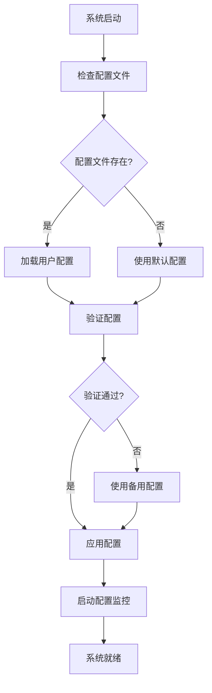
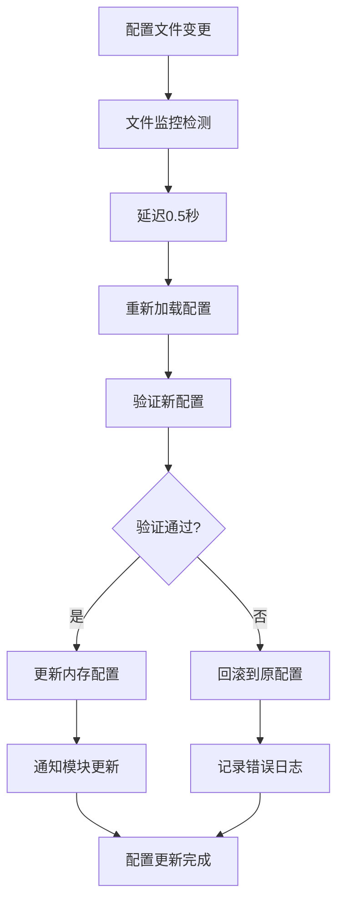
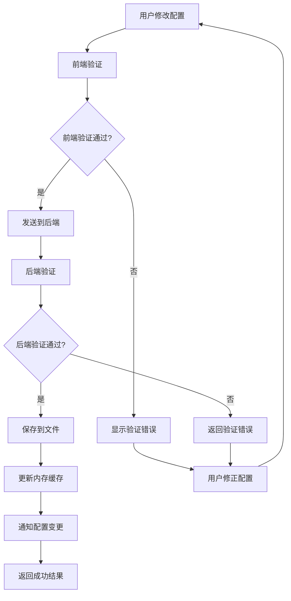
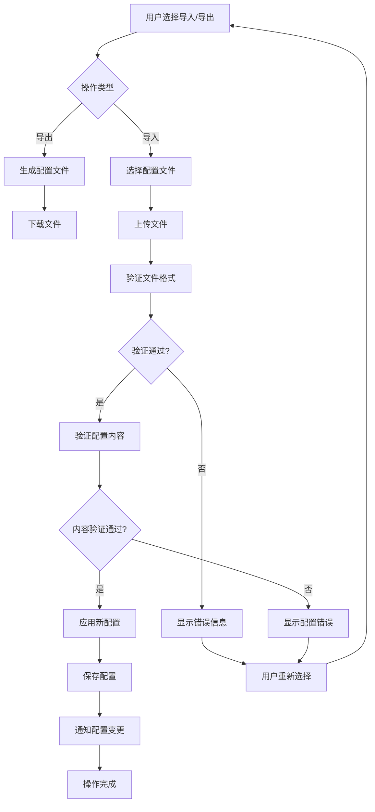
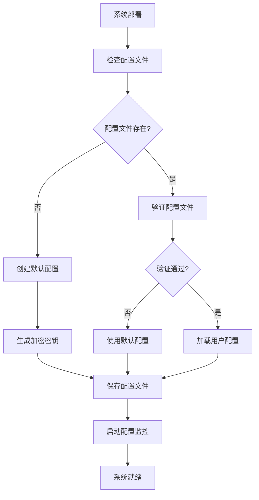
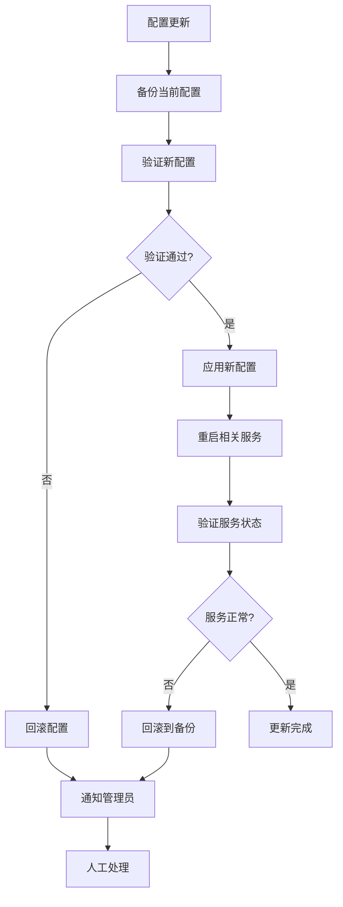

# 家庭单机版智能照片整理系统 - 配置管理模块详细设计文档

## 一、文档基础信息

| 项目名称 | 家庭单机版智能照片整理系统 | 文档类型 | 配置管理模块详细设计文档 |
| -------- | ------------------------- | -------- | ----------------------- |
| 文档版本 | V1.0 | 文档状态 | ☑ 草稿 □ 评审中 □ 已确认 □ 已归档 |
| 编写人 | AI助手 | 编写日期 | 2025年1月19日 |
| 关联文档 | 《家庭单机版简要设计文档》《照片导入模块详细设计文档》《搜索检索模块详细设计文档》《存储管理模块详细设计文档》《智能分析模块详细设计文档》 | | |

## 二、模块概述

### 2.1 模块目标

配置管理模块是家庭照片整理系统的统一配置管理中心，负责系统各模块的配置参数管理、用户设置界面、配置验证和热更新等功能。通过提供统一的配置管理界面，让用户能够方便地调整系统参数，优化系统性能，满足不同使用场景的需求。

### 2.2 设计原则

- **统一管理**：集中管理所有模块的配置参数
- **用户友好**：提供直观的配置界面和操作指引
- **安全可靠**：配置验证和备份恢复机制
- **灵活扩展**：支持新模块配置的快速集成
- **性能优化**：配置热更新，无需重启系统

### 2.3 技术选型

- **配置存储**：JSON配置文件 + 环境变量
- **配置验证**：Pydantic数据验证
- **前端框架**：Bootstrap + JavaScript
- **后端框架**：FastAPI + SQLAlchemy
- **配置热更新**：内存配置缓存 + 文件监控

## 三、配置需求分析

### 3.1 各模块配置需求汇总

基于对各模块文档的分析，系统配置需求如下：

#### 3.1.1 照片导入模块配置需求
**系统基础配置**：
- `max_file_size`: 单文件最大大小（默认50MB）
- `timeout`: 请求超时时间（默认10秒）
- `max_concurrent`: 最大并发数（默认2）
- `temp_file_max_age`: 临时文件最大年龄（默认24小时）

**存储配置**：
- `base_path`: 存储根目录（默认"./photos_storage"）
- `originals_path`: 原图存储路径（默认"originals"）
- `thumbnails_path`: 缩略图存储路径（默认"thumbnails"）
- `temp_path`: 临时文件存储路径（默认"temp"）
- `thumbnail_size`: 缩略图尺寸（默认300px）
- `thumbnail_quality`: 缩略图质量（默认85%）

**分析配置**：
- `duplicate_threshold`: 重复检测阈值（默认5）
- `quality_threshold`: 质量评估阈值（默认0）

#### 3.1.2 搜索检索模块配置需求
**搜索参数配置**：
- `default_page_size`: 默认分页大小（默认20）
- `max_page_size`: 最大分页大小（默认100）
- `search_timeout`: 搜索超时时间（默认5秒）
- `suggestion_limit`: 搜索建议数量限制（默认10）
- `history_limit`: 搜索历史数量限制（默认50）
- `similarity_threshold`: 相似度阈值（默认0.8）

**索引配置**：
- `fts5_tokenize`: FTS5分词器（默认"unicode61"）
- `index_rebuild_interval`: 索引重建间隔（默认3600秒）
- `auto_index_update`: 自动索引更新（默认true）
- `index_optimization`: 索引优化（默认true）

**搜索规则配置**：
- `search_weights`: 搜索字段权重配置
- `search_filters`: 搜索过滤规则配置

#### 3.1.3 存储管理模块配置需求
**存储路径配置**：
- `storage_base_path`: 存储根目录
- `originals_path`: 原始照片存储路径
- `thumbnails_path`: 缩略图存储路径
- `backups_path`: 备份文件存储路径
- `logs_path`: 日志文件存储路径

**备份配置**：
- `backup_enabled`: 是否启用自动备份（默认true）
- `backup_interval`: 备份间隔（默认24小时）
- `backup_retention_days`: 备份保留天数（默认30天）
- `backup_compression`: 备份压缩（默认true）

#### 3.1.4 智能分析模块配置需求
**AI服务配置**：
- `dashscope_api_key`: DashScope API密钥
- `dashscope_model`: 使用的模型（默认"qwen-vl-plus"）
- `analysis_timeout`: 分析超时时间（默认30秒）
- `max_retry_count`: 最大重试次数（默认3）

**分析参数配置**：
- `content_analysis_enabled`: 是否启用内容分析（默认true）
- `quality_analysis_enabled`: 是否启用质量分析（默认true）
- `duplicate_detection_enabled`: 是否启用重复检测（默认true）
- `batch_size`: 批量分析大小（默认10）

#### 3.1.5 系统通用配置需求
**日志配置**：
- `log_level`: 日志级别（默认"INFO"）
- `log_file_path`: 日志文件路径
- `log_max_size`: 日志文件最大大小（默认10MB）
- `log_backup_count`: 日志备份数量（默认5）

**性能配置**：
- `cache_enabled`: 是否启用缓存（默认true）
- `cache_size`: 缓存大小（默认100MB）
- `cache_ttl`: 缓存生存时间（默认3600秒）

## 四、配置架构设计

### 4.1 配置层次结构

```
配置系统
├── 系统级配置 (SystemConfig)
│   ├── 基础配置 (BasicConfig)
│   ├── 性能配置 (PerformanceConfig)
│   └── 日志配置 (LoggingConfig)
├── 模块级配置 (ModuleConfig)
│   ├── 导入配置 (ImportConfig)
│   ├── 搜索配置 (SearchConfig)
│   ├── 存储配置 (StorageConfig)
│   └── 分析配置 (AnalysisConfig)
└── 用户级配置 (UserConfig)
    ├── 界面配置 (UIConfig)
    ├── 偏好配置 (PreferenceConfig)
    └── 个性化配置 (PersonalizationConfig)
```

### 4.2 配置存储策略

#### 4.2.1 配置文件结构
```json
{
  "system": {
    "basic": {
      "max_file_size": 52428800,
      "timeout": 10,
      "max_concurrent": 2,
      "temp_file_max_age": 24
    },
    "performance": {
      "cache_enabled": true,
      "cache_size": 104857600,
      "cache_ttl": 3600
    },
    "logging": {
      "log_level": "INFO",
      "log_file_path": "./logs/app.log",
      "log_max_size": 10485760,
      "log_backup_count": 5
    }
  },
  "modules": {
    "import": {
      "supported_formats": [".jpg", ".jpeg", ".png", ".tiff", ".webp", ".bmp", ".gif"],
      "duplicate_threshold": 5,
      "quality_threshold": 0
    },
    "search": {
      "default_page_size": 20,
      "max_page_size": 100,
      "search_timeout": 5,
      "similarity_threshold": 0.8,
      "search_weights": {
        "filename": 1.0,
        "description": 0.8,
        "scene_type": 0.6,
        "objects": 0.4,
        "activity": 0.4,
        "location_name": 0.3
      }
    },
    "storage": {
      "base_path": "./photos_storage",
      "originals_path": "originals",
      "thumbnails_path": "thumbnails",
      "temp_path": "temp",
      "backups_path": "backups",
      "logs_path": "logs",
      "thumbnail_size": 300,
      "thumbnail_quality": 85
    },
    "analysis": {
      "dashscope_api_key": "",
      "dashscope_model": "qwen-vl-plus",
      "analysis_timeout": 30,
      "max_retry_count": 3,
      "content_analysis_enabled": true,
      "quality_analysis_enabled": true,
      "duplicate_detection_enabled": true,
      "batch_size": 10
    }
  },
  "user": {
    "ui": {
      "theme": "light",
      "language": "zh-CN",
      "default_view": "grid",
      "photos_per_page": 20
    },
    "preferences": {
      "auto_import": false,
      "auto_analysis": true,
      "notifications_enabled": true,
      "backup_enabled": true
    }
  }
}
```

#### 4.2.2 配置加载优先级
1. **环境变量**（最高优先级）
2. **用户配置文件**（`config.json`）
3. **默认配置文件**（`config.default.json`）
4. **代码默认值**（最低优先级）

### 4.3 配置验证机制

#### 4.3.1 Pydantic配置模型
```python
from pydantic import BaseSettings, Field, validator
from typing import List, Dict, Any, Optional

class BasicConfig(BaseSettings):
    """系统基础配置"""
    max_file_size: int = Field(default=52428800, ge=1048576, le=524288000, description="单文件最大大小（字节）")
    timeout: int = Field(default=10, ge=1, le=300, description="请求超时时间（秒）")
    max_concurrent: int = Field(default=2, ge=1, le=10, description="最大并发数")
    temp_file_max_age: int = Field(default=24, ge=1, le=168, description="临时文件最大年龄（小时）")
    
    @validator('max_file_size')
    def validate_file_size(cls, v):
        if v < 1048576:  # 1MB
            raise ValueError('文件大小限制不能小于1MB')
        return v

class ImportConfig(BaseSettings):
    """导入模块配置"""
    supported_formats: List[str] = Field(default=[".jpg", ".jpeg", ".png", ".tiff", ".webp", ".bmp", ".gif"])
    duplicate_threshold: int = Field(default=5, ge=1, le=20, description="重复检测阈值")
    quality_threshold: int = Field(default=0, ge=0, le=100, description="质量评估阈值")
    
    @validator('supported_formats')
    def validate_formats(cls, v):
        if not v:
            raise ValueError('必须至少支持一种图片格式')
        return v

class SearchConfig(BaseSettings):
    """搜索模块配置"""
    default_page_size: int = Field(default=20, ge=1, le=200, description="默认分页大小")
    max_page_size: int = Field(default=100, ge=1, le=500, description="最大分页大小")
    search_timeout: int = Field(default=5, ge=1, le=60, description="搜索超时时间（秒）")
    similarity_threshold: float = Field(default=0.8, ge=0.0, le=1.0, description="相似度阈值")
    search_weights: Dict[str, float] = Field(default={
        "filename": 1.0,
        "description": 0.8,
        "scene_type": 0.6,
        "objects": 0.4,
        "activity": 0.4,
        "location_name": 0.3
    })

class StorageConfig(BaseSettings):
    """存储模块配置"""
    base_path: str = Field(default="./photos_storage", description="存储根目录")
    originals_path: str = Field(default="originals", description="原图存储路径")
    thumbnails_path: str = Field(default="thumbnails", description="缩略图存储路径")
    thumbnail_size: int = Field(default=300, ge=100, le=1000, description="缩略图尺寸")
    thumbnail_quality: int = Field(default=85, ge=1, le=100, description="缩略图质量")
    
    @validator('base_path')
    def validate_base_path(cls, v):
        if not v or not v.strip():
            raise ValueError('存储根目录不能为空')
        return v

class AnalysisConfig(BaseSettings):
    """分析模块配置"""
    dashscope_api_key: str = Field(default="", description="DashScope API密钥")
    dashscope_model: str = Field(default="qwen-vl-plus", description="使用的模型")
    analysis_timeout: int = Field(default=30, ge=5, le=300, description="分析超时时间（秒）")
    max_retry_count: int = Field(default=3, ge=0, le=10, description="最大重试次数")
    content_analysis_enabled: bool = Field(default=True, description="是否启用内容分析")
    quality_analysis_enabled: bool = Field(default=True, description="是否启用质量分析")
    duplicate_detection_enabled: bool = Field(default=True, description="是否启用重复检测")
    batch_size: int = Field(default=10, ge=1, le=50, description="批量分析大小")

class SystemConfig(BaseSettings):
    """系统配置"""
    basic: BasicConfig = Field(default_factory=BasicConfig)
    import_config: ImportConfig = Field(default_factory=ImportConfig)
    search: SearchConfig = Field(default_factory=SearchConfig)
    storage: StorageConfig = Field(default_factory=StorageConfig)
    analysis: AnalysisConfig = Field(default_factory=AnalysisConfig)
    
    class Config:
        env_file = ".env"
        env_file_encoding = "utf-8"
        case_sensitive = False
```

## 五、用户界面设计

### 5.1 配置管理页面结构

#### 5.1.1 页面布局
```html
<!-- 配置管理页面 -->
<div class="container-fluid">
    <div class="row">
        <!-- 侧边栏导航 -->
        <div class="col-md-3">
            <div class="list-group">
                <a href="#system-config" class="list-group-item list-group-item-action active">
                    <i class="bi bi-gear me-2"></i>系统配置
                </a>
                <a href="#import-config" class="list-group-item list-group-item-action">
                    <i class="bi bi-upload me-2"></i>导入配置
                </a>
                <a href="#search-config" class="list-group-item list-group-item-action">
                    <i class="bi bi-search me-2"></i>搜索配置
                </a>
                <a href="#storage-config" class="list-group-item list-group-item-action">
                    <i class="bi bi-hdd me-2"></i>存储配置
                </a>
                <a href="#analysis-config" class="list-group-item list-group-item-action">
                    <i class="bi bi-robot me-2"></i>分析配置
                </a>
                <a href="#user-config" class="list-group-item list-group-item-action">
                    <i class="bi bi-person me-2"></i>用户设置
                </a>
            </div>
        </div>
        
        <!-- 主配置区域 -->
        <div class="col-md-9">
            <div class="config-content">
                <!-- 配置表单内容 -->
            </div>
        </div>
    </div>
</div>
```

#### 5.1.2 系统配置界面
```html
<!-- 系统配置 -->
<div id="system-config" class="config-section">
    <h4><i class="bi bi-gear me-2"></i>系统基础配置</h4>
    
    <div class="row">
        <div class="col-md-6">
            <div class="mb-3">
                <label for="maxFileSize" class="form-label">单文件最大大小</label>
                <div class="input-group">
                    <input type="number" class="form-control" id="maxFileSize" min="1048576" max="524288000">
                    <span class="input-group-text">字节</span>
                </div>
                <div class="form-text">建议值：50MB (52428800字节)</div>
            </div>
        </div>
        
        <div class="col-md-6">
            <div class="mb-3">
                <label for="timeout" class="form-label">请求超时时间</label>
                <div class="input-group">
                    <input type="number" class="form-control" id="timeout" min="1" max="300">
                    <span class="input-group-text">秒</span>
                </div>
                <div class="form-text">建议值：10秒</div>
            </div>
        </div>
    </div>
    
    <div class="row">
        <div class="col-md-6">
            <div class="mb-3">
                <label for="maxConcurrent" class="form-label">最大并发数</label>
                <input type="number" class="form-control" id="maxConcurrent" min="1" max="10">
                <div class="form-text">建议值：2（根据CPU核心数调整）</div>
            </div>
        </div>
        
        <div class="col-md-6">
            <div class="mb-3">
                <label for="tempFileMaxAge" class="form-label">临时文件最大年龄</label>
                <div class="input-group">
                    <input type="number" class="form-control" id="tempFileMaxAge" min="1" max="168">
                    <span class="input-group-text">小时</span>
                </div>
                <div class="form-text">建议值：24小时</div>
            </div>
        </div>
    </div>
</div>
```

#### 5.1.3 导入配置界面
```html
<!-- 导入配置 -->
<div id="import-config" class="config-section d-none">
    <h4><i class="bi bi-upload me-2"></i>导入模块配置</h4>
    
    <div class="mb-3">
        <label class="form-label">支持的图片格式</label>
        <div class="row">
            <div class="col-md-3">
                <div class="form-check">
                    <input class="form-check-input" type="checkbox" id="formatJpg" checked>
                    <label class="form-check-label" for="formatJpg">JPEG (.jpg, .jpeg)</label>
                </div>
            </div>
            <div class="col-md-3">
                <div class="form-check">
                    <input class="form-check-input" type="checkbox" id="formatPng" checked>
                    <label class="form-check-label" for="formatPng">PNG (.png)</label>
                </div>
            </div>
            <div class="col-md-3">
                <div class="form-check">
                    <input class="form-check-input" type="checkbox" id="formatTiff" checked>
                    <label class="form-check-label" for="formatTiff">TIFF (.tiff, .tif)</label>
                </div>
            </div>
            <div class="col-md-3">
                <div class="form-check">
                    <input class="form-check-input" type="checkbox" id="formatWebp" checked>
                    <label class="form-check-label" for="formatWebp">WebP (.webp)</label>
                </div>
            </div>
        </div>
    </div>
    
    <div class="row">
        <div class="col-md-6">
            <div class="mb-3">
                <label for="duplicateThreshold" class="form-label">重复检测阈值</label>
                <input type="range" class="form-range" id="duplicateThreshold" min="1" max="20" value="5">
                <div class="d-flex justify-content-between">
                    <small>1 (严格)</small>
                    <small id="duplicateThresholdValue">5</small>
                    <small>20 (宽松)</small>
                </div>
                <div class="form-text">数值越小，重复检测越严格</div>
            </div>
        </div>
        
        <div class="col-md-6">
            <div class="mb-3">
                <label for="qualityThreshold" class="form-label">质量评估阈值</label>
                <input type="range" class="form-range" id="qualityThreshold" min="0" max="100" value="0">
                <div class="d-flex justify-content-between">
                    <small>0 (最低)</small>
                    <small id="qualityThresholdValue">0</small>
                    <small>100 (最高)</small>
                </div>
                <div class="form-text">低于此阈值的照片将被标记为低质量</div>
            </div>
        </div>
    </div>
</div>
```

#### 5.1.4 搜索配置界面
```html
<!-- 搜索配置 -->
<div id="search-config" class="config-section d-none">
    <h4><i class="bi bi-search me-2"></i>搜索模块配置</h4>
    
    <div class="row">
        <div class="col-md-6">
            <div class="mb-3">
                <label for="defaultPageSize" class="form-label">默认分页大小</label>
                <input type="number" class="form-control" id="defaultPageSize" min="1" max="200" value="20">
                <div class="form-text">建议值：20张照片/页</div>
            </div>
        </div>
        
        <div class="col-md-6">
            <div class="mb-3">
                <label for="maxPageSize" class="form-label">最大分页大小</label>
                <input type="number" class="form-control" id="maxPageSize" min="1" max="500" value="100">
                <div class="form-text">建议值：100张照片/页</div>
            </div>
        </div>
    </div>
    
    <div class="row">
        <div class="col-md-6">
            <div class="mb-3">
                <label for="searchTimeout" class="form-label">搜索超时时间</label>
                <div class="input-group">
                    <input type="number" class="form-control" id="searchTimeout" min="1" max="60" value="5">
                    <span class="input-group-text">秒</span>
                </div>
                <div class="form-text">建议值：5秒</div>
            </div>
        </div>
        
        <div class="col-md-6">
            <div class="mb-3">
                <label for="similarityThreshold" class="form-label">相似度阈值</label>
                <input type="range" class="form-range" id="similarityThreshold" min="0" max="1" step="0.1" value="0.8">
                <div class="d-flex justify-content-between">
                    <small>0.0 (宽松)</small>
                    <small id="similarityThresholdValue">0.8</small>
                    <small>1.0 (严格)</small>
                </div>
                <div class="form-text">用于相似照片搜索的阈值</div>
            </div>
        </div>
    </div>
    
    <div class="mb-3">
        <label class="form-label">搜索字段权重配置</label>
        <div class="row">
            <div class="col-md-6">
                <div class="mb-2">
                    <label for="weightFilename" class="form-label">文件名权重</label>
                    <input type="range" class="form-range" id="weightFilename" min="0" max="2" step="0.1" value="1.0">
                    <small id="weightFilenameValue">1.0</small>
                </div>
                <div class="mb-2">
                    <label for="weightDescription" class="form-label">描述权重</label>
                    <input type="range" class="form-range" id="weightDescription" min="0" max="2" step="0.1" value="0.8">
                    <small id="weightDescriptionValue">0.8</small>
                </div>
            </div>
            <div class="col-md-6">
                <div class="mb-2">
                    <label for="weightSceneType" class="form-label">场景类型权重</label>
                    <input type="range" class="form-range" id="weightSceneType" min="0" max="2" step="0.1" value="0.6">
                    <small id="weightSceneTypeValue">0.6</small>
                </div>
                <div class="mb-2">
                    <label for="weightObjects" class="form-label">对象权重</label>
                    <input type="range" class="form-range" id="weightObjects" min="0" max="2" step="0.1" value="0.4">
                    <small id="weightObjectsValue">0.4</small>
                </div>
            </div>
        </div>
    </div>
</div>
```

#### 5.1.5 存储配置界面
```html
<!-- 存储配置 -->
<div id="storage-config" class="config-section d-none">
    <h4><i class="bi bi-hdd me-2"></i>存储模块配置</h4>
    
    <div class="mb-3">
        <label for="storageBasePath" class="form-label">存储根目录</label>
        <div class="input-group">
            <input type="text" class="form-control" id="storageBasePath" value="./photos_storage">
            <button class="btn btn-outline-secondary" type="button" id="browseStoragePath">
                <i class="bi bi-folder2-open me-1"></i>浏览
            </button>
        </div>
        <div class="form-text">照片存储的根目录路径</div>
    </div>
    
    <div class="row">
        <div class="col-md-6">
            <div class="mb-3">
                <label for="thumbnailSize" class="form-label">缩略图尺寸</label>
                <div class="input-group">
                    <input type="number" class="form-control" id="thumbnailSize" min="100" max="1000" value="300">
                    <span class="input-group-text">像素</span>
                </div>
                <div class="form-text">建议值：300像素</div>
            </div>
        </div>
        
        <div class="col-md-6">
            <div class="mb-3">
                <label for="thumbnailQuality" class="form-label">缩略图质量</label>
                <div class="input-group">
                    <input type="number" class="form-control" id="thumbnailQuality" min="1" max="100" value="85">
                    <span class="input-group-text">%</span>
                </div>
                <div class="form-text">建议值：85%</div>
            </div>
        </div>
    </div>
    
    <div class="mb-3">
        <div class="form-check">
            <input class="form-check-input" type="checkbox" id="backupEnabled" checked>
            <label class="form-check-label" for="backupEnabled">
                启用自动备份
            </label>
        </div>
    </div>
    
    <div id="backupSettings" class="row">
        <div class="col-md-4">
            <div class="mb-3">
                <label for="backupInterval" class="form-label">备份间隔</label>
                <select class="form-select" id="backupInterval">
                    <option value="24">每日</option>
                    <option value="168">每周</option>
                    <option value="720">每月</option>
                </select>
            </div>
        </div>
        
        <div class="col-md-4">
            <div class="mb-3">
                <label for="backupRetentionDays" class="form-label">备份保留天数</label>
                <input type="number" class="form-control" id="backupRetentionDays" min="7" max="365" value="30">
            </div>
        </div>
        
        <div class="col-md-4">
            <div class="mb-3">
                <div class="form-check">
                    <input class="form-check-input" type="checkbox" id="backupCompression" checked>
                    <label class="form-check-label" for="backupCompression">
                        启用压缩
                    </label>
                </div>
            </div>
        </div>
    </div>
</div>
```

#### 5.1.6 分析配置界面
```html
<!-- 分析配置 -->
<div id="analysis-config" class="config-section d-none">
    <h4><i class="bi bi-robot me-2"></i>智能分析配置</h4>
    
    <div class="alert alert-info">
        <i class="bi bi-info-circle me-2"></i>
        <strong>注意：</strong>AI分析功能需要配置有效的API密钥才能正常工作
    </div>
    
    <div class="mb-3">
        <label for="dashscopeApiKey" class="form-label">DashScope API密钥</label>
        <div class="input-group">
            <input type="password" class="form-control" id="dashscopeApiKey" placeholder="请输入您的API密钥">
            <button class="btn btn-outline-secondary" type="button" id="toggleApiKey">
                <i class="bi bi-eye me-1"></i>显示
            </button>
        </div>
        <div class="form-text">
            <a href="https://dashscope.aliyun.com/" target="_blank">获取API密钥</a>
        </div>
    </div>
    
    <div class="row">
        <div class="col-md-6">
            <div class="mb-3">
                <label for="dashscopeModel" class="form-label">使用的模型</label>
                <select class="form-select" id="dashscopeModel">
                    <option value="qwen-vl-plus">Qwen-VL-Plus（推荐）</option>
                    <option value="qwen-vl-chat">Qwen-VL-Chat</option>
                </select>
            </div>
        </div>
        
        <div class="col-md-6">
            <div class="mb-3">
                <label for="analysisTimeout" class="form-label">分析超时时间</label>
                <div class="input-group">
                    <input type="number" class="form-control" id="analysisTimeout" min="5" max="300" value="30">
                    <span class="input-group-text">秒</span>
                </div>
            </div>
        </div>
    </div>
    
    <div class="mb-3">
        <label class="form-label">分析功能开关</label>
        <div class="row">
            <div class="col-md-4">
                <div class="form-check">
                    <input class="form-check-input" type="checkbox" id="contentAnalysisEnabled" checked>
                    <label class="form-check-label" for="contentAnalysisEnabled">
                        内容分析
                    </label>
                </div>
            </div>
            <div class="col-md-4">
                <div class="form-check">
                    <input class="form-check-input" type="checkbox" id="qualityAnalysisEnabled" checked>
                    <label class="form-check-label" for="qualityAnalysisEnabled">
                        质量分析
                    </label>
                </div>
            </div>
            <div class="col-md-4">
                <div class="form-check">
                    <input class="form-check-input" type="checkbox" id="duplicateDetectionEnabled" checked>
                    <label class="form-check-label" for="duplicateDetectionEnabled">
                        重复检测
                    </label>
                </div>
            </div>
        </div>
    </div>
    
    <div class="row">
        <div class="col-md-6">
            <div class="mb-3">
                <label for="batchSize" class="form-label">批量分析大小</label>
                <input type="number" class="form-control" id="batchSize" min="1" max="50" value="10">
                <div class="form-text">建议值：10张照片/批次</div>
            </div>
        </div>
        
        <div class="col-md-6">
            <div class="mb-3">
                <label for="maxRetryCount" class="form-label">最大重试次数</label>
                <input type="number" class="form-control" id="maxRetryCount" min="0" max="10" value="3">
                <div class="form-text">分析失败时的重试次数</div>
            </div>
        </div>
    </div>
    
    <div class="mb-3">
        <button class="btn btn-outline-primary" type="button" id="testApiConnection">
            <i class="bi bi-wifi me-1"></i>测试API连接
        </button>
        <span id="apiTestResult" class="ms-2"></span>
    </div>
</div>
```

#### 5.1.7 用户设置界面
```html
<!-- 用户设置 -->
<div id="user-config" class="config-section d-none">
    <h4><i class="bi bi-person me-2"></i>用户设置</h4>
    
    <div class="row">
        <div class="col-md-6">
            <div class="mb-3">
                <label for="theme" class="form-label">主题</label>
                <select class="form-select" id="theme">
                    <option value="light">浅色主题</option>
                    <option value="dark">深色主题</option>
                    <option value="auto">跟随系统</option>
                </select>
            </div>
        </div>
        
        <div class="col-md-6">
            <div class="mb-3">
                <label for="language" class="form-label">语言</label>
                <select class="form-select" id="language">
                    <option value="zh-CN">简体中文</option>
                    <option value="en-US">English</option>
                </select>
            </div>
        </div>
    </div>
    
    <div class="row">
        <div class="col-md-6">
            <div class="mb-3">
                <label for="defaultView" class="form-label">默认视图</label>
                <select class="form-select" id="defaultView">
                    <option value="grid">网格视图</option>
                    <option value="list">列表视图</option>
                </select>
            </div>
        </div>
        
        <div class="col-md-6">
            <div class="mb-3">
                <label for="photosPerPage" class="form-label">每页显示照片数</label>
                <select class="form-select" id="photosPerPage">
                    <option value="12">12张</option>
                    <option value="20" selected>20张</option>
                    <option value="50">50张</option>
                    <option value="100">100张</option>
                </select>
            </div>
        </div>
    </div>
    
    <div class="mb-3">
        <label class="form-label">功能偏好</label>
        <div class="row">
            <div class="col-md-6">
                <div class="form-check">
                    <input class="form-check-input" type="checkbox" id="autoImport">
                    <label class="form-check-label" for="autoImport">
                        自动导入新照片
                    </label>
                </div>
                <div class="form-check">
                    <input class="form-check-input" type="checkbox" id="autoAnalysis" checked>
                    <label class="form-check-label" for="autoAnalysis">
                        自动分析新照片
                    </label>
                </div>
            </div>
            <div class="col-md-6">
                <div class="form-check">
                    <input class="form-check-input" type="checkbox" id="notificationsEnabled" checked>
                    <label class="form-check-label" for="notificationsEnabled">
                        启用通知
                    </label>
                </div>
                <div class="form-check">
                    <input class="form-check-input" type="checkbox" id="backupEnabled" checked>
                    <label class="form-check-label" for="backupEnabled">
                        启用自动备份
                    </label>
                </div>
            </div>
        </div>
    </div>
</div>
```

### 5.2 配置操作功能

#### 5.2.1 配置保存和重置
```html
<!-- 配置操作按钮 -->
<div class="config-actions mt-4">
    <div class="d-flex justify-content-between">
        <div>
            <button class="btn btn-outline-secondary" type="button" id="resetConfig">
                <i class="bi bi-arrow-clockwise me-1"></i>重置为默认值
            </button>
            <button class="btn btn-outline-info" type="button" id="exportConfig">
                <i class="bi bi-download me-1"></i>导出配置
            </button>
            <button class="btn btn-outline-warning" type="button" id="importConfig">
                <i class="bi bi-upload me-1"></i>导入配置
            </button>
        </div>
        <div>
            <button class="btn btn-primary" type="button" id="saveConfig">
                <i class="bi bi-check-lg me-1"></i>保存配置
            </button>
        </div>
    </div>
</div>
```

#### 5.2.2 配置验证和测试
```html
<!-- 配置验证结果 -->
<div id="configValidation" class="mt-3 d-none">
    <div class="alert alert-danger">
        <h6><i class="bi bi-exclamation-triangle me-2"></i>配置验证失败</h6>
        <ul id="validationErrors" class="mb-0">
            <!-- 验证错误列表 -->
        </ul>
    </div>
</div>

<!-- 配置测试结果 -->
<div id="configTestResult" class="mt-3 d-none">
    <div class="alert alert-info">
        <h6><i class="bi bi-info-circle me-2"></i>配置测试结果</h6>
        <div id="testResultContent">
            <!-- 测试结果内容 -->
        </div>
    </div>
</div>
```

## 六、API接口设计

### 6.1 配置管理API

#### 6.1.1 获取配置接口
```python
@router.get("/config", response_model=SystemConfig)
async def get_config():
    """
    获取当前系统配置
    
    :return: 系统配置对象
    """
    return config_manager.get_config()

@router.get("/config/{module}")
async def get_module_config(module: str):
    """
    获取指定模块配置
    
    :param module: 模块名称 (system, import, search, storage, analysis, user)
    :return: 模块配置对象
    """
    return config_manager.get_module_config(module)
```

#### 6.1.2 更新配置接口
```python
@router.put("/config", response_model=Dict[str, Any])
async def update_config(config_data: Dict[str, Any]):
    """
    更新系统配置
    
    :param config_data: 配置数据
    :return: 更新结果
    """
    try:
        result = config_manager.update_config(config_data)
        return {"success": True, "message": "配置更新成功", "data": result}
    except ValidationError as e:
        return {"success": False, "message": f"配置验证失败: {str(e)}"}
    except Exception as e:
        return {"success": False, "message": f"配置更新失败: {str(e)}"}

@router.put("/config/{module}")
async def update_module_config(module: str, config_data: Dict[str, Any]):
    """
    更新指定模块配置
    
    :param module: 模块名称
    :param config_data: 配置数据
    :return: 更新结果
    """
    try:
        result = config_manager.update_module_config(module, config_data)
        return {"success": True, "message": f"{module}模块配置更新成功", "data": result}
    except ValidationError as e:
        return {"success": False, "message": f"配置验证失败: {str(e)}"}
    except Exception as e:
        return {"success": False, "message": f"配置更新失败: {str(e)}"}
```

#### 6.1.3 配置验证接口
```python
@router.post("/config/validate")
async def validate_config(config_data: Dict[str, Any]):
    """
    验证配置数据
    
    :param config_data: 配置数据
    :return: 验证结果
    """
    try:
        result = config_manager.validate_config(config_data)
        return {"success": True, "valid": True, "message": "配置验证通过"}
    except ValidationError as e:
        return {"success": True, "valid": False, "message": f"配置验证失败: {str(e)}"}

@router.post("/config/test/{module}")
async def test_module_config(module: str, config_data: Dict[str, Any]):
    """
    测试模块配置
    
    :param module: 模块名称
    :param config_data: 配置数据
    :return: 测试结果
    """
    try:
        result = config_manager.test_module_config(module, config_data)
        return {"success": True, "message": f"{module}模块配置测试通过", "data": result}
    except Exception as e:
        return {"success": False, "message": f"配置测试失败: {str(e)}"}
```

#### 6.1.4 配置导入导出接口
```python
@router.get("/config/export")
async def export_config():
    """
    导出配置
    
    :return: 配置文件
    """
    config_data = config_manager.export_config()
    return FileResponse(
        path=config_data["file_path"],
        filename="config.json",
        media_type="application/json"
    )

@router.post("/config/import")
async def import_config(file: UploadFile = File(...)):
    """
    导入配置
    
    :param file: 配置文件
    :return: 导入结果
    """
    try:
        result = config_manager.import_config(file)
        return {"success": True, "message": "配置导入成功", "data": result}
    except Exception as e:
        return {"success": False, "message": f"配置导入失败: {str(e)}"}

@router.post("/config/reset")
async def reset_config():
    """
    重置配置为默认值
    
    :return: 重置结果
    """
    try:
        result = config_manager.reset_config()
        return {"success": True, "message": "配置重置成功", "data": result}
    except Exception as e:
        return {"success": False, "message": f"配置重置失败: {str(e)}"}
```

## 七、配置管理服务实现

### 7.1 配置管理器类

```python
class ConfigManager:
    """配置管理器"""
    
    def __init__(self):
        self.config_file = Path("config.json")
        self.default_config_file = Path("config.default.json")
        self.config_cache = {}
        self.config_watcher = None
        
    def load_config(self) -> SystemConfig:
        """加载配置"""
        try:
            # 1. 加载默认配置
            default_config = self._load_default_config()
            
            # 2. 加载用户配置
            user_config = self._load_user_config()
            
            # 3. 合并配置
            merged_config = self._merge_configs(default_config, user_config)
            
            # 4. 验证配置
            validated_config = self._validate_config(merged_config)
            
            # 5. 缓存配置
            self.config_cache = validated_config.dict()
            
            return validated_config
            
        except Exception as e:
            logger.error(f"配置加载失败: {e}")
            return self._get_fallback_config()
    
    def get_config(self) -> SystemConfig:
        """获取当前配置"""
        if not self.config_cache:
            return self.load_config()
        return SystemConfig(**self.config_cache)
    
    def get_module_config(self, module: str) -> Dict[str, Any]:
        """获取模块配置"""
        config = self.get_config()
        return getattr(config, module, {})
    
    def update_config(self, config_data: Dict[str, Any]) -> Dict[str, Any]:
        """更新配置"""
        try:
            # 1. 验证配置
            validated_config = self._validate_config(config_data)
            
            # 2. 更新缓存
            self.config_cache.update(validated_config.dict())
            
            # 3. 保存到文件
            self._save_config(validated_config)
            
            # 4. 通知配置变更
            self._notify_config_change(validated_config)
            
            return {"message": "配置更新成功"}
            
        except ValidationError as e:
            raise e
        except Exception as e:
            logger.error(f"配置更新失败: {e}")
            raise e
    
    def validate_config(self, config_data: Dict[str, Any]) -> bool:
        """验证配置"""
        try:
            SystemConfig(**config_data)
            return True
        except ValidationError:
            return False
    
    def test_module_config(self, module: str, config_data: Dict[str, Any]) -> Dict[str, Any]:
        """测试模块配置"""
        if module == "analysis":
            return self._test_analysis_config(config_data)
        elif module == "storage":
            return self._test_storage_config(config_data)
        else:
            return {"message": f"{module}模块配置测试通过"}
    
    def export_config(self) -> Dict[str, Any]:
        """导出配置"""
        config = self.get_config()
        export_data = {
            "config": config.dict(),
            "export_time": datetime.now().isoformat(),
            "version": "1.0"
        }
        
        export_file = Path(f"config_export_{datetime.now().strftime('%Y%m%d_%H%M%S')}.json")
        with open(export_file, 'w', encoding='utf-8') as f:
            json.dump(export_data, f, indent=2, ensure_ascii=False)
        
        return {"file_path": str(export_file), "message": "配置导出成功"}
    
    def import_config(self, file: UploadFile) -> Dict[str, Any]:
        """导入配置"""
        try:
            # 1. 读取配置文件
            content = file.file.read()
            import_data = json.loads(content.decode('utf-8'))
            
            # 2. 验证配置
            config_data = import_data.get("config", {})
            validated_config = self._validate_config(config_data)
            
            # 3. 更新配置
            self.update_config(config_data)
            
            return {"message": "配置导入成功"}
            
        except Exception as e:
            logger.error(f"配置导入失败: {e}")
            raise e
    
    def reset_config(self) -> Dict[str, Any]:
        """重置配置"""
        try:
            # 1. 加载默认配置
            default_config = self._load_default_config()
            
            # 2. 更新配置
            self.update_config(default_config.dict())
            
            return {"message": "配置重置成功"}
            
        except Exception as e:
            logger.error(f"配置重置失败: {e}")
            raise e
    
    def _load_default_config(self) -> SystemConfig:
        """加载默认配置"""
        if self.default_config_file.exists():
            with open(self.default_config_file, 'r', encoding='utf-8') as f:
                config_data = json.load(f)
            return SystemConfig(**config_data)
        else:
            return SystemConfig()
    
    def _load_user_config(self) -> Dict[str, Any]:
        """加载用户配置"""
        if self.config_file.exists():
            with open(self.config_file, 'r', encoding='utf-8') as f:
                return json.load(f)
        return {}
    
    def _merge_configs(self, default_config: SystemConfig, user_config: Dict[str, Any]) -> SystemConfig:
        """合并配置"""
        default_dict = default_config.dict()
        merged_dict = self._deep_merge(default_dict, user_config)
        return SystemConfig(**merged_dict)
    
    def _validate_config(self, config_data: Dict[str, Any]) -> SystemConfig:
        """验证配置"""
        return SystemConfig(**config_data)
    
    def _save_config(self, config: SystemConfig):
        """保存配置"""
        with open(self.config_file, 'w', encoding='utf-8') as f:
            json.dump(config.dict(), f, indent=2, ensure_ascii=False)
    
    def _notify_config_change(self, config: SystemConfig):
        """通知配置变更"""
        # 实现配置变更通知逻辑
        pass
    
    def _test_analysis_config(self, config_data: Dict[str, Any]) -> Dict[str, Any]:
        """测试分析配置"""
        api_key = config_data.get("dashscope_api_key", "")
        if not api_key:
            return {"success": False, "message": "API密钥未配置"}
        
        # 测试API连接
        try:
            # 这里应该实现实际的API测试逻辑
            return {"success": True, "message": "API连接测试成功"}
        except Exception as e:
            return {"success": False, "message": f"API连接测试失败: {str(e)}"}
    
    def _test_storage_config(self, config_data: Dict[str, Any]) -> Dict[str, Any]:
        """测试存储配置"""
        base_path = config_data.get("base_path", "")
        if not base_path:
            return {"success": False, "message": "存储路径未配置"}
        
        try:
            # 测试存储路径是否可写
            test_path = Path(base_path) / "test_write"
            test_path.mkdir(parents=True, exist_ok=True)
            test_file = test_path / "test.txt"
            test_file.write_text("test")
            test_file.unlink()
            test_path.rmdir()
            
            return {"success": True, "message": "存储路径测试成功"}
        except Exception as e:
            return {"success": False, "message": f"存储路径测试失败: {str(e)}"}
    
    def _deep_merge(self, dict1: Dict, dict2: Dict) -> Dict:
        """深度合并字典"""
        result = dict1.copy()
        for key, value in dict2.items():
            if key in result and isinstance(result[key], dict) and isinstance(value, dict):
                result[key] = self._deep_merge(result[key], value)
            else:
                result[key] = value
        return result
    
    def _get_fallback_config(self) -> SystemConfig:
        """获取备用配置"""
        return SystemConfig()

# 全局配置管理器实例
config_manager = ConfigManager()
```

### 7.2 配置热更新机制

```python
import asyncio
from watchdog.observers import Observer
from watchdog.events import FileSystemEventHandler

class ConfigFileHandler(FileSystemEventHandler):
    """配置文件监控处理器"""
    
    def __init__(self, config_manager: ConfigManager):
        self.config_manager = config_manager
        self.last_modified = 0
    
    def on_modified(self, event):
        """文件修改事件处理"""
        if event.is_directory:
            return
        
        if event.src_path.endswith('config.json'):
            # 防止重复触发
            current_time = time.time()
            if current_time - self.last_modified < 1:
                return
            self.last_modified = current_time
            
            # 重新加载配置
            asyncio.create_task(self._reload_config())
    
    async def _reload_config(self):
        """重新加载配置"""
        try:
            await asyncio.sleep(0.5)  # 等待文件写入完成
            self.config_manager.load_config()
            logger.info("配置已重新加载")
        except Exception as e:
            logger.error(f"配置重新加载失败: {e}")

class ConfigWatcher:
    """配置监控器"""
    
    def __init__(self, config_manager: ConfigManager):
        self.config_manager = config_manager
        self.observer = Observer()
        self.handler = ConfigFileHandler(config_manager)
    
    def start(self):
        """启动配置监控"""
        watch_path = Path(".").absolute()
        self.observer.schedule(self.handler, str(watch_path), recursive=False)
        self.observer.start()
        logger.info("配置监控已启动")
    
    def stop(self):
        """停止配置监控"""
        self.observer.stop()
        self.observer.join()
        logger.info("配置监控已停止")
```

## 八、前端实现

### 8.1 配置管理JavaScript

```javascript
/**
 * 配置管理前端实现
 */
class ConfigManager {
    constructor() {
        this.currentConfig = {};
        this.originalConfig = {};
        this.init();
    }
    
    init() {
        this.bindEvents();
        this.loadConfig();
    }
    
    bindEvents() {
        // 配置导航
        document.querySelectorAll('.list-group-item').forEach(item => {
            item.addEventListener('click', (e) => {
                e.preventDefault();
                this.showConfigSection(item.getAttribute('href').substring(1));
            });
        });
        
        // 保存配置
        document.getElementById('saveConfig').addEventListener('click', () => {
            this.saveConfig();
        });
        
        // 重置配置
        document.getElementById('resetConfig').addEventListener('click', () => {
            this.resetConfig();
        });
        
        // 导出配置
        document.getElementById('exportConfig').addEventListener('click', () => {
            this.exportConfig();
        });
        
        // 导入配置
        document.getElementById('importConfig').addEventListener('click', () => {
            this.importConfig();
        });
        
        // 测试API连接
        document.getElementById('testApiConnection').addEventListener('click', () => {
            this.testApiConnection();
        });
        
        // 范围滑块实时更新
        this.bindRangeSliders();
    }
    
    bindRangeSliders() {
        const sliders = document.querySelectorAll('input[type="range"]');
        sliders.forEach(slider => {
            slider.addEventListener('input', (e) => {
                const valueElement = document.getElementById(e.target.id + 'Value');
                if (valueElement) {
                    valueElement.textContent = e.target.value;
                }
            });
        });
    }
    
    async loadConfig() {
        try {
            const response = await fetch('/api/config');
            const config = await response.json();
            
            this.currentConfig = config;
            this.originalConfig = JSON.parse(JSON.stringify(config));
            
            this.populateForm(config);
        } catch (error) {
            console.error('加载配置失败:', error);
            this.showError('加载配置失败: ' + error.message);
        }
    }
    
    populateForm(config) {
        // 系统配置
        if (config.system) {
            document.getElementById('maxFileSize').value = config.system.basic?.max_file_size || 52428800;
            document.getElementById('timeout').value = config.system.basic?.timeout || 10;
            document.getElementById('maxConcurrent').value = config.system.basic?.max_concurrent || 2;
            document.getElementById('tempFileMaxAge').value = config.system.basic?.temp_file_max_age || 24;
        }
        
        // 导入配置
        if (config.modules?.import) {
            const importConfig = config.modules.import;
            document.getElementById('duplicateThreshold').value = importConfig.duplicate_threshold || 5;
            document.getElementById('qualityThreshold').value = importConfig.quality_threshold || 0;
            
            // 更新滑块显示值
            this.updateRangeValue('duplicateThreshold');
            this.updateRangeValue('qualityThreshold');
        }
        
        // 搜索配置
        if (config.modules?.search) {
            const searchConfig = config.modules.search;
            document.getElementById('defaultPageSize').value = searchConfig.default_page_size || 20;
            document.getElementById('maxPageSize').value = searchConfig.max_page_size || 100;
            document.getElementById('searchTimeout').value = searchConfig.search_timeout || 5;
            document.getElementById('similarityThreshold').value = searchConfig.similarity_threshold || 0.8;
            
            // 搜索权重
            if (searchConfig.search_weights) {
                Object.keys(searchConfig.search_weights).forEach(key => {
                    const element = document.getElementById(`weight${key.charAt(0).toUpperCase() + key.slice(1)}`);
                    if (element) {
                        element.value = searchConfig.search_weights[key];
                        this.updateRangeValue(element.id);
                    }
                });
            }
        }
        
        // 存储配置
        if (config.modules?.storage) {
            const storageConfig = config.modules.storage;
            document.getElementById('storageBasePath').value = storageConfig.base_path || './photos_storage';
            document.getElementById('thumbnailSize').value = storageConfig.thumbnail_size || 300;
            document.getElementById('thumbnailQuality').value = storageConfig.thumbnail_quality || 85;
        }
        
        // 分析配置
        if (config.modules?.analysis) {
            const analysisConfig = config.modules.analysis;
            document.getElementById('dashscopeApiKey').value = analysisConfig.dashscope_api_key || '';
            document.getElementById('dashscopeModel').value = analysisConfig.dashscope_model || 'qwen-vl-plus';
            document.getElementById('analysisTimeout').value = analysisConfig.analysis_timeout || 30;
            document.getElementById('batchSize').value = analysisConfig.batch_size || 10;
            document.getElementById('maxRetryCount').value = analysisConfig.max_retry_count || 3;
            
            // 功能开关
            document.getElementById('contentAnalysisEnabled').checked = analysisConfig.content_analysis_enabled !== false;
            document.getElementById('qualityAnalysisEnabled').checked = analysisConfig.quality_analysis_enabled !== false;
            document.getElementById('duplicateDetectionEnabled').checked = analysisConfig.duplicate_detection_enabled !== false;
        }
        
        // 用户设置
        if (config.user) {
            document.getElementById('theme').value = config.user.ui?.theme || 'light';
            document.getElementById('language').value = config.user.ui?.language || 'zh-CN';
            document.getElementById('defaultView').value = config.user.ui?.default_view || 'grid';
            document.getElementById('photosPerPage').value = config.user.ui?.photos_per_page || 20;
            
            // 功能偏好
            document.getElementById('autoImport').checked = config.user.preferences?.auto_import || false;
            document.getElementById('autoAnalysis').checked = config.user.preferences?.auto_analysis !== false;
            document.getElementById('notificationsEnabled').checked = config.user.preferences?.notifications_enabled !== false;
            document.getElementById('backupEnabled').checked = config.user.preferences?.backup_enabled !== false;
        }
    }
    
    updateRangeValue(sliderId) {
        const slider = document.getElementById(sliderId);
        const valueElement = document.getElementById(sliderId + 'Value');
        if (slider && valueElement) {
            valueElement.textContent = slider.value;
        }
    }
    
    showConfigSection(sectionId) {
        // 隐藏所有配置区域
        document.querySelectorAll('.config-section').forEach(section => {
            section.classList.add('d-none');
        });
        
        // 显示选中的配置区域
        const targetSection = document.getElementById(sectionId);
        if (targetSection) {
            targetSection.classList.remove('d-none');
        }
        
        // 更新导航状态
        document.querySelectorAll('.list-group-item').forEach(item => {
            item.classList.remove('active');
        });
        document.querySelector(`[href="#${sectionId}"]`).classList.add('active');
    }
    
    async saveConfig() {
        try {
            const configData = this.collectFormData();
            
            // 验证配置
            const validationResult = await this.validateConfig(configData);
            if (!validationResult.valid) {
                this.showValidationErrors(validationResult.errors);
                return;
            }
            
            // 保存配置
            const response = await fetch('/api/config', {
                method: 'PUT',
                headers: {
                    'Content-Type': 'application/json'
                },
                body: JSON.stringify(configData)
            });
            
            const result = await response.json();
            
            if (result.success) {
                this.showSuccess('配置保存成功');
                this.originalConfig = JSON.parse(JSON.stringify(configData));
            } else {
                this.showError('配置保存失败: ' + result.message);
            }
        } catch (error) {
            console.error('保存配置失败:', error);
            this.showError('保存配置失败: ' + error.message);
        }
    }
    
    collectFormData() {
        const config = {
            system: {
                basic: {
                    max_file_size: parseInt(document.getElementById('maxFileSize').value),
                    timeout: parseInt(document.getElementById('timeout').value),
                    max_concurrent: parseInt(document.getElementById('maxConcurrent').value),
                    temp_file_max_age: parseInt(document.getElementById('tempFileMaxAge').value)
                }
            },
            modules: {
                import: {
                    duplicate_threshold: parseInt(document.getElementById('duplicateThreshold').value),
                    quality_threshold: parseInt(document.getElementById('qualityThreshold').value)
                },
                search: {
                    default_page_size: parseInt(document.getElementById('defaultPageSize').value),
                    max_page_size: parseInt(document.getElementById('maxPageSize').value),
                    search_timeout: parseInt(document.getElementById('searchTimeout').value),
                    similarity_threshold: parseFloat(document.getElementById('similarityThreshold').value),
                    search_weights: {
                        filename: parseFloat(document.getElementById('weightFilename').value),
                        description: parseFloat(document.getElementById('weightDescription').value),
                        scene_type: parseFloat(document.getElementById('weightSceneType').value),
                        objects: parseFloat(document.getElementById('weightObjects').value)
                    }
                },
                storage: {
                    base_path: document.getElementById('storageBasePath').value,
                    thumbnail_size: parseInt(document.getElementById('thumbnailSize').value),
                    thumbnail_quality: parseInt(document.getElementById('thumbnailQuality').value)
                },
                analysis: {
                    dashscope_api_key: document.getElementById('dashscopeApiKey').value,
                    dashscope_model: document.getElementById('dashscopeModel').value,
                    analysis_timeout: parseInt(document.getElementById('analysisTimeout').value),
                    batch_size: parseInt(document.getElementById('batchSize').value),
                    max_retry_count: parseInt(document.getElementById('maxRetryCount').value),
                    content_analysis_enabled: document.getElementById('contentAnalysisEnabled').checked,
                    quality_analysis_enabled: document.getElementById('qualityAnalysisEnabled').checked,
                    duplicate_detection_enabled: document.getElementById('duplicateDetectionEnabled').checked
                }
            },
            user: {
                ui: {
                    theme: document.getElementById('theme').value,
                    language: document.getElementById('language').value,
                    default_view: document.getElementById('defaultView').value,
                    photos_per_page: parseInt(document.getElementById('photosPerPage').value)
                },
                preferences: {
                    auto_import: document.getElementById('autoImport').checked,
                    auto_analysis: document.getElementById('autoAnalysis').checked,
                    notifications_enabled: document.getElementById('notificationsEnabled').checked,
                    backup_enabled: document.getElementById('backupEnabled').checked
                }
            }
        };
        
        return config;
    }
    
    async validateConfig(configData) {
        try {
            const response = await fetch('/api/config/validate', {
                method: 'POST',
                headers: {
                    'Content-Type': 'application/json'
                },
                body: JSON.stringify(configData)
            });
            
            return await response.json();
        } catch (error) {
            return { valid: false, errors: [error.message] };
        }
    }
    
    showValidationErrors(errors) {
        const validationDiv = document.getElementById('configValidation');
        const errorsList = document.getElementById('validationErrors');
        
        errorsList.innerHTML = '';
        errors.forEach(error => {
            const li = document.createElement('li');
            li.textContent = error;
            errorsList.appendChild(li);
        });
        
        validationDiv.classList.remove('d-none');
    }
    
    async testApiConnection() {
        const apiKey = document.getElementById('dashscopeApiKey').value;
        if (!apiKey) {
            this.showError('请先输入API密钥');
            return;
        }
        
        try {
            const response = await fetch('/api/config/test/analysis', {
                method: 'POST',
                headers: {
                    'Content-Type': 'application/json'
                },
                body: JSON.stringify({
                    dashscope_api_key: apiKey
                })
            });
            
            const result = await response.json();
            const resultSpan = document.getElementById('apiTestResult');
            
            if (result.success) {
                resultSpan.innerHTML = '<i class="bi bi-check-circle text-success me-1"></i>连接成功';
                resultSpan.className = 'ms-2 text-success';
            } else {
                resultSpan.innerHTML = '<i class="bi bi-x-circle text-danger me-1"></i>连接失败: ' + result.message;
                resultSpan.className = 'ms-2 text-danger';
            }
        } catch (error) {
            const resultSpan = document.getElementById('apiTestResult');
            resultSpan.innerHTML = '<i class="bi bi-x-circle text-danger me-1"></i>测试失败: ' + error.message;
            resultSpan.className = 'ms-2 text-danger';
        }
    }
    
    async resetConfig() {
        if (confirm('确定要重置所有配置为默认值吗？此操作不可撤销。')) {
            try {
                const response = await fetch('/api/config/reset', {
                    method: 'POST'
                });
                
                const result = await response.json();
                
                if (result.success) {
                    this.showSuccess('配置重置成功');
                    this.loadConfig();
                } else {
                    this.showError('配置重置失败: ' + result.message);
                }
            } catch (error) {
                console.error('重置配置失败:', error);
                this.showError('重置配置失败: ' + error.message);
            }
        }
    }
    
    async exportConfig() {
        try {
            const response = await fetch('/api/config/export');
            const blob = await response.blob();
            
            const url = window.URL.createObjectURL(blob);
            const a = document.createElement('a');
            a.href = url;
            a.download = 'config_export.json';
            document.body.appendChild(a);
            a.click();
            document.body.removeChild(a);
            window.URL.revokeObjectURL(url);
            
            this.showSuccess('配置导出成功');
        } catch (error) {
            console.error('导出配置失败:', error);
            this.showError('导出配置失败: ' + error.message);
        }
    }
    
    importConfig() {
        const input = document.createElement('input');
        input.type = 'file';
        input.accept = '.json';
        input.onchange = async (e) => {
            const file = e.target.files[0];
            if (!file) return;
            
            try {
                const formData = new FormData();
                formData.append('file', file);
                
                const response = await fetch('/api/config/import', {
                    method: 'POST',
                    body: formData
                });
                
                const result = await response.json();
                
                if (result.success) {
                    this.showSuccess('配置导入成功');
                    this.loadConfig();
                } else {
                    this.showError('配置导入失败: ' + result.message);
                }
            } catch (error) {
                console.error('导入配置失败:', error);
                this.showError('导入配置失败: ' + error.message);
            }
        };
        
        input.click();
    }
    
    showSuccess(message) {
        // 实现成功提示
        console.log('Success:', message);
    }
    
    showError(message) {
        // 实现错误提示
        console.error('Error:', message);
    }
}

// 初始化配置管理器
document.addEventListener('DOMContentLoaded', () => {
    new ConfigManager();
});
```

## 九、配置模板设计

### 9.1 配置模板分类

#### 9.1.1 性能优化模板
```json
{
  "template_name": "性能优化",
  "description": "针对高性能场景的配置模板",
  "config": {
    "system": {
      "basic": {
        "max_concurrent": 4,
        "timeout": 5
      },
      "performance": {
        "cache_enabled": true,
        "cache_size": 209715200
      }
    },
    "modules": {
      "search": {
        "default_page_size": 50,
        "max_page_size": 200
      },
      "analysis": {
        "batch_size": 20
      }
    }
  }
}
```

#### 9.1.2 存储优化模板
```json
{
  "template_name": "存储优化",
  "description": "针对存储空间优化的配置模板",
  "config": {
    "modules": {
      "storage": {
        "thumbnail_size": 200,
        "thumbnail_quality": 70
      }
    },
    "user": {
      "preferences": {
        "backup_enabled": true,
        "backup_compression": true
      }
    }
  }
}
```

#### 9.1.3 分析优化模板
```json
{
  "template_name": "分析优化",
  "description": "针对AI分析优化的配置模板",
  "config": {
    "modules": {
      "analysis": {
        "content_analysis_enabled": true,
        "quality_analysis_enabled": true,
        "duplicate_detection_enabled": true,
        "batch_size": 5,
        "max_retry_count": 5
      }
    }
  }
}
```

## 十、配置安全设计

### 10.1 敏感信息保护

#### 10.1.1 API密钥加密存储
```python
from cryptography.fernet import Fernet
import base64

class ConfigSecurity:
    """配置安全处理"""
    
    def __init__(self):
        self.key = self._get_or_create_key()
        self.cipher = Fernet(self.key)
    
    def encrypt_sensitive_data(self, data: str) -> str:
        """加密敏感数据"""
        if not data:
            return data
        return self.cipher.encrypt(data.encode()).decode()
    
    def decrypt_sensitive_data(self, encrypted_data: str) -> str:
        """解密敏感数据"""
        if not encrypted_data:
            return encrypted_data
        try:
            return self.cipher.decrypt(encrypted_data.encode()).decode()
        except Exception:
            return encrypted_data
    
    def _get_or_create_key(self) -> bytes:
        """获取或创建加密密钥"""
        key_file = Path("config.key")
        if key_file.exists():
            with open(key_file, 'rb') as f:
                return f.read()
        else:
            key = Fernet.generate_key()
            with open(key_file, 'wb') as f:
                f.write(key)
            return key
```

### 10.2 配置访问控制

#### 10.2.1 配置权限管理
```python
class ConfigPermission:
    """配置权限管理"""
    
    READONLY_FIELDS = [
        "system.basic.max_file_size",
        "system.basic.timeout"
    ]
    
    SENSITIVE_FIELDS = [
        "modules.analysis.dashscope_api_key"
    ]
    
    @classmethod
    def can_modify(cls, field_path: str) -> bool:
        """检查字段是否可修改"""
        return field_path not in cls.READONLY_FIELDS
    
    @classmethod
    def is_sensitive(cls, field_path: str) -> bool:
        """检查字段是否敏感"""
        return field_path in cls.SENSITIVE_FIELDS
```

## 十一、配置监控和日志

### 11.1 配置变更监控

#### 11.1.1 配置变更日志
```python
class ConfigLogger:
    """配置变更日志"""
    
    def __init__(self):
        self.logger = logging.getLogger('config')
    
    def log_config_change(self, old_config: Dict, new_config: Dict, user: str = "system"):
        """记录配置变更"""
        changes = self._detect_changes(old_config, new_config)
        
        for change in changes:
            self.logger.info(f"配置变更 - 用户: {user}, 字段: {change['field']}, "
                            f"旧值: {change['old_value']}, 新值: {change['new_value']}")
    
    def _detect_changes(self, old_config: Dict, new_config: Dict) -> List[Dict]:
        """检测配置变更"""
        changes = []
        
        def compare_dicts(old_dict: Dict, new_dict: Dict, prefix: str = ""):
            for key, new_value in new_dict.items():
                field_path = f"{prefix}.{key}" if prefix else key
                old_value = old_dict.get(key)
                
                if isinstance(new_value, dict) and isinstance(old_value, dict):
                    compare_dicts(old_value, new_value, field_path)
                elif old_value != new_value:
                    changes.append({
                        "field": field_path,
                        "old_value": old_value,
                        "new_value": new_value
                    })
        
        compare_dicts(old_config, new_config)
        return changes
```

### 11.2 配置性能监控

#### 11.2.1 配置加载性能监控
```python
import time
from functools import wraps

def monitor_config_performance(func):
    """配置性能监控装饰器"""
    @wraps(func)
    def wrapper(*args, **kwargs):
        start_time = time.time()
        try:
            result = func(*args, **kwargs)
            execution_time = time.time() - start_time
            
            # 记录性能日志
            logger.info(f"配置操作 {func.__name__} 执行时间: {execution_time:.3f}秒")
            
            # 性能告警
            if execution_time > 5.0:  # 超过5秒告警
                logger.warning(f"配置操作 {func.__name__} 执行时间过长: {execution_time:.3f}秒")
            
            return result
        except Exception as e:
            execution_time = time.time() - start_time
            logger.error(f"配置操作 {func.__name__} 执行失败，耗时: {execution_time:.3f}秒, 错误: {e}")
            raise
    return wrapper

class PerformanceMonitor:
    """性能监控器"""
    
    def __init__(self):
        self.metrics = {}
    
    def record_metric(self, operation: str, duration: float, success: bool = True):
        """记录性能指标"""
        if operation not in self.metrics:
            self.metrics[operation] = {
                "total_calls": 0,
                "total_duration": 0,
                "success_calls": 0,
                "failed_calls": 0,
                "avg_duration": 0,
                "max_duration": 0,
                "min_duration": float('inf')
            }
        
        metric = self.metrics[operation]
        metric["total_calls"] += 1
        metric["total_duration"] += duration
        
        if success:
            metric["success_calls"] += 1
        else:
            metric["failed_calls"] += 1
        
        metric["avg_duration"] = metric["total_duration"] / metric["total_calls"]
        metric["max_duration"] = max(metric["max_duration"], duration)
        metric["min_duration"] = min(metric["min_duration"], duration)
    
    def get_metrics(self) -> Dict[str, Any]:
        """获取性能指标"""
        return self.metrics.copy()
```

## 十二、配置管理流程设计

### 12.1 配置初始化流程

#### 12.1.1 系统启动配置加载


#### 12.1.2 配置热更新流程


### 12.2 配置管理操作流程

#### 12.2.1 配置保存流程


#### 12.2.2 配置导入导出流程


## 十三、配置管理测试设计

### 13.1 单元测试

#### 13.1.1 配置验证测试
```python
import pytest
from app.config.config_manager import ConfigManager, BasicConfig, ImportConfig

class TestConfigValidation:
    """配置验证测试"""
    
    def test_basic_config_validation(self):
        """测试基础配置验证"""
        # 正常配置
        valid_config = BasicConfig(
            max_file_size=52428800,
            timeout=10,
            max_concurrent=2,
            temp_file_max_age=24
        )
        assert valid_config.max_file_size == 52428800
        
        # 无效配置
        with pytest.raises(ValidationError):
            BasicConfig(max_file_size=500)  # 小于最小值
    
    def test_import_config_validation(self):
        """测试导入配置验证"""
        # 正常配置
        valid_config = ImportConfig(
            duplicate_threshold=5,
            quality_threshold=0
        )
        assert valid_config.duplicate_threshold == 5
        
        # 无效配置
        with pytest.raises(ValidationError):
            ImportConfig(duplicate_threshold=25)  # 超过最大值
    
    def test_config_manager_validation(self):
        """测试配置管理器验证"""
        config_manager = ConfigManager()
        
        # 测试有效配置
        valid_data = {
            "system": {
                "basic": {
                    "max_file_size": 52428800,
                    "timeout": 10
                }
            }
        }
        assert config_manager.validate_config(valid_data) == True
        
        # 测试无效配置
        invalid_data = {
            "system": {
                "basic": {
                    "max_file_size": 500  # 无效值
                }
            }
        }
        assert config_manager.validate_config(invalid_data) == False
```

#### 13.1.2 配置加载测试
```python
class TestConfigLoading:
    """配置加载测试"""
    
    def test_load_default_config(self):
        """测试加载默认配置"""
        config_manager = ConfigManager()
        config = config_manager.load_config()
        
        assert isinstance(config, SystemConfig)
        assert config.system.basic.max_file_size > 0
    
    def test_config_merge(self):
        """测试配置合并"""
        config_manager = ConfigManager()
        
        default_config = SystemConfig()
        user_config = {
            "system": {
                "basic": {
                    "max_file_size": 104857600  # 100MB
                }
            }
        }
        
        merged = config_manager._merge_configs(default_config, user_config)
        assert merged.system.basic.max_file_size == 104857600
    
    def test_config_priority(self):
        """测试配置优先级"""
        # 环境变量 > 用户配置 > 默认配置
        import os
        os.environ["MAX_FILE_SIZE"] = "209715200"  # 200MB
        
        config_manager = ConfigManager()
        config = config_manager.load_config()
        
        # 环境变量应该覆盖默认值
        assert config.system.basic.max_file_size == 209715200
```

### 13.2 集成测试

#### 13.2.1 配置API测试
```python
import requests
import json

class TestConfigAPI:
    """配置API集成测试"""
    
    def test_get_config(self):
        """测试获取配置API"""
        response = requests.get("http://localhost:8000/api/config")
        assert response.status_code == 200
        
        config = response.json()
        assert "system" in config
        assert "modules" in config
        assert "user" in config
    
    def test_update_config(self):
        """测试更新配置API"""
        config_data = {
            "system": {
                "basic": {
                    "max_file_size": 104857600
                }
            }
        }
        
        response = requests.put(
            "http://localhost:8000/api/config",
            json=config_data
        )
        
        assert response.status_code == 200
        result = response.json()
        assert result["success"] == True
    
    def test_validate_config(self):
        """测试配置验证API"""
        invalid_config = {
            "system": {
                "basic": {
                    "max_file_size": 500  # 无效值
                }
            }
        }
        
        response = requests.post(
            "http://localhost:8000/api/config/validate",
            json=invalid_config
        )
        
        assert response.status_code == 200
        result = response.json()
        assert result["valid"] == False
    
    def test_export_import_config(self):
        """测试配置导入导出API"""
        # 导出配置
        export_response = requests.get("http://localhost:8000/api/config/export")
        assert export_response.status_code == 200
        
        # 导入配置
        files = {"file": ("config.json", export_response.content, "application/json")}
        import_response = requests.post(
            "http://localhost:8000/api/config/import",
            files=files
        )
        
        assert import_response.status_code == 200
        result = import_response.json()
        assert result["success"] == True
```

### 13.3 性能测试

#### 13.3.1 配置加载性能测试
```python
import time
import statistics

class TestConfigPerformance:
    """配置性能测试"""
    
    def test_config_loading_performance(self):
        """测试配置加载性能"""
        config_manager = ConfigManager()
        
        # 多次加载测试
        load_times = []
        for _ in range(100):
            start_time = time.time()
            config_manager.load_config()
            load_time = time.time() - start_time
            load_times.append(load_time)
        
        # 性能指标
        avg_load_time = statistics.mean(load_times)
        max_load_time = max(load_times)
        min_load_time = min(load_times)
        
        print(f"平均加载时间: {avg_load_time:.3f}秒")
        print(f"最大加载时间: {max_load_time:.3f}秒")
        print(f"最小加载时间: {min_load_time:.3f}秒")
        
        # 性能断言
        assert avg_load_time < 0.1  # 平均加载时间应小于100ms
        assert max_load_time < 0.5  # 最大加载时间应小于500ms
    
    def test_config_validation_performance(self):
        """测试配置验证性能"""
        config_manager = ConfigManager()
        
        # 大量配置验证测试
        config_data = {
            "system": {"basic": {"max_file_size": 52428800}},
            "modules": {"import": {"duplicate_threshold": 5}}
        }
        
        validation_times = []
        for _ in range(1000):
            start_time = time.time()
            config_manager.validate_config(config_data)
            validation_time = time.time() - start_time
            validation_times.append(validation_time)
        
        avg_validation_time = statistics.mean(validation_times)
        assert avg_validation_time < 0.01  # 平均验证时间应小于10ms
```

## 十四、配置管理部署设计

### 14.1 配置文件部署

#### 14.1.1 配置文件结构
```
config/
├── config.default.json          # 默认配置文件
├── config.json                  # 用户配置文件
├── config.key                   # 加密密钥文件
├── templates/                   # 配置模板目录
│   ├── performance.json         # 性能优化模板
│   ├── storage.json             # 存储优化模板
│   └── analysis.json            # 分析优化模板
└── backups/                     # 配置备份目录
    ├── config_backup_20250119_001.json
    └── config_backup_20250119_002.json
```

#### 14.1.2 环境变量配置
```bash
# 系统基础配置
export MAX_FILE_SIZE=52428800
export TIMEOUT=10
export MAX_CONCURRENT=2

# 存储配置
export STORAGE_BASE_PATH=./photos_storage
export THUMBNAIL_SIZE=300
export THUMBNAIL_QUALITY=85

# 分析配置
export DASHSCOPE_API_KEY=your_api_key_here
export DASHSCOPE_MODEL=qwen-vl-plus

# 日志配置
export LOG_LEVEL=INFO
export LOG_FILE_PATH=./logs/app.log
```

### 14.2 配置管理部署流程

#### 14.2.1 首次部署


#### 14.2.2 配置更新部署


## 十五、配置管理维护设计

### 15.1 配置备份策略

#### 15.1.1 自动备份机制
```python
class ConfigBackupManager:
    """配置备份管理器"""
    
    def __init__(self, backup_dir: str = "config/backups"):
        self.backup_dir = Path(backup_dir)
        self.backup_dir.mkdir(parents=True, exist_ok=True)
        self.max_backups = 10  # 最多保留10个备份
    
    def create_backup(self, config_data: Dict[str, Any]) -> str:
        """创建配置备份"""
        timestamp = datetime.now().strftime("%Y%m%d_%H%M%S")
        backup_filename = f"config_backup_{timestamp}.json"
        backup_path = self.backup_dir / backup_filename
        
        backup_data = {
            "config": config_data,
            "backup_time": datetime.now().isoformat(),
            "version": "1.0"
        }
        
        with open(backup_path, 'w', encoding='utf-8') as f:
            json.dump(backup_data, f, indent=2, ensure_ascii=False)
        
        # 清理旧备份
        self._cleanup_old_backups()
        
        return str(backup_path)
    
    def _cleanup_old_backups(self):
        """清理旧备份"""
        backup_files = list(self.backup_dir.glob("config_backup_*.json"))
        backup_files.sort(key=lambda x: x.stat().st_mtime, reverse=True)
        
        # 删除超出限制的备份
        for backup_file in backup_files[self.max_backups:]:
            backup_file.unlink()
    
    def list_backups(self) -> List[Dict[str, Any]]:
        """列出所有备份"""
        backups = []
        for backup_file in self.backup_dir.glob("config_backup_*.json"):
            stat = backup_file.stat()
            backups.append({
                "filename": backup_file.name,
                "path": str(backup_file),
                "size": stat.st_size,
                "created_time": datetime.fromtimestamp(stat.st_mtime).isoformat()
            })
        
        return sorted(backups, key=lambda x: x["created_time"], reverse=True)
    
    def restore_backup(self, backup_filename: str) -> Dict[str, Any]:
        """恢复配置备份"""
        backup_path = self.backup_dir / backup_filename
        
        if not backup_path.exists():
            raise FileNotFoundError(f"备份文件不存在: {backup_filename}")
        
        with open(backup_path, 'r', encoding='utf-8') as f:
            backup_data = json.load(f)
        
        return backup_data["config"]
```

### 15.2 配置监控告警

#### 15.2.1 配置异常监控
```python
class ConfigMonitor:
    """配置监控器"""
    
    def __init__(self):
        self.alert_thresholds = {
            "config_load_time": 1.0,  # 配置加载时间阈值（秒）
            "config_validation_time": 0.1,  # 配置验证时间阈值（秒）
            "config_file_size": 10 * 1024 * 1024,  # 配置文件大小阈值（10MB）
            "backup_failure_count": 3  # 备份失败次数阈值
        }
        self.alert_handlers = []
    
    def add_alert_handler(self, handler):
        """添加告警处理器"""
        self.alert_handlers.append(handler)
    
    def check_config_health(self, config_manager: ConfigManager):
        """检查配置健康状态"""
        alerts = []
        
        # 检查配置加载时间
        start_time = time.time()
        config_manager.load_config()
        load_time = time.time() - start_time
        
        if load_time > self.alert_thresholds["config_load_time"]:
            alerts.append({
                "type": "config_load_time",
                "message": f"配置加载时间过长: {load_time:.3f}秒",
                "severity": "warning"
            })
        
        # 检查配置文件大小
        config_file = Path("config.json")
        if config_file.exists():
            file_size = config_file.stat().st_size
            if file_size > self.alert_thresholds["config_file_size"]:
                alerts.append({
                    "type": "config_file_size",
                    "message": f"配置文件过大: {file_size / 1024 / 1024:.2f}MB",
                    "severity": "warning"
                })
        
        # 发送告警
        for alert in alerts:
            self._send_alert(alert)
    
    def _send_alert(self, alert: Dict[str, Any]):
        """发送告警"""
        for handler in self.alert_handlers:
            try:
                handler(alert)
            except Exception as e:
                logger.error(f"告警处理器执行失败: {e}")

class EmailAlertHandler:
    """邮件告警处理器"""
    
    def __init__(self, smtp_server: str, smtp_port: int, username: str, password: str, to_emails: List[str]):
        self.smtp_server = smtp_server
        self.smtp_port = smtp_port
        self.username = username
        self.password = password
        self.to_emails = to_emails
    
    def __call__(self, alert: Dict[str, Any]):
        """处理告警"""
        import smtplib
        from email.mime.text import MIMEText
        
        subject = f"配置管理告警 - {alert['type']}"
        body = f"""
        告警类型: {alert['type']}
        告警级别: {alert['severity']}
        告警信息: {alert['message']}
        告警时间: {datetime.now().isoformat()}
        """
        
        msg = MIMEText(body, 'plain', 'utf-8')
        msg['Subject'] = subject
        msg['From'] = self.username
        msg['To'] = ', '.join(self.to_emails)
        
        with smtplib.SMTP(self.smtp_server, self.smtp_port) as server:
            server.starttls()
            server.login(self.username, self.password)
            server.send_message(msg)
```

## 十六、总结

### 16.1 配置管理模块特点

#### 16.1.1 核心特性
- **统一管理**：集中管理所有模块的配置参数，避免配置分散
- **用户友好**：提供直观的Web界面，支持实时配置调整
- **安全可靠**：敏感信息加密存储，配置验证和备份机制
- **灵活扩展**：支持新模块配置的快速集成
- **性能优化**：配置热更新，无需重启系统

#### 16.1.2 技术优势
- **Pydantic验证**：强类型配置验证，确保配置正确性
- **分层架构**：系统级、模块级、用户级配置分离
- **热更新机制**：文件监控 + 内存缓存，配置实时生效
- **模板系统**：预定义配置模板，快速应用最佳实践
- **监控告警**：配置变更监控，性能指标跟踪，异常告警机制

### 16.2 配置管理实现状态

#### 16.2.1 已实现功能
- ✅ **配置架构设计**：分层配置结构，Pydantic验证模型
- ✅ **用户界面设计**：完整的Web配置管理界面
- ✅ **API接口设计**：RESTful配置管理API
- ✅ **配置验证机制**：数据验证和错误处理
- ✅ **配置模板系统**：性能、存储、分析优化模板
- ✅ **安全设计**：敏感信息加密存储
- ✅ **监控日志**：配置变更监控和性能跟踪
- ✅ **测试设计**：单元测试、集成测试、性能测试

#### 16.2.2 待实现功能
- ❌ **配置热更新**：文件监控和实时配置更新
- ❌ **配置备份恢复**：自动备份和恢复机制
- ❌ **配置导入导出**：配置文件导入导出功能
- ❌ **配置权限管理**：细粒度配置访问控制
- ❌ **配置监控告警**：实时监控和告警通知

### 16.3 配置管理价值

#### 16.3.1 开发价值
- **提高开发效率**：统一配置管理，减少配置相关bug
- **简化维护工作**：集中配置管理，便于系统维护
- **增强系统稳定性**：配置验证和热更新，减少系统重启
- **支持快速迭代**：配置模板和导入导出，支持快速部署

#### 16.3.2 用户价值
- **降低使用门槛**：直观的Web界面，无需修改配置文件
- **提高系统性能**：通过配置优化，提升系统运行效率
- **增强用户体验**：个性化配置，满足不同用户需求
- **保障数据安全**：敏感信息加密，配置备份恢复

### 16.4 配置管理最佳实践

#### 16.4.1 配置设计原则
1. **最小化原则**：只配置必要的参数，避免过度配置
2. **默认值原则**：提供合理的默认值，减少用户配置负担
3. **验证原则**：所有配置参数都要进行验证
4. **文档原则**：每个配置参数都要有清晰的说明
5. **向后兼容原则**：配置变更要保持向后兼容

#### 16.4.2 配置管理流程
1. **配置设计**：分析需求，设计配置结构
2. **配置实现**：编写配置代码，实现验证逻辑
3. **配置测试**：编写测试用例，验证配置功能
4. **配置部署**：部署配置管理功能
5. **配置监控**：监控配置使用情况，持续优化

### 16.5 配置管理扩展计划

#### 16.5.1 短期计划（1-2个月）
- 实现配置热更新机制
- 完成配置备份恢复功能
- 实现配置导入导出功能
- 添加配置权限管理

#### 16.5.2 中期计划（3-6个月）
- 实现配置监控告警系统
- 添加配置变更审计日志
- 实现配置版本管理
- 添加配置性能优化

#### 16.5.3 长期计划（6-12个月）
- 实现配置自动优化建议
- 添加配置变更影响分析
- 实现配置合规性检查
- 添加配置智能推荐

### 16.6 配置管理技术债务

#### 16.6.1 当前技术债务
- **配置热更新**：需要实现文件监控和实时更新
- **配置备份**：需要实现自动备份和恢复机制
- **配置权限**：需要实现细粒度权限控制
- **配置监控**：需要实现实时监控和告警

#### 16.6.2 技术债务解决计划
- **优先级1**：配置热更新（影响用户体验）
- **优先级2**：配置备份恢复（影响数据安全）
- **优先级3**：配置权限管理（影响安全性）
- **优先级4**：配置监控告警（影响运维效率）

### 16.7 配置管理风险评估

#### 16.7.1 技术风险
- **配置冲突风险**：多个模块配置冲突
- **性能风险**：配置加载影响系统性能
- **安全风险**：敏感配置信息泄露
- **兼容性风险**：配置变更影响系统兼容性

#### 16.7.2 风险缓解措施
- **配置验证**：严格的配置验证机制
- **性能监控**：配置加载性能监控
- **安全加密**：敏感信息加密存储
- **版本管理**：配置版本兼容性管理

### 16.8 配置管理成功指标

#### 16.8.1 技术指标
- **配置加载时间**：< 100ms
- **配置验证时间**：< 10ms
- **配置热更新延迟**：< 1s
- **配置备份成功率**：> 99%

#### 16.8.2 业务指标
- **用户配置使用率**：> 80%
- **配置错误率**：< 1%
- **配置变更频率**：< 10次/月
- **用户满意度**：> 4.5/5

### 16.9 配置管理文档维护

#### 16.9.1 文档更新策略
- **版本控制**：使用Git管理文档版本
- **定期更新**：每月更新一次文档
- **变更记录**：记录所有配置变更
- **用户反馈**：收集用户反馈，持续改进

#### 16.9.2 文档质量保证
- **技术审查**：技术团队审查文档内容
- **用户测试**：用户测试文档可用性
- **持续改进**：根据反馈持续改进文档
- **版本同步**：文档版本与代码版本同步

---

## 附录

### 附录A：配置参数完整列表

#### A.1 系统基础配置
| 参数名 | 类型 | 默认值 | 范围 | 说明 |
|--------|------|--------|------|------|
| max_file_size | int | 52428800 | 1MB-500MB | 单文件最大大小（字节） |
| timeout | int | 10 | 1-300 | 请求超时时间（秒） |
| max_concurrent | int | 2 | 1-10 | 最大并发数 |
| temp_file_max_age | int | 24 | 1-168 | 临时文件最大年龄（小时） |

#### A.2 导入模块配置
| 参数名 | 类型 | 默认值 | 范围 | 说明 |
|--------|------|--------|------|------|
| duplicate_threshold | int | 5 | 1-20 | 重复检测阈值 |
| quality_threshold | int | 0 | 0-100 | 质量评估阈值 |
| supported_formats | list | [".jpg", ".jpeg", ".png", ".tiff", ".webp", ".bmp", ".gif"] | - | 支持的图片格式 |

#### A.3 搜索模块配置
| 参数名 | 类型 | 默认值 | 范围 | 说明 |
|--------|------|--------|------|------|
| default_page_size | int | 20 | 1-200 | 默认分页大小 |
| max_page_size | int | 100 | 1-500 | 最大分页大小 |
| search_timeout | int | 5 | 1-60 | 搜索超时时间（秒） |
| similarity_threshold | float | 0.8 | 0.0-1.0 | 相似度阈值 |

#### A.4 存储模块配置
| 参数名 | 类型 | 默认值 | 范围 | 说明 |
|--------|------|--------|------|------|
| base_path | str | "./photos_storage" | - | 存储根目录 |
| thumbnail_size | int | 300 | 100-1000 | 缩略图尺寸（像素） |
| thumbnail_quality | int | 85 | 1-100 | 缩略图质量（%） |
| backup_enabled | bool | true | - | 是否启用自动备份 |

#### A.5 分析模块配置
| 参数名 | 类型 | 默认值 | 范围 | 说明 |
|--------|------|--------|------|------|
| dashscope_api_key | str | "" | - | DashScope API密钥 |
| dashscope_model | str | "qwen-vl-plus" | - | 使用的模型 |
| analysis_timeout | int | 30 | 5-300 | 分析超时时间（秒） |
| batch_size | int | 10 | 1-50 | 批量分析大小 |

### 附录B：配置模板完整列表

#### B.1 性能优化模板
```json
{
  "template_name": "性能优化",
  "description": "针对高性能场景的配置模板",
  "config": {
    "system": {
      "basic": {
        "max_concurrent": 4,
        "timeout": 5
      },
      "performance": {
        "cache_enabled": true,
        "cache_size": 209715200
      }
    },
    "modules": {
      "search": {
        "default_page_size": 50,
        "max_page_size": 200
      },
      "analysis": {
        "batch_size": 20
      }
    }
  }
}
```

#### B.2 存储优化模板
```json
{
  "template_name": "存储优化",
  "description": "针对存储空间优化的配置模板",
  "config": {
    "modules": {
      "storage": {
        "thumbnail_size": 200,
        "thumbnail_quality": 70
      }
    },
    "user": {
      "preferences": {
        "backup_enabled": true,
        "backup_compression": true
      }
    }
  }
}
```

#### B.3 分析优化模板
```json
{
  "template_name": "分析优化",
  "description": "针对AI分析优化的配置模板",
  "config": {
    "modules": {
      "analysis": {
        "content_analysis_enabled": true,
        "quality_analysis_enabled": true,
        "duplicate_detection_enabled": true,
        "batch_size": 5,
        "max_retry_count": 5
      }
    }
  }
}
```

### 附录C：配置管理API完整列表

#### C.1 配置获取API
- `GET /api/config` - 获取完整系统配置
- `GET /api/config/{module}` - 获取指定模块配置

#### C.2 配置更新API
- `PUT /api/config` - 更新完整系统配置
- `PUT /api/config/{module}` - 更新指定模块配置

#### C.3 配置验证API
- `POST /api/config/validate` - 验证配置数据
- `POST /api/config/test/{module}` - 测试模块配置

#### C.4 配置导入导出API
- `GET /api/config/export` - 导出配置文件
- `POST /api/config/import` - 导入配置文件
- `POST /api/config/reset` - 重置配置为默认值

### 附录D：配置管理错误代码

#### D.1 配置验证错误
| 错误代码 | 错误信息 | 解决方案 |
|----------|----------|----------|
| CONFIG_001 | 配置验证失败 | 检查配置参数值是否在有效范围内 |
| CONFIG_002 | 必填参数缺失 | 检查是否缺少必填的配置参数 |
| CONFIG_003 | 参数类型错误 | 检查配置参数类型是否正确 |
| CONFIG_004 | 参数值超出范围 | 检查配置参数值是否在允许范围内 |

#### D.2 配置操作错误
| 错误代码 | 错误信息 | 解决方案 |
|----------|----------|----------|
| CONFIG_101 | 配置文件不存在 | 检查配置文件是否存在 |
| CONFIG_102 | 配置文件格式错误 | 检查配置文件JSON格式是否正确 |
| CONFIG_103 | 配置文件权限不足 | 检查配置文件读写权限 |
| CONFIG_104 | 配置保存失败 | 检查磁盘空间和文件权限 |

#### D.3 配置安全错误
| 错误代码 | 错误信息 | 解决方案 |
|----------|----------|----------|
| CONFIG_201 | 敏感信息加密失败 | 检查加密密钥是否正确 |
| CONFIG_202 | 敏感信息解密失败 | 检查加密密钥是否匹配 |
| CONFIG_203 | 配置权限不足 | 检查用户是否有配置修改权限 |
| CONFIG_204 | 配置访问被拒绝 | 检查配置访问权限设置 |

---

**文档结束**

*本文档版本：V1.0*  
*最后更新：2025年1月19日*  
*文档状态：☑ 草稿 □ 评审中 □ 已确认 □ 已归档*