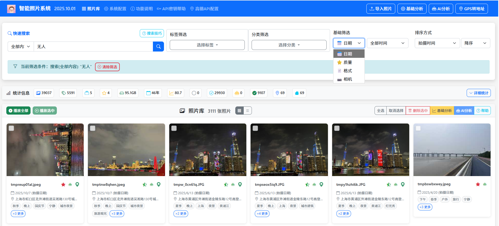
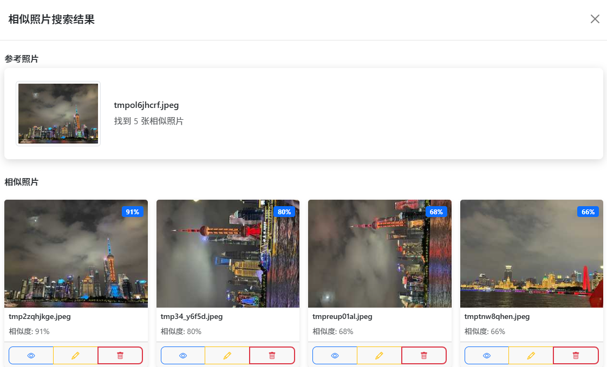

# 家庭版智能照片系统 - 功能说明

**数据永不离身，绝对隐私无忧**  *基于AI技术的智能照片管理平台*

---

## 一、系统概述

基于AI技术的智能照片管理平台，支持照片自动分析、分类、标签生成、重复检测、相似照片匹配等，支持节假日识别，基于GPS信息提取地址。

🌟**数据永不离身，绝对隐私无忧：**您的照片数据始终存储在您控制的本地设备中，既可以安心放在家里，也可以随身携带。从不上传到任何云端服务，彻底杜绝泄密风险，确保家庭隐私完全自主掌控。真正的便携式设计，解压即用，一次配置处处可用。

### 🛡️ 核心特性

| 🔒 数据永不离身，隐私无忧 | 🏠 家庭组网，随时随地访问 | 🤖 分步骤智能分析，灵活选择 | 🔍 多端快速导入、超强搜索引擎 |
|:---:|:---:|:---:|:---:|
| ✅ 放在家里安心，带身上放心 ✅ 从不上传云端，杜绝泄密风险 ✅ 本地存储，便携使用 ✅ 家庭隐私完全自主掌控 | ✅ 一台主机，多端同步 ✅ 多设备无缝访问 ✅ 触摸友好操作 ✅ 家庭共享协作 | ✅ 重复照片自动检测 ✅ 节假日识别，地址提取 ✅ 基础分析：免费的质量评估 ✅ AI分析：深度内容识别 | ✅ 多终端联网快速导入 ✅ 标签、日期、分类搜索 ✅ 全文快速智能搜索 ✅ 相似照片秒速匹配 |

---

## 二、快速开始

### 🪟 Windows 用户

1. 下载 `PhotoSystem-Portable.zip`
2. 解压到一个**足够存储家庭照片**的目录
3. **双击运行 `PhotoSystem.exe`** 直接启动
4. 或者运行 `startup.bat` 获得更好的用户体验
5. 初次启动，估计要等待1分钟
6. 启动完成后，请不要关闭启动窗口

### 🌐 访问系统

🎉 **启动完成后，在浏览器中访问：** `http://127.0.0.1:8000`

也可在家庭的其他设备上，根据启动页的提示，在浏览器中访问：`http://主机ip地址:8000`

### ⚙️ 首次使用建议

1. [**申请并配置免费大模型API密钥和高德API密钥**](#七api密钥配置)
2. 导入照片并开始智能分析
3. 先进行**基础分析**（免费、快速的质量评估）
4. 再进行**AI分析**（深度内容识别，需要API密钥）
5. 享受智能照片管理体验！

---

## 三、核心功能使用

### 3.1 📥 照片导入

系统支持多种方式导入照片，确保您的家庭照片库完整且有序。

- **单文件上传：** 点击"导入照片"按钮，选择单个文件上传
- **文件夹扫描：** 选择"扫描文件夹"模式，批量导入整个文件夹
- **智能处理：** 自动生成缩略图，支持同时处理多张照片
- **格式支持：** JPG、PNG、HEIC等多种常见照片格式

### 3.2 🤖 智能分析（基础分析 + AI分析）

系统提供分步骤的智能分析功能，先进行基础分析获取质量评估，再可选择进行AI深度分析。

#### 🎯 分析功能分为两步

| 📊 基础分析（免费） | 🤖 AI分析（需申请AI密钥） |
|:----|:----|
| ✅ **质量评估：** 分析照片的技术质量，包括清晰度、亮度、对比度、色彩、构图等指标 ✅ 基础标签：生成时间标签、EXIF标签等基础信息 ✅ 处理速度：本地处理，速度快，完全免费 ✅ 无需网络：可在离线环境下使用 | ✅ **AI内容分析：** 使用千问大模型识别照片中的物体、场景、人脸、情感等，生成详细描述 ✅ 智能分类：基于AI分析结果自动为照片添加合适的标签和分类 ✅ 重复检测：计算照片的感知哈希值，用于查找和识别重复照片 ✅ 需要网络：需要有效的API密钥和网络连接 |

#### ⚠️ 智能分析注意事项

**基础分析：**
- 完全免费，无需网络连接
- 本地处理，速度快，资源占用少
- 可离线使用
- 已处理过的照片可以重新分析

**AI分析：**
- 需要有效的阿里云DashScope千问大模型API密钥
- 处理时间与照片数量、复杂度、网络状况有关
- 已处理过的照片可以重新分析以更新AI分析结果
- 建议在网络稳定时进行批量处理
- 处理过程中请勿关闭浏览器窗口

### 3.3 📍 GPS转地址

将照片中的GPS坐标信息转换为可读的地理地址，支持批量转换和单张照片转换。

#### 🌍 GPS转地址功能

| 🎯 功能特点 | ⚙️ 使用要求 |
|:----|:---:|
| ✅ **地理编码：** 使用高德地图API将GPS坐标转换为详细地址 ✅ 地址存储：转换后的地址保存到照片的地点名称字段 ✅ 批量处理：支持一次转换所有有GPS信息的照片 ✅ 重新解析：支持重新解析已转换的地址 ✅ 状态显示：直观显示转换状态（已解析/未解析） | ⚠️ **API密钥：** 需要配置高德地图API密钥 ⚠️ GPS信息：照片必须包含GPS坐标信息 ⚠️ 网络连接：需要稳定的网络连接 ⚠️ iPhone设置：拍摄时需开启定位服务 |

#### ⚠️ GPS转地址注意事项

**API配置：**
- 首次使用前需要配置高德地图API密钥
- 访问系统配置页面设置API密钥
- 配置后无需重启应用即可生效
- API密钥泄露时及时更换

**照片要求：**
- 照片必须在拍摄时开启GPS定位
- iPhone用户需在设置中允许相机访问位置信息
- 室内拍摄可能无法获取GPS信息
- GPS信息不完整的照片无法转换

### 3.4 🔍 智能搜索

强大的搜索功能让您快速找到需要的照片，支持多种搜索方式和条件组合。

- **关键词搜索：** 支持文件名、描述、标签、分类、AI分析结果搜索
- **条件筛选：** 按日期、质量、标签、分类等条件精确筛选
- **相似照片：** 通过图片悬停功能快速发现相似照片
- **搜索建议：** 基于热门标签和分类的智能建议

#### 💡 基础搜索技巧

- `花朵` - 搜索包含"花朵"的照片
- `家庭 全家福` - 搜索同时包含"家庭"和"全家福"的照片
- 选择搜索类型：文件名、标签、分类、AI分析结果等
- 日期筛选：今天、本周、本月、今年
- 质量筛选：优秀、良好、一般、较差
- 相机筛选：基于拍摄照片的相机型号进行筛选(CANON、SONY、IPHONE等)
- 格式筛选：基于照片格式进行筛选（如JPEG、HEIC、BMP等)

#### 🔧 高级搜索用法

**搜索范围：**

- **全部内容：** 文件名、标签、分类、描述、AI分析
- **文件名：** 仅搜索照片文件名
- **用户描述：** 仅搜索用户添加的描述
- **AI分析结果：** 仅搜索AI自动分析的内容

**热门搜索词：** `花朵` `盆栽` `欢乐` `宁静` `室内` `户外`

### 3.5 🖼️ 照片显示

系统提供多种照片查看和操作方式，让您能够方便地浏览、管理和欣赏您的照片收藏。

#### 👁️ 照片浏览模式

- **网格视图：** 以网格形式显示照片缩略图，便于快速浏览和选择
- **列表视图：** 以列表形式显示，包含更多详细信息和批量操作选项
- **全屏查看：** 点击照片可进入全屏查看模式，欣赏照片细节
- **幻灯片播放：** 连续播放照片，支持自动和手动控制播放速度

#### ⚙️ 照片操作功能

- **悬停预览：** 鼠标悬停显示照片详细信息和快速操作按钮
- **相似照片：** 点击相似照片按钮查看内容相似的相关照片
- **编辑信息：** 修改照片描述、添加或编辑标签和分类
- **批量操作：** 选择多张照片进行批量删除、移动或分类

#### 📋 照片详情查看

- **EXIF信息：** 查看拍摄参数、相机型号、镜头信息、GPS位置等
- **AI分析结果：** 显示AI识别的场景、物体、人物、情感等分析结果
- **质量评估：** 查看清晰度、亮度、对比度、色彩等质量指标
- **标签管理：** 查看和编辑照片的所有标签和分类信息

---

## 四、配置管理

### 🤖 AI服务设置

- **大模型选择：** qwen-vl-plus、qwen-vl-plus-latest等
- **API密钥：** 从阿里云DashScope获取，支持环境变量
- **安全提示：** 优先使用环境变量，避免配置文件明文存储

### 🗺️ 地图服务设置

- **地图服务提供商：** 高德地图（Amap）
- **API密钥：** 从高德地图开发者平台获取
- **功能支持：** GPS坐标转地理地址
- **配置方式：** 通过系统配置页面设置，或使用环境变量
- **安全建议：** 定期更换API密钥，避免泄露

### 💾 存储设置

- **文件大小限制：** 25MB、50MB、100MB、200MB可选
- **缩略图设置：** 质量50%、尺寸300像素推荐
- **重要提醒：** 更改目录前先备份原有数据

### 🎨 界面设置

- **每页显示照片数：** 6、12、18、24、30张可选
- **相似照片数量：** 4、8、12张可选
- **推荐配置：** 每页12张照片，相似照片8张

### 🔍 搜索设置

- **相似度阈值：** 0.0-1.0，推荐0.6
- **重复检测阈值：** 1-20，推荐5
- **平衡配置：** 准确性和召回率的良好平衡

---

## 五、多设备访问

### 🏠 家庭组网访问

系统支持同一家庭网络内的多设备同时访问，实现家庭照片的共享和协作管理。

### 🌐 局域网访问设置

1. **确保设备在同一网络：** 电脑、手机、平板连接到同一个WiFi
2. **获取主机IP地址：** 在主机上运行 `ipconfig` 或 `ifconfig`
3. **其他设备访问：** 浏览器输入 `http://主机IP地址:8000`
4. **防火墙设置：** 确保端口8000未被防火墙阻止

### 🔒 远程访问（可选）

⚠️ **安全提醒：** 远程访问需要谨慎配置，确保网络安全。

- **端口转发：** 路由器设置端口转发到服务器的8000端口
- **动态域名：** 可选使用花生壳等动态域名服务
- **VPN访问：** 推荐使用VPN进行安全远程访问
- **防火墙：** 只开放必要的端口和IP段

### 📱 设备兼容性

- **桌面浏览器：** Chrome 90+、Firefox 88+、Edge 90+、Safari 14+
- **移动设备：** iOS Safari、Android Chrome等现代移动浏览器
- **平板设备：** 完美支持触摸操作，适合家庭成员使用
- **响应式设计：** 自动适配不同屏幕尺寸

---

## 六、数据永不离身，本地存储无忧

### 🛡️ **既安全又便携，本地存储的最佳选择**

我们的系统完美实现了安全与便携的统一：数据永不离身，既可以安心放在家里，也可以随身携带。从不上传云端，彻底杜绝泄密风险，让您随时随地安全地管理自己的家庭照片。

### 🏠 家庭硬盘存储

**安心放在家里：** 将系统安装在家庭电脑的硬盘上，所有照片、智能分析结果、标签数据完全存储在自家硬盘中，完全由您掌控。适合长期家庭使用，享受稳定的本地存储体验。

🏡 **家庭优势：** 杜绝任何数据泄密风险，您的家庭照片永远安全在家园守护下。

### 🎒 随身携带便携

**随时带在身上：** 将系统安装在U盘或移动硬盘上，随身携带您的完整照片管理系统。即插即用，无论走到哪里，都能立即访问您的家庭照片，享受真正的"数据永不离身"体验。

✈️ **便携优势：** 特别适合旅行、办公、出差等场景，您的照片数据时刻跟随在身边。

### 💼 数据永不离身

**完整系统随身携带：** 照片库、智能分析结果、个人配置、分类标签等全部存储在同一个移动设备中。无论您走到哪里，您的完整照片管理系统都时刻跟随在身边，确保数据永不离身。

### 🔐 使用无痕，数据永不离身

**即用即走，安全无忧：** 系统不会在使用的电脑上留下任何痕迹。使用完成后直接拔出设备即可，不会占用系统资源，也不会遗留个人数据。您的照片数据始终存储在您的移动设备中，真正实现了"数据永不离身"的安全理念。

🛡️ **安全保证：** 在任何设备上使用都绝对安全，您的家庭隐私时刻在您的掌控之中。

### 💼 应用场景

| 💼 商务演示 | 🏠 家庭聚会 | 🏢 办公室使用 | ✈️ 旅行随行 |
|:---:|:---:|:---:|:---:|
| 数据永不离身，U盘随身携带，在客户现场即插即用，展示系统功能时数据时刻在掌控之中。 | 移动硬盘随身携带，走到哪里家就在哪里，在任何地方都能安全分享家庭美好时光。 | U盘插上就用，用完即拔即走，工作数据永不离身，办公隐私完全自主掌控。 | 移动硬盘装进行李，旅途中随时查看家庭照片，美丽回忆时刻相伴，数据永不离身。 |

---

## 七、API密钥配置

⚠️ **重要：** AI分析功能需要有效的阿里云DashScope千问大模型API密钥，GPS转地址功能需要高德地图API密钥才能正常工作。

[🔑 AI密钥配置指南](#) • [📍 高德API配置指南](#)

### 🤖 获取AI分析API密钥（阿里云DashScope）

1. 访问 [阿里云DashScope](https://dashscope.aliyun.com/) 官网
2. 注册账号并完成实名认证
3. 进入API-KEY管理页面
4. 创建新的API密钥
5. 复制生成的API密钥

### 🗺️ 获取GPS转地址API密钥（高德地图）

1. 访问 [高德地图开放平台](https://lbs.amap.com/)
2. 注册账号并完成开发者认证
3. 进入控制台创建新应用
4. 为应用添加地理编码API服务
5. 获取应用的API Key

### ⚙️ 配置方式

1. 访问 [系统配置页面](http://127.0.0.1:8000/settings)，找到"AI服务设置"部分，配置DashScope API密钥，点击"保存配置"
2. 访问 [高德API配置页面](http://127.0.0.1:8000/help-gaode-api-key)，配置高德地图API密钥，点击"保存配置"

### 🛡️ 安全建议

- 定期更换API密钥，建议每3-6个月更换一次
- 不要在公共场所或不安全网络环境下使用系统
- API密钥泄露时立即更换，并检查是否有异常使用记录
- 合理控制API使用频率，避免超出服务商的免费额度

---

## 八、系统要求

| 💻 硬件要求 | 🔧 软件要求 |
|:----|:----|
| ✅ **处理器：** Intel i5/Ryzen 5及以上（推荐i7/Ryzen 7） ✅ 内存：8GB RAM及以上（推荐16GB） ✅ 存储：100GB可用空间（推荐SSD，提高访问速度） ✅ 网络：稳定的互联网连接（用于AI分析，支持离线缓存） | ✅ **操作系统：** Windows 10/11、macOS 10.15+、Ubuntu 18.04+ ✅ 浏览器：Chrome 90+、Firefox 88+、Safari 14+、Edge 90+ ✅ 依赖服务：DashScope API、SQLite |

---

## 九、技术支持

### 🆘 获取帮助

- 查看系统日志了解详细错误信息：`logs/app.log`
- 检查配置文件格式是否正确
- 确认系统权限设置

### 🔍 问题诊断

- **日志查看：** 检查logs/app.log文件
- **配置检查：** 验证config.json文件格式
- **权限检查：** 确认文件和目录权限

### 📞 联系支持

- **系统问题：** 查看日志文件
- **配置问题：** 参考本帮助文档
- **技术问题：** 联系开发人员 alva_xu@sina.com

---

## 十、推广与支持

### 🌟 自由推广

如果您觉得这个照片管理系统好用，不妨分享给您的家人和朋友。您的推荐是我们最大的动力！

*让更多人享受到智能照片管理带来的便利*

### ❤️ 支持我们

作为独立开发者，我们致力于不断改进系统，为您提供更好的使用体验。如果您愿意，可以通过扫码支持我们继续前行。

*您的每一份支持，都是对我们持续改进的鼓励*

💡 **感谢您的使用！** 您的反馈和支持是我们前进的动力。

---

*© 2025 家庭版智能照片系统 | 数据永不离身，隐私无忧*

