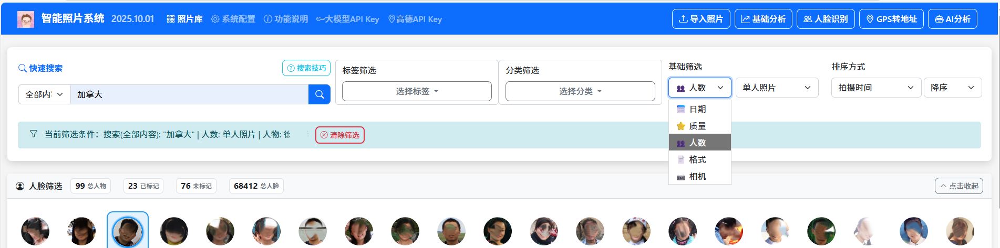
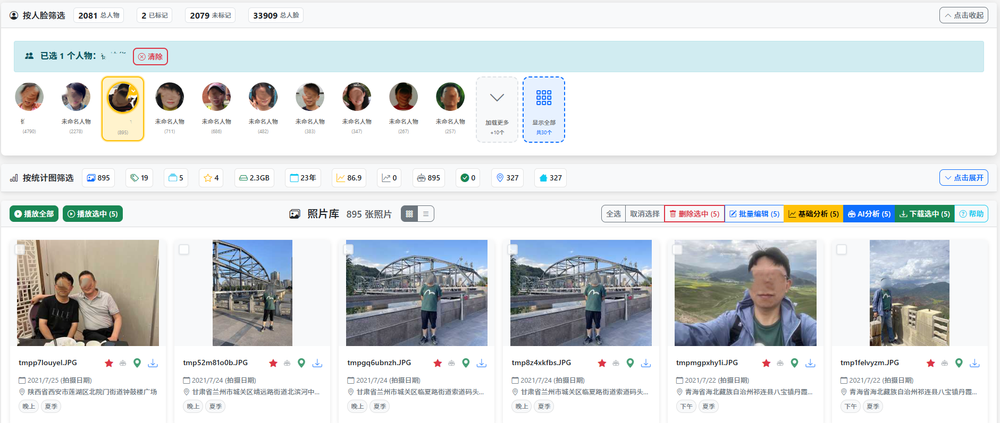

# 家庭版智能照片系统v4.3版 - 功能说明

**数据永不离身，绝对隐私无忧**  *基于AI技术的智能照片管理平台*

---

## 一、系统概述

基于AI技术的智能照片管理平台，支持照片自动分析、分类、标签生成、重复检测、相似照片匹配、**人脸识别与人物管理**、**GPS转地址多服务解析**等。

🌟**数据永不离身，绝对隐私无忧：**您的照片数据始终存储在您控制的本地设备中，既可以安心放在家里，也可以随身携带。从不上传到任何云端服务，彻底杜绝泄密风险，确保家庭隐私完全自主掌控。真正的便携式设计，解压即用，一次配置处处可用。

### 🛡️ 核心特性

| 🔒 数据永不离身 隐私无忧 | 🏠 家庭组网 随时随地访问 | 🤖 智能分析 灵活选择 |
|:---:|:---:|:---:|
| ✅ 放在家里安心 ✅ 从不上传云端 ✅ 本地存储便携 ✅ 隐私完全自主掌控 | ✅ 一台主机多端同步 ✅ 多设备无缝访问 ✅ 触摸友好操作 ✅ 家庭共享协作 | ✅ 基础分析（获取数据） ✅ AI分析（深度识别） ✅ 人脸识别 ✅ 重复检测 |

| 🔍 超强搜索和统计功能 | 👤 人脸识别与管理 | 📍 GPS转地址 多服务 |
|:---:|:---:|:---:|
| ✅ 肖像搜索人物同框照 ✅ 全文搜索多条件筛选 ✅ 相似照片匹配 ✅ 超强统计功能 | ✅ 自动识别照片上的人脸 ✅ AI智能聚类 ✅ 本地处理安全 ✅ 按人物筛选 | ✅ 高德API/Nominatim/离线 ✅ 自由选择服务 ✅ 批量/单张转换 ✅ 支持全球地址解析 |

---

## 二、快速开始

### 🪟 Windows 用户

1. 扫码本文档下方百度云共享链接，下载 **最新版**`PhotoSystem-Portable.zip`
2. 解压到一个**足够存储家庭照片**的目录
3. **双击运行 `PhotoSystem.exe`** 直接启动
4. 或者运行 `startup.bat` 脚本启动
5. 初次启动，仅需等待1分钟，之后再次启动，秒速完成
6. 启动完成后，请不要关闭启动窗口

### 🌐 访问系统

🎉 **启动完成后，在浏览器中访问：** `http://127.0.0.1:8000`

也可在家庭的其他设备上，根据启动页的提示，在浏览器中访问：`http://主机ip地址:8000`

**导航栏功能：** 页面顶部提供快速入口，包括**导入照片**、**基础分析**、**GPS转地址**、**人脸识别**、**AI分析**等核心功能按钮。

### ⚙️ 首次使用建议

1. 导入照片到系统中
2. 先进行**基础分析**（本地快速的基础数据提取、分析和质量评估）
3. 再进行**GPS转地址**（选择高德、Nominatim或离线三种服务中的一种进行地址解析）
4. 启动**人脸识别**（本地AI模型，自动聚类人物）
5. 使用智能搜索和筛选功能管理照片
6. 享受智能照片管理体验！
7. 还可以申请并配置免费额度大模型API密钥以便对照片进行更深入AI分析
8. 如选用高德API解析照片地址，也需申请并配置免费额度高德API密钥

---

## 三、核心功能使用

### 3.1 📥 照片导入

系统支持多种方式导入照片，确保您的家庭照片库完整且有序。

- **单文件上传：** 点击"导入照片"按钮，选择单个文件上传
- **文件夹扫描：** 选择"扫描文件夹"模式，批量导入整个文件夹
- **智能处理：** 自动生成缩略图，支持同时处理多张照片
- **格式支持：** JPG、PNG、HEIC等多种常见照片格式
- **处理过程：**批量处理时，当前浏览器窗口可实时显示进度和处理结果，建议不要关闭，但可以打开新窗口访问照片

### 3.2 🤖 智能分析（基础分析 + AI分析）

系统提供两种分析功能，基础分析获取基础信息并做质量评估，AI分析对照片进行深度分析。

#### 🎯 分析功能分为两步

| 📊 基础分析 | 🤖 AI分析（需申请AI密钥） |
|:----|:----|
| ✅ **质量评估：** 分析照片的技术质量，包括清晰度、亮度、对比度、色彩、构图等指标 ✅ **基础标签：**生成时间标签、节假日标签、EXIF标签等基础信息 ✅ **无需网络：**可在离线环境下使用，速度快 ✅**重新分析:** 处理过的照片可以重新分析 | ✅ **AI内容分析：** 使用千问大模型识别照片中的物体、场景、人物情感等，生成详细描述 ✅ **智能分类：**基于AI分析结果自动为照片添加合适的标签和分类 ✅ **需要网络：**需要有效的API密钥和上网连接  ✅**重新分析:** 处理过的照片可以重新分析 |

#### ⚠️ 提示
- 因为系统已经有了本地的人脸识别等功能，因此AI分析的必要性就不是特别大了

- 批量分析时，当前浏览器窗口可实时显示进度和处理结果，建议不要关闭，但可以打开新窗口访问照片

  

### 3.3 📍 GPS转地址（多服务支持）

将照片中的GPS坐标信息转换为可读的地理地址，支持多种解析服务，功能更强大。

#### 🌍 GPS转地址功能

| 🎯 支持的服务 | ⚙️ 配置要求 |
|:----|:---:|
| ✅ **高德API：** 国内地址详细准确，需上网 ✅ **离线模式：**全球主要城市名，无需网络， ✅ **Nominatim API：**全球地址详细准确，需科学上网 ✅ **批量/单张：**支持批量转换和单张照片转换 ✅**重新解析:** 支持重新解析已转换的地址 | ⚠️ **高德API：** 需申请和配置API密钥 ⚠️ **离线模式：**无需任何配置 ⚠️ **Nominatim API：**无需密钥，需VPN ⚠️ **智能选择：**用户可按需选定一种服务，也可每次转换前选择 ⚠️ **GPS信息：**照片必须包含GPS坐标信息 |

#### ⚠️ GPS转地址注意事项

**配置：**

- 如果选用高德API，那么首次使用前需要配置高德地图API密钥
- 访问系统配置页面设置API密钥
- 配置后无需重启应用即可生效

**照片要求：**
- 相机必须在拍摄时开启GPS定位
- iPhone手机拍照前需设置允许相机访问位置信息
- GPS信息不完整的照片无法转换

**处理时间：**

- 离线模式处理速度最快，高德API和Nominatim API因为免费原因有限流要求，约为每秒1张照片
- 大量照片可能需要较长时间，请耐心等待
- 当前浏览器窗口可显示最终处理结果，建议不要关闭，但可以打开新窗口访问照片

### 3.4 👤 人脸识别与人物管理

智能识别照片中的人脸，自动聚类同一个人物，方便您按人物浏览和整理家庭照片。

#### 🔍 人脸识别功能

| 🤖 核心功能 | ⚙️ 使用要求 |
|:----|:---:|
| ✅ **人脸检测：** 自动识别照片中的人脸并提取特征 ✅ **智能聚类：** 使用AI算法将相似人脸聚类到同一个人物组 ✅ **肖像生成：** 自动为每个聚类选择最佳肖像照片 ✅ **人脸筛选：** 按人脸筛选照片，快速找到特定人物 ✅ **批量管理：** 批量处理、合并、拆分人物聚类 | ⚠️ **预置模型：** 模型已在系统中内置，无需下载 ⚠️ **本地处理：** 完全本地运行，无需网络连接 ⚠️ **隐私安全：** 所有人脸数据存储本地，绝对安全 ⚠️ **处理速度：** 取决于照片数量，支持批量处理 |

#### 🎯 人脸识别的使用方式

**开始人脸识别：**

- **入口：** 点击导航栏"人脸识别"按钮
- **批量处理：** 系统自动识别所有照片中的人脸
- **进度显示：** 显示处理进度和处理统计信息

**人物管理：**
- **查看人物：** 浏览系统识别的所有人物分组
- **重命名人物：** 为人物设置友好名称
- **优化肖像：** 可选择自动生成高质量圆形头像

#### ⚠️ 人脸识别注意事项

**处理时间：**

- 人脸识别处理速度很快，约为每秒5-10张照片
- 大量照片可能需要较长时间，请耐心等待
- 当前浏览器窗口可实时显示进度和最终结果，建议不要关闭，但可以打开新窗口访问照片

**准确性提示：**
- 人脸清晰、正面照片识别准确率最高
- 侧面、模糊、戴口罩照片可能识别失败

### 3.5 🔍 智能搜索

强大的搜索功能让您快速找到需要的照片，支持多种搜索方式和条件组合。

- **全文搜索：** 支持多文本组合全文搜索，支持中文分词和复杂查询

- **关键词搜索：** 支持文件名、描述、标签、分类、AI分析结果搜索

- **人脸筛选：**支持单张人脸筛选个人照片，及多张人脸筛选同框照片

- **条件筛选：** 按日期、质量、相机、格式、标签、分类等条件精确筛选

- **相似照片：** 通过图片悬停功能快速发现相似照片

  

### 3.6 🖼️ 照片显示

系统提供多种照片查看和操作方式，让您能够方便地浏览、管理和欣赏您的照片收藏。

#### 👁️ 照片浏览模式

- **网格视图：** 以网格形式显示照片缩略图，便于快速浏览和选择
- **列表视图：** 以列表形式显示，包含更多详细信息和批量操作选项
- **全屏查看：** 点击照片可进入全屏查看模式，欣赏照片细节
- **幻灯片播放：** 连续播放照片，支持自动和手动控制播放速度

#### ⚙️ 照片操作功能

- **悬停预览：** 鼠标悬停显示照片详细信息和快速操作按钮
- **相似照片：** 点击相似照片按钮查看内容相似的相关照片
- **编辑信息：** 修改照片名、描述、添加或编辑标签和分类、补充拍摄时间、地址等
- **批量操作：** 选择多张照片进行批量删除、下载、编辑、重新地址转换、基础分析、AI分析等

#### 📋 照片详情查看

- **EXIF信息：** 查看拍摄参数、相机型号、镜头信息、GPS位置等
- **AI分析结果：** 显示AI识别的场景、物体、人物、情感等分析结果
- **质量评估：** 查看清晰度、亮度、对比度、色彩等质量指标
- **标签管理：** 查看和编辑照片的所有标签和分类信息

### 3.7 ⚙️ 系统配置

通过系统配置页面，您可以根据个人需求调整系统的各项参数和功能设置。

**配置项说明：**
- **AI服务设置：** 配置大模型选择和API密钥
- **存储设置：** 配置照片大小限制和缩略图参数
- **地址解析设置：** 配置GPS转地址服务和API密钥
- **界面设置：** 调整每页显示照片数和相似照片数量
- **搜索设置：** 配置相似度阈值和重复检测阈值

**配置操作：**
- **修改配置：** 在各配置项中调整参数值
- **保存配置：** 点击"保存配置"按钮应用更改
- **重置配置：** 点击"重置为默认"按钮恢复默认值
- **导出配置：** 点击"导出配置"按钮备份当前配置

---

## 四、配置管理

### 🤖 AI服务设置

- **大模型选择：** qwen-vl-plus、qwen-vl-plus-latest等
- **API密钥：** 从阿里云DashScope获取，支持环境变量
- **安全提示：** 优先使用环境变量，避免配置文件明文存储

### 🗺️ 地址解析服务设置

- **支持的服务：** 高德地图API、离线数据库、Nominatim API
- **配置方式：** 系统配置页面设置默认服务
- **智能选择：** 可设置每次都询问，或默认使用某个服务

### 🎨 界面设置

- **每页显示照片数：** 6、12、18、24、30张可选
- **相似照片数量：** 4、8、12张可选
- **推荐配置：** 每页12张照片，相似照片8张

---

## 五、多设备访问

### 🏠 家庭组网访问

系统支持同一家庭网络内的多设备同时访问，实现家庭照片的共享和协作管理。

### 🌐 局域网访问设置

1. **确保设备在同一网络：** 电脑、手机、平板连接到同一个WiFi
2. **获取主机IP地址：查看启动屏幕上的信息即可，也可在主机上运行 <code>ipconfig</code> 
3. **防火墙设置：** 确保端口8000未被防火墙阻止

### 📱 设备兼容性

- **桌面浏览器：** Chrome 、Firefox 、Edge 、Safari 等常用浏览器
- **移动设备：** iOS Safari、Android Chrome等现代移动浏览器
- **平板设备：** 完美支持触摸操作，适合家庭成员使用
- **响应式设计：** 自动适配不同屏幕尺寸

---

## 六、数据永不离身，本地存储无忧

### 🛡️ **既安全又便携，本地存储的最佳选择**

我们的系统完美实现了安全与便携的统一：数据永不离身，既可以安心放在家里，也可以随身携带。从不上传云端，彻底杜绝泄密风险，让您随时随地安全地管理自己的家庭照片。

### 🏠 家庭硬盘存储

**安心放在家里：** 将系统安装在家庭电脑的硬盘上，所有照片、智能分析结果、标签数据完全存储在自家硬盘中，完全由您掌控。适合长期家庭使用，享受稳定的本地存储体验。

🏡 **家庭优势：** 杜绝任何数据泄密风险，您的家庭照片永远安全在家园守护下。

### 🎒 随身携带便携

**随时带在身上：** 将系统安装在U盘或移动硬盘上，随身携带您的完整照片管理系统。即插即用，无论走到哪里，都能立即访问您的家庭照片，享受真正的"数据永不离身"体验。

✈️ **便携优势：** 特别适合旅行、办公、出差等场景，您的照片数据时刻跟随在身边。

### 🔐 使用无痕，数据永不离身

**即用即走，安全无忧：**  仅需注意浏览器及时清理缓存不留痕迹，系统不会在使用的电脑上留下任何痕迹。使用完成后直接拔出设备即可，不会占用系统资源，也不会遗留个人数据。您的照片数据始终存储在您的移动设备中，真正实现了"数据永不离身"的安全理念。

🛡️ **安全优势：** 仅需注意浏览器及时清理缓存不留痕迹，那么在任何设备上使用都绝对安全，您的家庭隐私时刻在您的掌控之中。

### 💼 应用场景

| 💼 商务演示 | 🏠 家庭聚会 | 🏢 办公室使用 | ✈️ 旅行随行 |
|:---:|:---:|:---:|:---:|
| 数据永不离身，U盘随身携带，在客户现场即插即用，展示系统功能时数据时刻在掌控之中。 | 移动硬盘随身携带，走到哪里家就在哪里，在任何地方都能安全分享家庭美好时光。 | U盘插上就用，用完即拔即走，工作数据永不离身，办公隐私完全自主掌控。 | 移动硬盘装进行李，旅途中随时查看家庭照片，美丽回忆时刻相伴，数据永不离身。 |

---

## 七、系统要求

比较新的普通的windows操作系统的家用电脑即可，性能越好，使用越流畅。

---

## 八、技术支持

### 🆘 获取帮助

- 查看系统日志了解详细错误信息：`logs/app.log`
- 检查配置文件格式是否正确
- 确认系统权限设置

### 📞 联系支持

- **系统问题：** 查看日志文件
- **配置问题：** 参考本帮助文档
- **技术问题：** 联系开发人员 alva_xu@sina.com

---

## 九、推广与支持

### 🌟 自由推广

如果您觉得这个照片管理系统好用，不妨分享给您的家人和朋友。您的推荐是我们最大的动力！

链接: https://pan.baidu.com/s/1cu0zt4R-Bp6BhLAx3bWcWw?pwd=1234 提取码: 1234

*请点击链接或扫码下载最新版软件分享，让更多人享受到智能照片管理带来的便利*

### ❤️ 支持我们

作为独立开发者，我们致力于不断改进系统，为您提供更好的使用体验。如果您愿意，可以通过扫码支持我们继续前行。

*您的每一份支持，都是对我们持续改进的鼓励*

💡 **感谢您的使用！** 您的反馈和支持是我们前进的动力。

---

*© 2025 家庭版智能照片系统 | 数据永不离身，隐私无忧*

